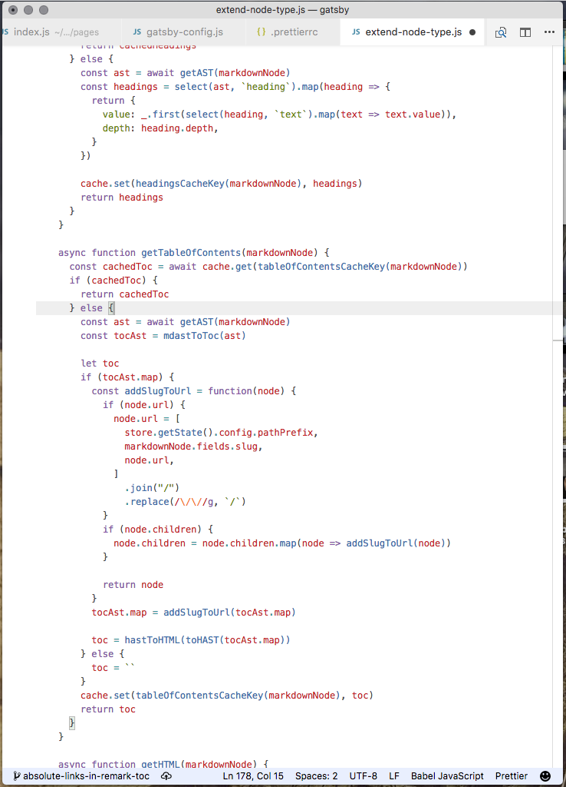
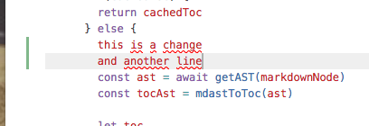

10 years of love for Emacs undone by a week in VSCode.🤔https://youtu.be/8kCd4w4kc68Last week, I wrote about [Why I won&#x27;t be switching to VSCode any time soon](https://swizec.com/blog/wont-be-switching-vscode/swizec/7898). Then [Cunningham&#x27;s law](https://meta.wikimedia.org/wiki/Cunningham's_Law) kicked in, I learned about some killer features, got tips on some config, and gave VSCode another chance.

https://twitter.com/_developit/status/926509015672160256

That was the one. The feature that made me try VSCode for real. You can hover any function or variable, press command, and see its definition in a little popup. Or jump straight to the code.

😍

I think I have the perfect config going, and I&#x27;d share it with you, but I don&#x27;t know how. Mainly I focused on getting a clean interface where code dominates.

Blank slate with a bunch of code. The status bar is subtle, no activity bar, no cruft to the left or right of the code. No ugly vertical lines showing indentation.

Change indicators still show up as subtle green or blue lines.

It&#x27;s great.

Here&#x27;s some stuff that still annoys me 👇

- tabs are huge, and there doesn&#x27;t seem to be a config for that
- pressing Tab inserts a tab
- changing Tab to &quot;line indent&quot; works okay-ish, but not quite. I&#x27;d like to indent to automatic correct indentation instead of having to press it multiple times. When cursor is in indent space, tab should jump to beginning of line, when cursor is in code space, tab should indent or do nothing.
- I installed emacs keybindings to preserve muscle memory, and now jump-to-line shortcut doesn&#x27;t work
- the `cmd+P` magic search can be annoyingly dumb sometimes, and the UI struggles with long file paths. Shows beginning of path instead of the important stuff
- the `cmd+O` shortcut isn&#x27;t context aware. Opens UI at last visited folder instead of at current file
- no good shortcut for &quot;jump back to previous file&quot; that I can find

Any ideas? [@ me](http://twitter.com/home?status=.@swizec%20you%20should%20try%20this%20for%20@code%20%F0%9F%91%89)
