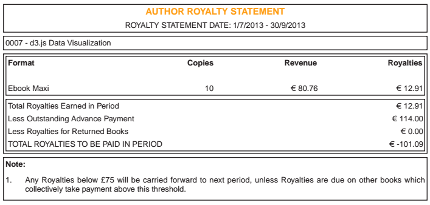
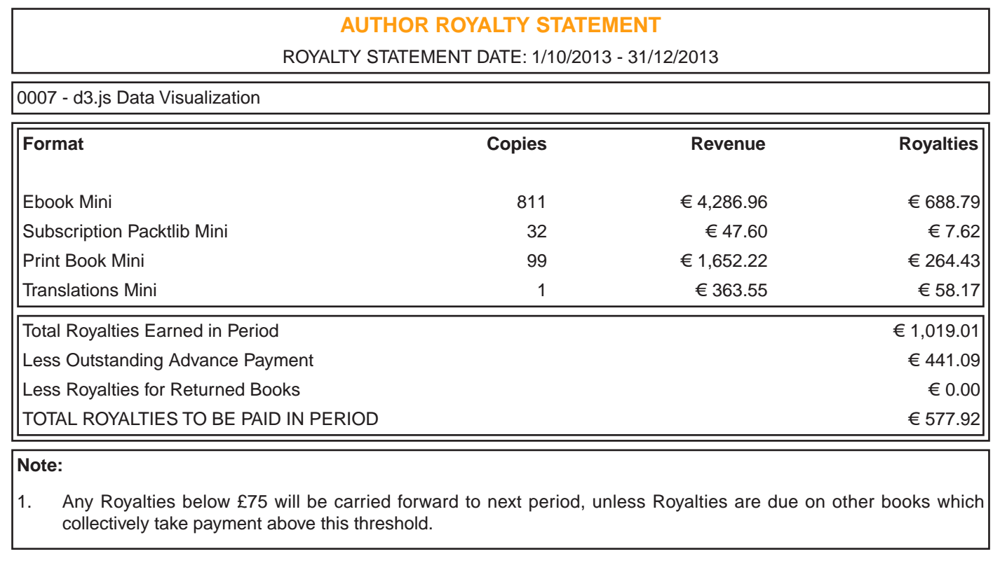

A while ago I wrote [a book about creating d3.js visualizations](http://www.packtpub.com/data-visualization-with-d3js/book). You can read about the writing, editing, and hair-pulling part of the process, [here](http://swizec.com/blog/i-published-a-book-with-a-publisher-heres-what-the-journey-was-like/swizec/6398). By the time it was published, I no longer liked my book. The didactic approach needed work, the examples were kind of meh, and too much of the content had to be breezy. When a [publisher](http://en.wikipedia.org/wiki/Publishing "Publishing") gets a fixed idea about book length, pushback is hard. Still managed to make it 70 pages longer than they wanted, though. Either way, the book has been out for five months now and with no word from the publisher, I was certain it tanked. An utter failure. [Packt](http://www.packtpub.com "Packt")'s official statement on keeping me in the loop was, _"You will get a [royalty](http://en.wikipedia.org/wiki/Royalties "Royalties") statement every quarter"_. Gee, thanks. That is very satisfying to both my inner data nerd and my ego. But probably good for peace of mind. Other than a _"Hey we have some errata"_ every once in a while, the book became completely invisible to me after publication. Just floating in the aether doing ... something. No discernible buzz. No marketing that I could see. For some reason I haven't even seen the book yet. I literally have _no_ idea how this thing turned out. In December the first royalty statement arrived.  Great, the book sold exactly ten copies in its first month. And that means I made a negative 101 euro ... perfect. Just perfect. I was right confused, so I asked what's going on.

> Hello Sir, Thanks for sending in your query . We have forwarded your query to the accounts team and will get back to you as soon a we receive an update. Thanks. Regards, Invoices Team

\_**\_**\*\*\*\*\_\_

