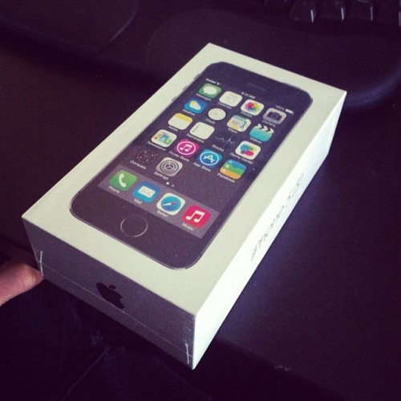

**\_\_\_\_**

1.  People are less likely to flake out
2.  Concrete plans mean you can concretely plan your day

I like having my day mapped out so I'm not guessing what to do with myself hour to hour. But I'm in the US now. All these crazy kids ever do is text each other. Nobody is ever available on Skype or on FB messenger or Twitter or email. Most of them don't even have a Twitter account! There's no wi-fi anywhere either. Or rather, you have wi-fi in random grocery stores, but not in coffee shops. Of the three places I went to in [San Francisco](<http://maps.google.com/maps?ll=37.7833333333,-122.416666667&spn=0.1,0.1&q=37.7833333333,-122.416666667 (San%20Francisco)&t=h> "San Francisco") last week not one of them had wi-fi. Must be some new hipster thing. Oooh we're too cool for wi-fi, we want you to actually talk to the people around you. Humbug. So this week I got a phone. I've been planning a new iPhone for a while, but these crazy Americans broke my resolve and I got a phone number as well. Unlimited everything for \\\\\\\$70 a month. It's pretty nifty. Having an internet in your pocket at all times comes handy more often than I thought. I no longer have to plan routes in advance, I don't have to remember to look things up before stepping out the door, I no longer get angry at coffee shops without wi-fi. I even have tethering! But ... they wouldn't let me have a phone with just internet. I have texting as well. It's taken three times longer than usual to write this post because I keep texting with a girl instead. Meeting her in SF tomorrow. We're figuring the plan out later ... _sigh_

