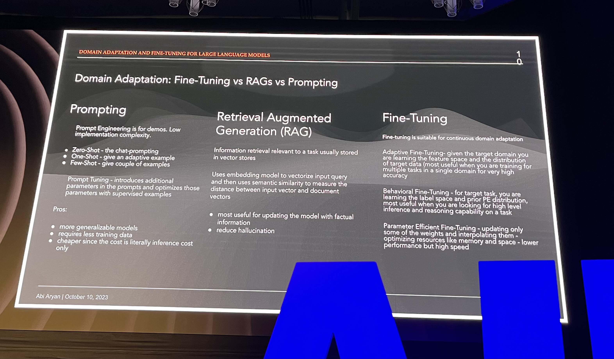
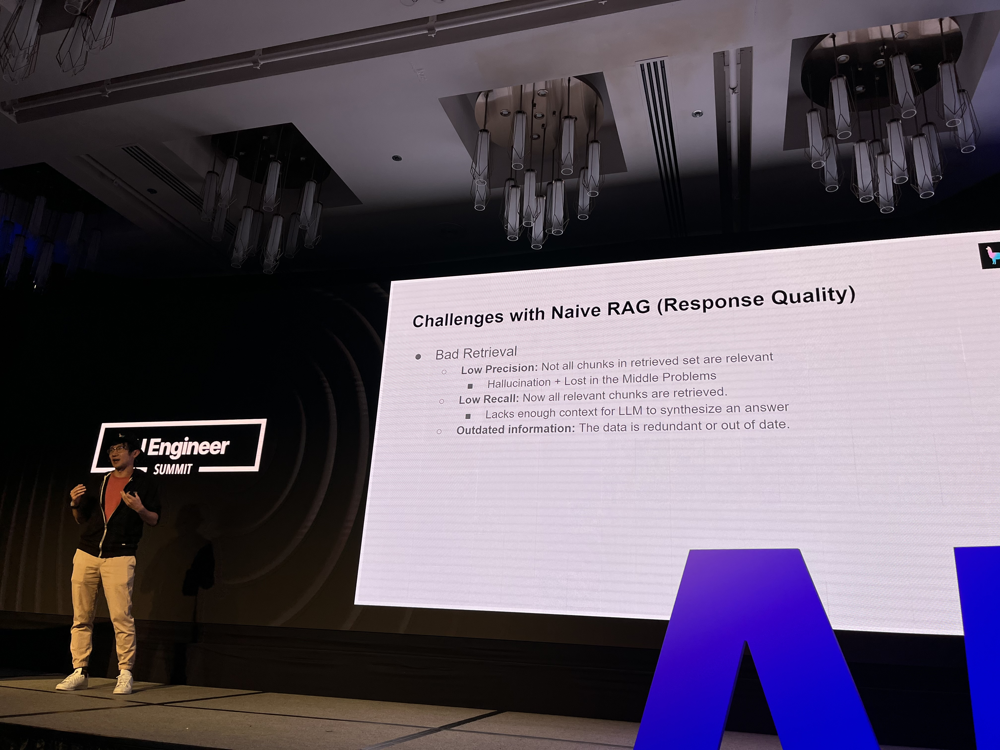
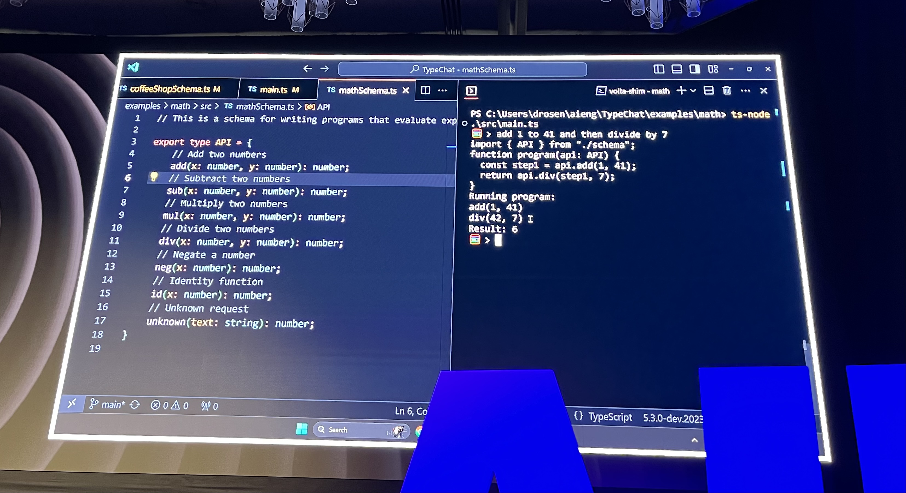
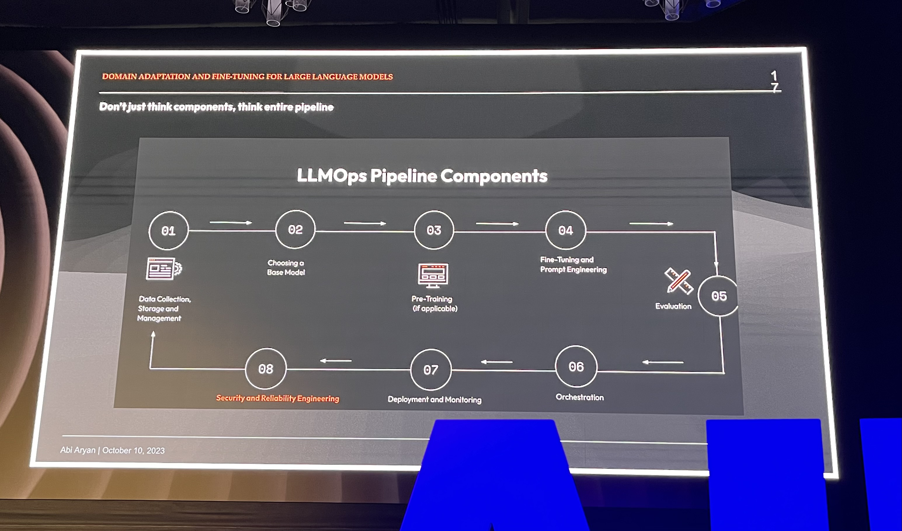
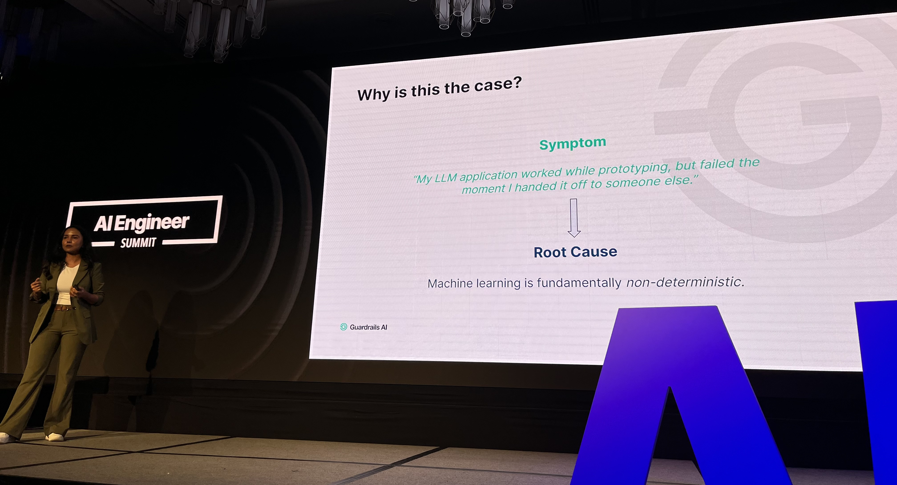

Here's my key takeaway from the inaugural [AI Engineer Summit](https://www.ai.engineer/summit) this week 👉 everyone's dealing with the same 3 problems.

1.  Good old fashioned data engineering
2.  Evals and non-determinism
3.  Product development

Like I've been saying for months now – AI is the easy part. Grab an API or an open-source model and you have a black-box brain that can do stuff. Easy.

But how do you turn that 2 hour demo into a product? _That_'s the challenge.

## Good old fashioned data engineering

Everyone at the conference has built a RAG demo. That's when you take a user's question, retrieve relevant documents, and pass those to the LLM as additional context inside the prompt.

Mine was [turning my blog into a chatbot](https://swizec.com/blog/how-i-turned-15-years-of-writing-into-a-chatbot/).

[Abi Aryan](https://twitter.com/GoAbiAryan) put that as the mid-level of domain adaptation in her deeply technical talk.

The demo is easy. Now how do you keep documents updated? How do you retrieve the right documents? How do you ensure the LLM doesn't get confused with irrelevant detail? Can you validate it didn't hallucinate despite the context? Did the LLM even read all the documents you sent? Are you sending the right chunks of documents or too much? What if the LLM needs to read a document, think a little, grab another document, and do full-on research before it can answer the question?

Like half the conference sponsors were various vector databases trying to solve those problems. Retrieval is tough.

[Jerry Liu](https://twitter.com/jerryjliu0)'s talk on how they think about solving these problems at LlamaIndex was neat. Especially the agents approach where your "database" can do autonomous research across your documents sounded exciting.

And that's the easy approach!

When you decide it's time to fine-tune a model, you'll need _plenty_ of data. Good clean high quality data. That someone needs to prepare and manage. That's a whole separate field of engineering!

## Evals and non-determinism

The hard part of working with AI are non-deterministic outputs. You get a different result every time you run your code.

So how do you know you're making it better?

Several speakers joked about "eyeballing" and "the vibe check", but that's what almost everybody does. You try a few things and say _"Yeah that looks about right"_.

There's two aspects people care about here:

1.  Did the LLM return a parse-able response (for chaining and such)
2.  Did the LLM return a good answer (for user output)

### Parse-able response?

We saw a couple of demos/approaches around convincing LLMs to respond with structured data.

[Jason Liu](https://twitter.com/jxnlco) shared how he uses pydantic to get type-checkable responses from LLMs in Python. With full type annotations and everything! I forgot to take a pic.

[Daniel Rosenwasser](https://twitter.com/drosenwasser) showed off a new thing Microsoft built – TypeChat. It's like TypeScript but for dealing with LLMs 😍

### Evals

Even harder than consistently parse-able responses is having an engineering process better than a vibe check. How do you know your code is improving?

That's where evals come in.

Abi put it in a nice MLOps/LLMOps pipeline for us:

Evals are like integration tests for your code, but probabilistic. If your code succeeds 30% of the time right now (answers correctly), you want the next iteration to get it right 35% of the time.

Yes you read that correctly: 30%. You can do better than that on some tasks but not all tasks. Depends how strict you are also – if a model answers the question and adds unnecessary fluff, is that a pass or fail?

Evaluation itself is hard. Best we can do right now is to have a pre-defined rubric we check against and a flexible evaluation criteria. Asking a stronger LLM for opinion is common.

[Shreya Rajpal](https://twitter.com/ShreyaR) is working on extending evals into pipeline building blocks with Guardrails AI.

That's not the best photo but I loved her idea that you can

1.  Run your LLM thing
2.  Eval the response
3.  Re-run until eval passes or you give up

Good for productizing! Wouldn't want your milkshake AI to go on a rant about almond milk.

## Product development

There is no AI moat because AI is the easy part.

That means your product needs to win the old fashioned way:

1.  Find a niche
2.  Solve the problem
3.  Good UX
4.  Gather feedback
5.  Iterate
6.  Win the marketing game

Eventually you'll hit a wall with off-the-shelf models and APIs and will need to fine-tune or build custom models to keep improving. At that point you'll need shitloads of data and user feedback. The big companies you're competing against already have that.

As [Hassan](https://twitter.com/nutlope) said: I spend 80% of my time on UI.

https://twitter.com/Swizec/status/1711825436500721875

Cheers, 
~Swizec
