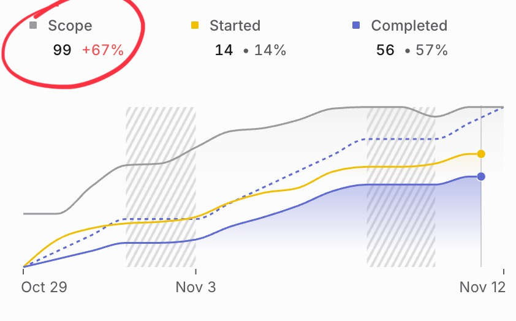

Remember when AI was gonna take our jobs? I've never felt busier. The more I get done, the more there is to do.

It's hard to explain. 3 analogies come to mind.

## Work done creates more work

Do you know how fizzy drinks explode out of a shaken can? Or how a very cold bottle of beer freezes solid when you tap the bottom?

Guess it works with supercooled water too.

The physics are fascinating: You have a high concentration of gas dissolved inside a liquid. Because the liquid is pure, the gas can't escape. But when you add a [nucleation site](https://en.wikipedia.org/wiki/Nucleation) bubbles (or ice crystals for supercooled liquids) begin to form. With the right conditions this kicks off an exponential reaction where every bubble becomes a nucleation site for more bubbles. Your fizzy drink blows up, supercooled beer freezes solid, clouds form in the sky, hailstorms are created, etc. All those phenomena are phase-shifts started by nucleation sites.

Using AI feels like that.

Every task you do, every feature you ship, creates more work and ideas for new things you could do. Then you do those and get even more ideas for neat things you could add. And ...

## How robots create busywork

Here's how robots create busywork

1. "Hey Swiz this sucks"
2. Oh shit yeah it does. Eh it's small and not worth our time. @cursor make this
3. Background agent started
4. **You run off to work on something else**
5. Ping! Agent finished your task
6. Oh right, that thing. What was I doing again?
7. Read the slack thread
8. Oh! Right. Look at pull request, yeah code looks fine
9. Ugh but it's complex enough that I should test this
10. Pull code, change branches, run the thing
11. Yep looks fine
12. But it's technically _my_ pull request so I can't approve and merge
13. Mark as ready to review
14. **Run off to work on something else**
15. Ping! Your code has been approved
16. Huh? Oh right, the thing. Hit merge

And you've spent 1 person-hour on something that was not a priority. It got done! It's useful! People love it.

But what are all the other more important things that didn't get their full attention? Don't forget others who had to review robot code, read robot comments from your reviewer bots, read the overly verbose PR description, and generally take time out of their day.

If reviewers have feedback, the whole thing gets worse.

Now you have to decide if slop is fine, the feedback is worth implementing, test your code again, wait for more reviews, ... all for a low-priority task nobody planned for. That's why you had a robot do it! Because it's not worth your time!

😩

Sounds a lot like working with juniors right? Wrong! Juniors are learning, you're training them The apprenticeship model! There's no apprenticing a robot.

## But at least you saved time?

Yeah maybe. Studies have shown that [programming with AI _feels_ 20% more productive, but is in fact 20% _less_ productive](https://arxiv.org/abs/2507.09089). This rhymes with studies on multi-tasking – it feels more productive but causes you to [get less done and feel more stressed](https://cupahr.org/wp-content/uploads/KC/heworkplace/Multitasking_Vol9No2.pdf).

[Work In Progress kills your progress](https://swizec.com/blog/workinprogress-kills-your-progress/). I will die on this hill. DO FEWER THINGS IN PARALLEL! AI encourages you to do more in parallel 🙃

Ok but at least AI helps with drudgery!?

Yes, that it does. We installed Linear recently and it's been great. You can have a long discussion in Slack and @linear to make a new task. Summarizes the thread, puts the task where you want it, assigns labels and people if you want. Much easier than switching apps and clicking around by hand.

It's ... great?

And that's just things we added straight to sprint. Please don't look at my triage inbox.

For each of those tasks and ideas someone (me as manager? me by delegating decisions?) has to [decide how important they are](https://swizec.com/blog/how-do-you-prioritize/). Is it urgent? Urgent and important? Quick and small so the robots can do it? (see above)

## 😮‍💨

Ultimately I'm responsible for making sure we meet our goals.

Are the robots helping? Who even knows anymore. They sure fill my day with more work to get done.

I think this is how my parents felt when computers entered the workplace. All the same work but faster and more frantic.

Cheers, 
\~Swizec
