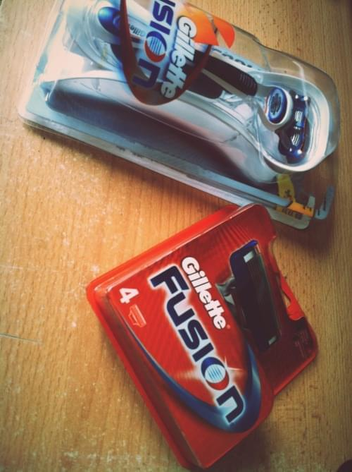

\_\_

## Good old bait and switch.

\_**\_**\_\_

## Volunteering for a rip off

After mulling over three blades, or five, aloe this strip, silky smooth rubber that strip, maye I should just get a [disposable razor](http://en.wikipedia.org/wiki/Razor "Razor") ... you finally pick something that looks like it might work. You fork over the 10 euro for a new razor and then 20 euro for a set of replacement blades ... ... and you vow not to make another purchase for at least a year. You'd rather suffer using the same blade for two or three months. No considerations of brand loyalty, no recollection of any marketing you saw on television, no other consideration than minimizing exposure to the purchase. When buying a computer all you want is an [Intel processor](http://en.wikipedia.org/wiki/List_of_Intel_microprocessors "List of Intel microprocessors") and a Nvidia graphics card. If it's portable and you can afford it, you want an Apple. And you cherish the purchase. You get excited when you buy something! With razor blades just walking into the store makes you feel ripped off. Maybe if they worked on that, they could get me in the store more often and increase the whole market - not just market share - would get bigger.

###### Related articles

- [Shaving company kickstarts business with hilarious viral video](http://www.digitaltrends.com/web/shaving-company-kickstarts-business-with-hilarious-viral-video/) (digitaltrends.com)
- [The Dollar Shave Club's pitch is smooth, and razor sharp](http://www2.macleans.ca/2012/03/20/shaving-sticker-shock-off-razors/) (macleans.ca)
- [Dollar Shave Club Punches Gillette Where It Hurts. (In the Marketing Budget)](http://pandodaily.com/2012/03/06/dollar-shave-club-punches-gillette-where-it-hurts-in-the-marketing-budget/) (pandodaily.com)
- [F\*\*\*ing Great Razors for Life?](http://gadgets.gunaxin.com/fing-great-razors-life/115512) (gadgets.gunaxin.com)

