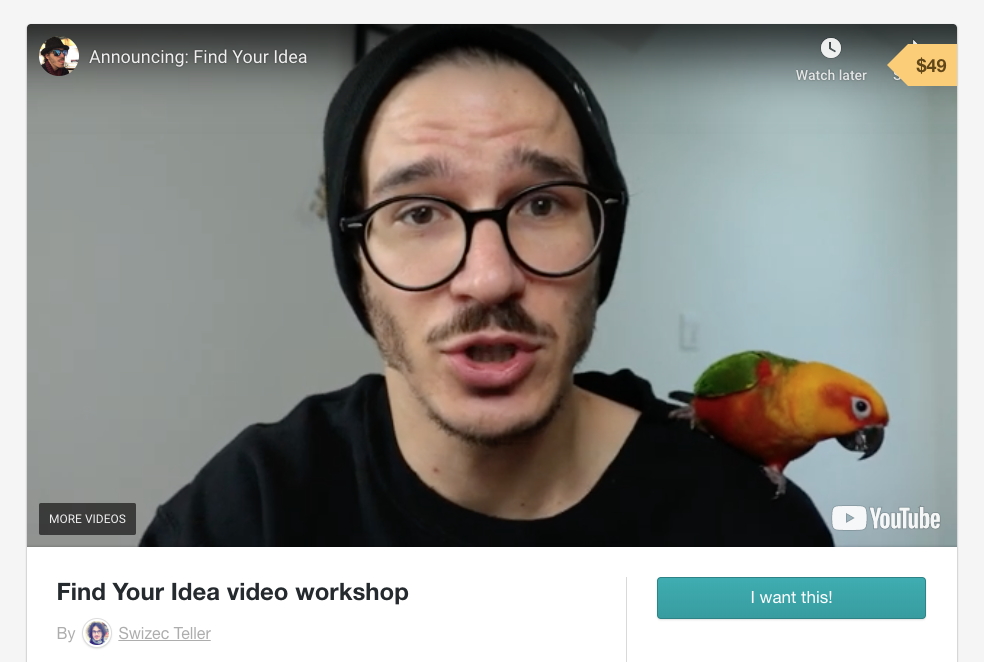

Derek Sivers once said that [ideas are just multipliers](https://sivers.org/multiply). Start with a bad idea and you&#x27;re gonna fail. Start with a great idea and with some luck and hard work, you&#x27;re gonna crush it.

> AWFUL IDEA = -1  
> WEAK IDEA = 1  
> SO-SO IDEA = 5  
> GOOD IDEA = 10  
> GREAT IDEA = 15  
> BRILLIANT IDEA = 20
>
> ---
>
> NO EXECUTION = $1  
> WEAK EXECUTION = $1000  
> SO-SO EXECUTION = $10,000  
> GOOD EXECUTION = $100,000  
> GREAT EXECUTION = $1,000,000  
> BRILLIANT EXECUTION = $10,000,000  
> **To make a business, you need to multiply the two.**

Derek Sivers was right  {{ subscriber.first_name | truncatewords: 1, &quot;&quot; | capitalize }}  my friend . You need a good idea for your hard work to be worth it.

Imagine pouring brilliant execution into a terrible idea 👉 minus \$10,000,000. Yikes 😬

We talked about that yesterday.

Frederic Tudor started with a _horrible_ idea – nobody wanted ice in the tropics. They didn&#x27;t even know what to use it for. But he developed that initial hunch into a _fantastic_ idea.

30 years later **everyone wanted ice**. He made a killing, created a whole new industry, and died a wealthy man.

So how do you know, if your idea is any good {{ subscriber.first_name | truncatewords: 1, &quot;&quot; | capitalize }}? How do you know whether it&#x27;s a dud or a slow hunch that just needs some love? Hell, how do you get over the _&quot;I don&#x27;t have an idea&quot;_ hump in the first place?

## Find Your Idea

[Find Your Idea](https://gum.co/fKfYf) is a short online workshop that teaches you how to source, classify, and validate your ideas _before_ you jump in and waste your time.

Worried you don&#x27;t have ideas? [Find Your Idea](https://gum.co/fKfYf) teaches you how to spot tens of ideas per week.

Worried you don&#x27;t have _good_ ideas? [Find Your Idea](https://gum.co/fKfYf) gives you a quick mental checklist.

Worried you&#x27;ll waste your time? [Find Your Idea](https://gum.co/fKfYf) shows you the framework I use to validate and stair-step ideas from investing 5 minutes to verify a hunch all the way to seeing if anyone will buy.

Don&#x27;t wanna start a business? [Find Your Idea](https://gum.co/fKfYf) helps you classify ideas into 3 buckets based on _&quot;What&#x27;s the goal of this one?&quot;_

Join this class and learn every mental model and quick hack I developed over the past 10 years of making money online and studying the bootstrapping greats that came before me.

[Find Your Idea](https://gum.co/fKfYf) happens on **May 10th at 1pm Pacific** and lasts about 2 hours. Structured as a workshop this isn&#x27;t just some boring lecture.

You&#x27;ll do exercises, answer questions, analyze other people&#x27;s ideas, and contribute your own. Walk away with a solid mental checklist that helps you qualify any idea in minutes, and a work sheet you can use to develop ideas in the future.

Can&#x27;t make it live? Don&#x27;t worry.

You&#x27;ll get the raw recording right after. After some editing [Find Your Idea](https://gum.co/fKfYf) will become a self-paced video workshop.

Join now and you get access. Wait and it&#x27;s 2x the price :)

So  {{ subscriber.first_name | truncatewords: 1, &quot;&quot; | capitalize }}  my friend , wanna learn a structured approach to creating and developing ideas? Join [Find Your Idea](https://gum.co/fKfYf).

Got questions? Hit reply

Cheers, ~Swizec

PS: I&#x27;m closing this on Friday ❤️
