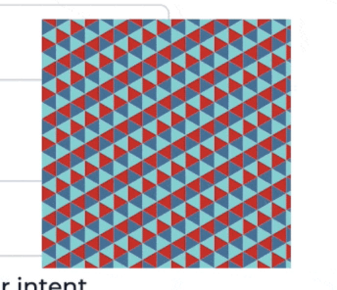

What's the most algorithmically fun code you've written recently? 🤔

Here's mine: A dataviz using a grid of triangles that fits into the client's logo.


Nearly broke my brain. It's good practice.

The dataviz represents your personalization score and attaches to any component that was personalized. Like a form dropdown that guesses your favorite option, or a landing page that chooses copy and pictures you're gonna like.

Each contiguous area of colored triangles represents a score. The number of triangles is proportional to the strength of that score.

The logo designer had a 20 page brief on how the logo is conceptually constructed out of equilateral triangles, can be reconstructed into many shapes, used for visual flourish with conceptual consistency across ... blah


Designers have their fun, engineers have ours.

How the heck do you build this? Are there formulas governing its shape? Where do the triangles come from? Can you cut it up into React components? What about an animated transition ... 🤔

## It starts with triangles

We started with a Codepen hacked in [Processing](https://processing.org/), a visual coding language.

[](https://codepen.io/willjrobinson-the-styleful/pen/NWjgXvE)

This was our playground. A place to explore the rules the grid, how the logo moves, and how far we can push before it starts to look like nothing.

Processing is a readable language, so getting the grid into JavaScript was easy 👉 translate the code.

I made a hook that creates a memoized list of triangles.

```javascript
function useTriangles({ triBase }) {
  const triHeight = (triBase / 2) * Math.sqrt(3);
  const cols = Math.ceil(DATAVIZ_WIDTH / triHeight);
  const rows =
    Math.ceil(DATAVIZ_HEIGHT / triBase) +
    Math.ceil((DATAVIZ_HEIGHT - triBase / 2) / triBase) +
    1;

  // create triangles, memoize
  const triangles = useMemo(
    () =>
      d3
        .range(cols)
        .map((col) =>
          d3.range(rows).map((row) => ({
            color: COLORS[(col + row) % 3],
            x: col * triHeight + triHeight * ((col + row) % 2),
            y: row * (triBase / 2),
            dir: Math.round(Math.pow(-1, row + col)),
          }))
        )
        .flat(),
    [triBase]
  );

  return { triangles };
}
```

`triangles` is a list of triangle objects with:

- `color`, the fill color to use
- `x`, the horizontal coordinate to render at
- `y`, the vertical coordinate
- `dir`, the left/right direction of where the triangle points

Flattening the grid into a list makes rendering easier. A single loop. Calculating `(x, y)` coordinates here makes the rest of your code simpler. Never think about the grid again ✌️

### Render each Triangle

Render each triangle as a `<polygon>` with a React component like this:

```javascript
const Triangle = ({ x, y, dir, color, base, height, index, ...rest }) => {
  return (
    <g transform={`translate(${x}, ${y})`}>
      <polygon
        fill={color}
        points={`${0},${0} ${height * dir},${base / 2} ${height * dir},${
          -base / 2
        }`}
      />
    </g>
  );
};
```

SVG polygons render from a list of `x,y` points. The math comes straight from your high school textbook.

You get a grid of colored triangles:



My final version adds a `useEffect` to animate each triangle independently. You can learn how that works over at [ReactForDataviz.com](https://ReactForDataviz.com).

## Carve out the logo

Michelangelo once said that creating a statue is easy – you look at the marble and cut away everything that isn't the statue. D'oh

Carving a shape out of your grid follows the same principle. Except there's a lot of math and it hurts your brain.

Sketches help.


I wanted a parametrized shape – thickness, proportions, the size of each triangle. More flexibility when it's time to visualize.

The final result may be the mathiest code I've ever written. There's edge cases where a combination of parameters breaks the shape, but overall works great.

https://twitter.com/Swizec/status/1427303347250372611

Edge cases documented as errors. Good enough 😇

```javascript
function useTriangles({ triBase, innerTriSide, thickness }) {
  // ...

  if (![2, 4, 8, 10].includes(triBase)) {
    throw "To avoid jagged edges, triBase has to be in [2, 4, 8, 10]";
  }

  if (![1, 3, 6, 7, 10].includes(innerTriSide)) {
    throw "To avoid jagged edges, the internal blank triangle needs to use sizes in [1, 3, 6, 7, 10]";
  }

  if (thickness % 2 === 0) {
    throw "To avoid jagged edges, thickness needs to be odd";
  }

  // ...
}
```

## The final dataviz coloration

You've got the list of colored triangles that make a shape. How do you turn this checkered mess into an organized visualization?


Remember when we turned the grid into a flat list earlier? That's gonna help us now.

You can think of this as a grouping problem – take N triangles for each data you want to represent. Iterate until you run out of triangles.

### Get the groups

D3 scales can calculate group size:

```javascript
const proportions = d3
  .scaleLinear()
  .domain([0, d3.sum(groupScores, (s) => s.str)])
  .rangeRound([0, coloredTriangles.length]);
```

A linear scale that maps `0` to `0` and `sum of all scores` to `number of triangles`. Everything between follows a linear function.

Means you can call `proportions(5)` to see how many triangles that should be. Using that, you go through your data and take N triangles off the grid for each.

```javascript
// take proportional triangles from coloredTriangles
// merge with score
const groups = groupScores.map((score) =>
  coloredTriangles.splice(0, proportions(score.str)).map((triangle) => ({
    ...triangle,
    ...score,
  }))
);

return groups.flat();
```

The `score` object has a color property that overrides each triangle's native color. Triangle color was for debugging.

You get a shape full of color groups.


### The .sort gotcha

Now that you're rendering the visually grouped list of triangles, the last step is a lateral thinking exercise. Like those experiments where you get a box of thumbtacks and a candle – attach candle to wall 🤨

Why do the color groups look like vertical slices?


Because triangles come from a grid! The double-loop goes column by column.

You have to sort those triangles before assigning to groups! 🤯

For groups that flow in a weird-shaped circle, you sort triangles by their angle around the center. Looking from the center of each triangle – the centroid.

[](https://en.wikipedia.org/wiki/Centroid)

D3 can calculate centroids for us. We'll need 2 – one for each direction of a triangle. Pretend they're at `(0, 0)`.

```javascript
(triCentroidRight = d3.polygonCentroid([
  [0, 0],
  [triHeight * 1, triBase / 2],
  [triHeight * 1, -triBase / 2],
])),
  (triCentroidLeft = d3.polygonCentroid([
    [0, 0],
    [triHeight * -1, triBase / 2],
    [triHeight * -1, -triBase / 2],
  ]));
```

Then you attach an `angle` to each triangle and sort.

```javascript
const coloredTriangles = triangles.triangles
  .filter((t) => t.color !== "transparent")
  .map((t) => {
    // grab pre-calculated triangle centroid
    const centroid = t.dir === 1 ? triCentroidRight : triCentroidLeft;

    return {
      ...t,
      // offset centroid by future (x, y) translation
      angle: Math.atan2(
        centroid[1] + t.y - center.y,
        centroid[0] + t.x - center.x
      ),
    };
  })
  // sort triangles in a circle around center
  .sort((a, b) => {
    return b.angle - a.angle;
  });
```

Remove transparent triangles, no need to render those, and use [`Math.atan2(y, x)`](https://en.wikipedia.org/wiki/Atan2) to get the angle in radians between the `center` of our dataviz and the `centroid` of a triangle.

The `.sort` function sorts our list of triangles by their angle. They're in a circle now.

Group as before and you get the final result – a beautiful dataviz that fits in a logo.


Wasn't that fun? It was even more fun to noodle out from scratch.

Point is: Use conventional tools for unconventional means.

Cheers,<br/>
~Swizec

PS: to solve the candle problem, you have to realize that _the box_ is an item separate from thumbtacks. You can use it as a shelf for the candle.
