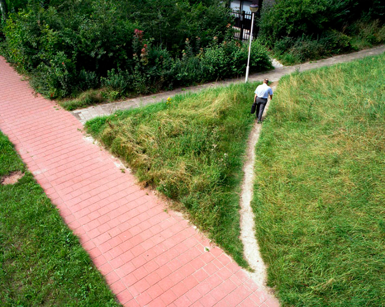

If nobody uses your abstraction, it's wrong.

Architects and urban planners call these [desire paths](https://www.theguardian.com/cities/2018/oct/05/desire-paths-the-illicit-trails-that-defy-the-urban-planners) – paths that develop _in spite of_ their best carefully planned designs. People walk where they want to, not where you tell them to.

Engineers do the same with code and users do it with your UI. Nobody cares about your beautiful vision \[name|], they just wanna get their work done. If your vision helps: great! If it doesn't: ignore.

## The bitter lesson

https://twitter.com/Swizec/status/1772312082295189859

The bitter lesson in software engineering is that messy fast iteration cycles beat careful upfront design. Inspired by the [bitter lesson in AI](http://www.incompleteideas.net/IncIdeas/BitterLesson.html) that the "throw more data at it" approach beats careful analysis and model building in the long-term.

"Beat" in this context means that fast iteration cycles deliver more working software faster. There's fewer bugs, users like using it more, and engineers find it easier to work with.

Yes that's not possible in every industry.

Medical devices and software are notoriously difficult to certify and require large upfront design costs. This is why consumers are starting to use [airpods over official hearing aids](https://www.seniorliving.org/hearing-aids/airpods/) – cheaper, easier to use, almost as good. And why there's an [entire DIY movement for insulin pumps](https://www.ncbi.nlm.nih.gov/pmc/articles/PMC7444403/) – consumers ain't got time to wait for your careful design and certification process. They want their problem solved!

This bitter lesson extends to all sorts of things you wouldn't expect.

The book [How Big Things Get Done](https://www.penguinrandomhouse.com/books/672118/how-big-things-get-done-by-bent-flyvbjerg-and-dan-gardner/) is all about how large scale projects benefit from fast iteration cycles and smaller more reusable designs. Think _"how do we use one of 5 bridge designs here"_ instead of _"how do we design the perfect bridge from scratch"_.

How Big Things Get Done posits that wasting time and resources on custom bespoke designs is how large projects fail. Better to take a known design off-the-shelf add a few iteration cycles, and get something good enough out there.

Yes you can't iterate on building a large bridge. That's what computer simulations and scale models are for. Shift left. Learn what's wrong earlier when it's cheap to fix.

But software is not a bridge. It's soft. We're always in the design stage! Iterate.

## Design your code like a park trail

99pi has a great episode on [how natural parks design trails](https://99percentinvisible.org/article/behind-scenery-subtle-art-crafting-public-wilderness-trails/).

Your favorite hiking path that naturally winds through the woods as if it's been there for eons? Designed! Someone built that for you. And made it look natural.

The trick trail designers use is to _start_ with desire paths. You look for where people and animals want to walk, then turn it into a path. Reinforce the footing, make it safer, add some structure so it lasts, make sure to divert any water that would erode the construction, then see what happens.

Next year you come back, see where people walked off the path or cut corners and make adjustments. If you can't make it safe, put a large boulder in the way so people naturally don't wanna go there. If it works, make it the new official path.

Use that same approach when writing your code.

### Build abstractions people want to use

Build a thing that works. See how it feels. Ask others how it feels. Observe.

Watch what people _do_ not what they _say_. Doesn't matter how much they all agree your abstraction is beautiful and elegant if they don't use it.

Sit back. Do less. Wait until patterns develop. Don't try to guess. When others suggest an abstraction say _"Let's wait a little, see what happens"_.

When it starts to hurt, when it becomes painfully obvious that you're doing the same thing over and over, _then_ you make an abstraction. Take what everyone's already doing and make it official. Make it painless.

That's a winning abstraction. A rickety desire path made sturdy, easy to use, and well maintained.

Do that and you'll notice people naturally reaching for your abstraction. You put the abstraction where they're looking! No need for education, no need for grand announcements. Just the perfect abstraction exactly where it needs to be.

When your abstraction grows new desire paths, improve further. Iterate.

Cheers, 
\~Swizec
