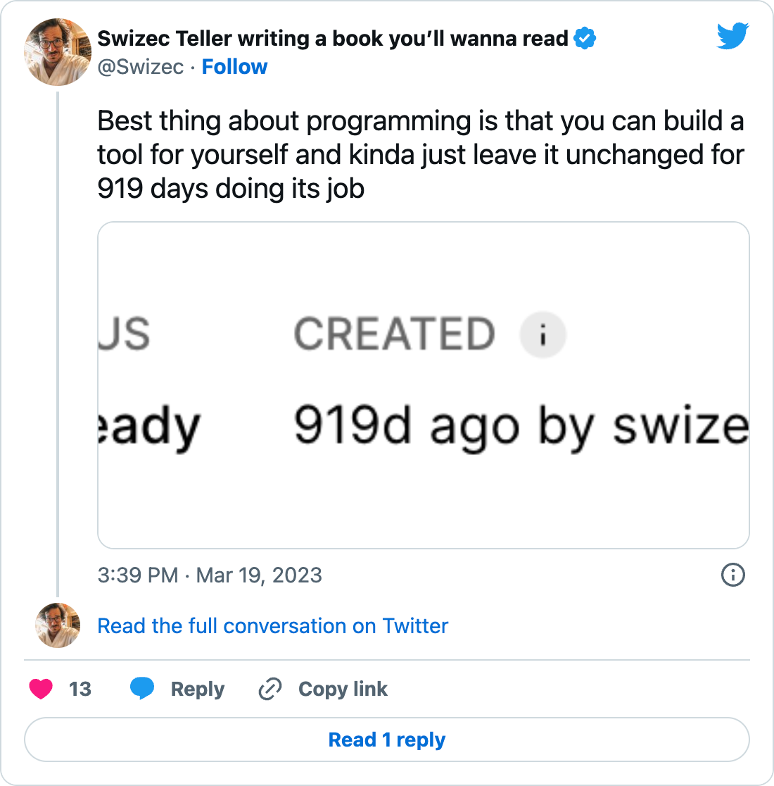
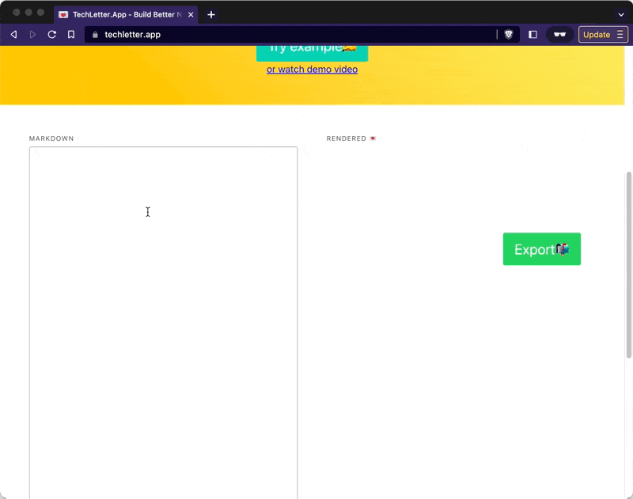
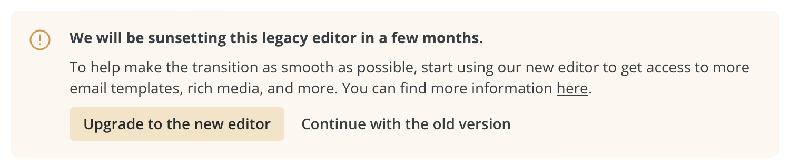

The extra space is no more! All fixed. Here's a little backstory that I hope inspires you to build more tools for yourself.

[](https://twitter.com/Swizec/status/1637584633671061504)

Back in 2018, I built [TechLetter.App](https://techletter.app) as part of a 24 hour challenge to build and launch an app. I wanted an easy to way to turn markdown into shippable newsletters and thought others might too.



They did not. TechLetter.App turned into the perfect example of Robin Sloane's [An app can be a home-cooked meal](https://www.robinsloan.com/notes/home-cooked-app/). Gets about 30 visits per month. Mostly from me.

I can't imagine living without this tool and ConvertKit's banner that they're sunsetting the old editor with a `Paste HTML` option fills me with dread.



May have to change email providers over this 😅

## How it works

TechLetter.App was one of the case studies peppered into [Serverless Handbook](https://serverlesshandbook.dev).

It takes markdown, uses the [unist ecosystem](https://github.com/syntax-tree/unist) to parse the input, pass it through a chain of custom plugins, and spit out a bunch of React components. The `Export` button then takes the raw HTML from the parent node of the rendered document.

Plugins do the hard work. Some make calls to [serverless functions that take screenshots](https://swizec.com/blog/serverless-chrome-on-aws-lambda-the-guide-that-works-in-2019-and-beyond/), others transform text to other text.

The [core business logic](https://github.com/Swizec/letter-builder/blob/master/src/utils/useRemark.js#L21) looks like this:

```javascript
remark()
    .use(urlThumbnail, {
        domains: [
            "m.twitter.com",
            "twitter.com",
            "youtube.com",
            "youtu.be",
            "instagram.com",
            "codesandbox.io",
        ],
    })
    .use(twitterUserLinks)
    .use(codeScreenshot)
    .use(githubLinks)
    .use(remarkGiphySearch)
    .use(remarkNameOrFriend)
    .use(remarkSparkJoy)
    .use(remark2react, {
	    // ...
```

A chain of syntax tree transformations. Each `.use()` accepts a [Remark plugin](https://swizec.com/blog/how-to-build-a-remark-plugin-to-supercharge-your-static-site/) that transforms the syntax tree.

## The space-after-name bug

Yes many readers complained about the extra space since I added the feature in August 2020. About one per quarter. It never quite made the priority list 😇

I use a custom bit of markdown syntax – `[name|something else]` – to inject your name into the email. If the system knows your name, it uses that, otherwise the `something else` part.

That happens via liquid syntax that ConvertKit and most other emailing systems understand. My custom Remark plugin finds the weird markdown syntax and turns it into liquid syntax.

Like this:

```javascript
const nameOrFriend = /^\s*name\s*\|(.*)$/;

export function remarkNameOrFriend() {
  return (tree) => {
    visit(tree, "linkReference", (node, index, parent) => {
      if (node.label.match(nameOrFriend)) {
        node.type = "text";

        node.value = node.label.replace(
          nameOrFriend,
          ' {{ subscriber.first_name | truncatewords: 1, "" | capitalize }}  $1 '
        );
        node.children = null;
      }
    });
  };
}
```

Can you spot the bug?

It's right here:

    ' {{ subscriber.first_name | truncatewords: 1, "" | capitalize }}  $1 '

That has spaces between the liquid tags 🤣

Needs to be:

    '{{ subscriber.first_name | truncatewords: 1, "" | capitalize }}$1'

And that's the bug that took me 919 days to fix.

Cheers,<br/>
~Swizec

PS: getting this deployed was an ordeal because _software breaks when you change it_. But that's a post for another day
