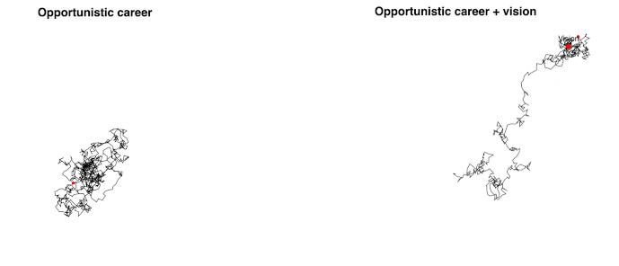

As we enter the funny week-without-time between Christmas and New Year, it's a great time to reflect. Here's a framework I like to use.

I start with an **Aspirational Vision**: _"If you were reading this twenty five years from today, and reflecting on the events of those twenty five years, what has to have happened in your \[insert area] for you to feel successful?"_

The areas are:

- business/work,
- health,
- relationships,
- other

You have to make space for health and relationships or nobody will. They're fuzzy and hard to measure so it's easy for business, work, and other distractions to spill all over and take control of your life. The [jar of sand analogy](https://eloquentlykate.com/2017/02/05/lessons-from-a-jar-rocks-pebbles-sand-and-coffee/).

Next I like to write down a **25-year vision**.

This sounds similar to the aspirational vision but it's more practical. What kind of person achieves those dreams? What do you have to do on a day-to-day, week-to-week, etc basis to get there? Is this a life you even want to live?

Just a little bit of vision helps you go far.

The first time I wrote my aspirational and 25-year visions was hard and cringey. That's a good sign. Means you're speaking from the heart and digging deep.

Now every year I review those visions and ask **_"Is this still a game I want to win?"_**.

Don't play games you don't think are worth winning. If the life you lead no longer aligns with the person you wish to become, make a change. Focus on [infinite instead of finite games](https://www.simonandschuster.com/books/Finite-and-Infinite-Games/James-Carse/9781476731711). The goal is to keep playing – the longer you can play, the more likely you are to win.

When you reflect, it's important to write things down. Writing forces clarity. You don't have to publish or show this to anyone. You'll read it next year and ask _"Was I playing games I want to win or did I get distracted by shiny objects?"_

Good luck and happy holidays 🎄 Enjoy the cringe of giving voice to your hopes and dreams.

My game right now is to build a billion dollar startup. We're close, it's exciting. Been dreaming of this since high school.

What's your game? Hit reply

\~Swizec

PS: every quarter or so is a good cadence to look at your vision and write a tactical plan around business/work, health, relationships, and other for the next quarter. Helps you adjust and respond
