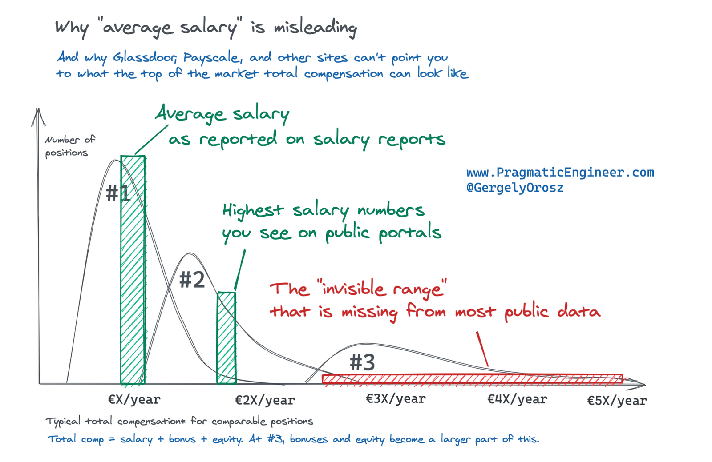
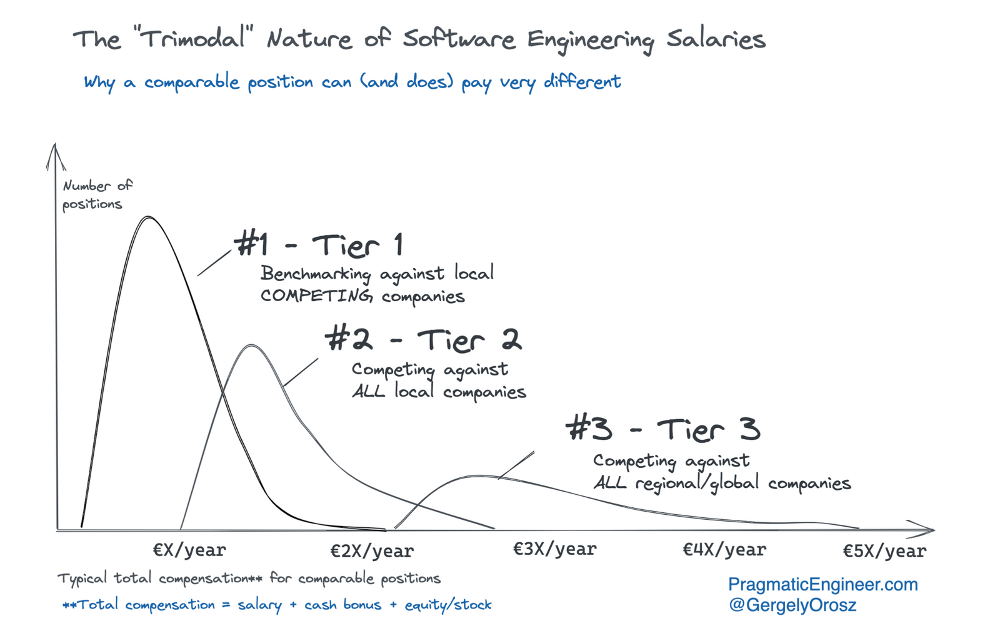

import { ContentUpgrades } from "@swizec/gatsby-theme-course-platform";

Back home the programming community used to run a salary poll on Facebook every year. How much do you make, what do you do?

This was in Slovenia a few years back – smaller numbers than you'd see online now. Some said €20,000 was the most an engineer could dream of, others that they wouldn't get out of bed for anything under €50,000 and €100,000+ sounds reasonable with some hustle.

Both groups yelling at each other that the other group doesn't exist. There is no way in hell an engineer could get paid lots! What do you mean you'd work for peanuts are you dumb??

The same fight every year!

You see this everywhere engineering salaries are shared. Distinct groups of people, doing the same work, paid on such vastly different scales they can't even imagine each other existing.

What do you think is going on here? 🤔

## The trimodal nature of engineering comp

In 2021 [Gergely Orosz collected data on engineering salaries](https://blog.pragmaticengineer.com/software-engineering-salaries-in-the-netherlands-and-europe/) and found that compensation is trimodal. What you see reported as averages, top of range on public portals, and an invisible range of high achievers and IPO lottery winners.

This is where my friend Josh, a salary negotiation coach, casually drops in chat _"Oh yeah we negotiated $800,000 more equity"_. You what now 😳

All these engineers have roughly the same work. Write code, have meetings, investigate bugs, [build company assets](https://swizec.com/blog/why-engineers-are-worth-so-much/), help others. Yet some get paid way more than others.

What gives?

## What you do matters less than who it's for

Early in 2021 a contractor helping with my websites took my advice and changed his day job from a local Italian enterprise to Automattic, the company behind Wordpress. His pay went from €28,000 to €116,000 overnight.

https://twitter.com/Swizec/status/1412900575126032387

He no longer has time to contract for me 😅

And instead of spending his days with an outdated in-house framework, he's learning transferable skills. How many companies would hire someone with deep Wordpress expertise? It runs [39% of all websites](https://www.searchenginejournal.com/wordpress-powers-39-5-of-all-websites/391647/) ...

Similarly, [I changed jobs](https://swizec.com/blog/how-to-grow-as-a-senior-engineer-or-why-i-got-a-new-job/) early in the pandemic and after a few comp adjustments now make $75,000/year more than before the pandemic. Cash.

https://twitter.com/Swizec/status/1454910488635068422

The equity could be anywhere from $0 to $millions in 10 years. We'll see 🤷‍♀️

<ContentUpgrades.SeniorMindset />

## Your comp is based on value

Gergely puts the difference down to competition.

**Tier 1** firms compete with local firms in the same industry. **Tier 2** firms compete with all local firms. **Tier 3** firms compete for talent globally and hire anyone who's good enough.

The pandemic accelerated this trend.

With remote work, every tier 1 company _has to_ compete with tier 3 for talent. That's pulling up the market for everyone.

The reason tier 3 companies can compete for global talent is the value you bring. Think about it.

How much can a $10,000,000/year company pay its 10 engineers? What about a $10,000,000,000/year company with 50 engineers?

Alphabet (Google) makes $1,650,000 per employee according to Wikipedia. Apple's quarterly profits are higher than Slovenia's annual GDP. Facebook can [lose $45,000,000,000 in stock value from a 6 hour outage](https://techcrunch.com/2021/10/04/facebook-stock-falls-as-global-outage-continues/).

How much salary do you think the engineers worth $7.5bn/hour can ask for?

What you do matters a lot less than the value you bring.

https://twitter.com/Swizec/status/1486104593587134469

## Is tier 3 all about company size?

You may think tier 3 companies are all about size. Large enterprise, huge profits -> tier 3.

Not so!

It's a mindset. A competitive strategy. The company has to _decide_ it wants to hire the best. Then it needs to attract the best and keep you happy.

The combination of company and personal growth, salary, exciting challenges, [brand building](https://swizec.com/blog/try-to-work-for-a-brand/), coworkers you can learn from, and good work environment all contribute. Tier 3 companies want you to be happy, challenged, and growing.

To them, you are an investment, not a cost.

Cheers, 
~Swizec
