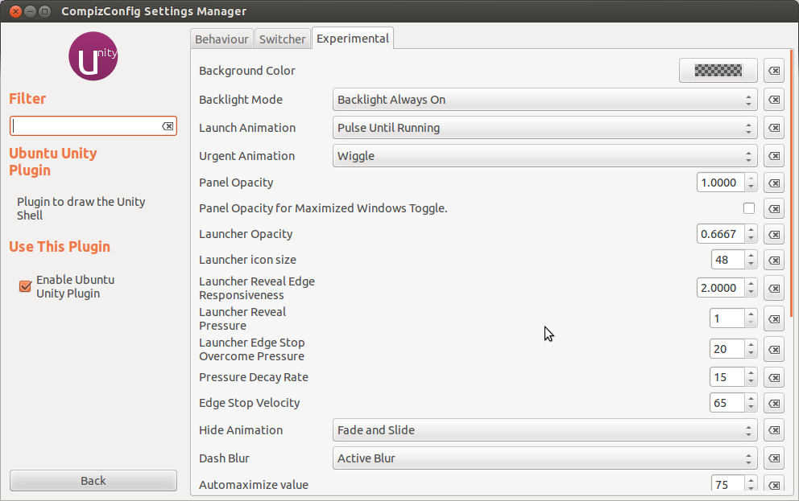

> Sales went up, but positive feedback went down.

**\*\*\*\*\_\_****\_\_**

###### Related articles

- [Screw the power users](http://nick.typepad.com/blog/2012/05/screw-the-power-users.html) (nick.typepad.com)
- [The debate over share buttons on blogs](http://rc3.org/2012/05/30/the-debate-over-share-buttons-on-blogs/) (rc3.org)
- [Sandboxing will 'disadvantage Mac users,' say developers](http://www.macworld.com/article/1166997/sandboxing_will_disadvantage_mac_users_say_developers.html) (macworld.com)
- [Zemanta Power User - Stuart Aken](http://www.zemanta.com/blog/zemanta-power-user-stuart-aken-2/) (zemanta.com)
- [Are You A Facebook Power User? New Chart Will Tell You The Answer](http://www.simplyzesty.com/facebook/are-you-a-facebook-power-user-new-chart-will-tell-you-the-answer/) (simplyzesty.com)
- [Beta testers wanted for our new iOS app](http://blog.inklingmarkets.com/2012/05/beta-testers-wanted-for-our-new-ios-app.html) (inklingmarkets.com)

