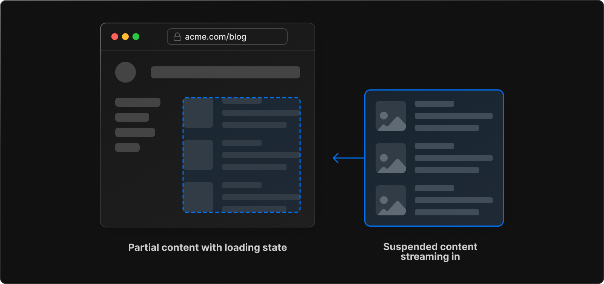

Wanna see something cool? React is getting native async support _and you can already try it out_ 😍

This will soon work anywhere:

```javascript
const ShowData = async () => {
  const res = await fetch("/data-source")
  const json = res.json()

  return <p>{json.text}</p>
}
```

Note the `async` React component, the `await` in its body, the complete lack of any loading states, effects, hooks, or libraries. It just works. You can use this component anywhere in your tree – even in a component that isn't itself async!

This is part of React's [RFC: First class support for promises and async/await](https://github.com/reactjs/rfcs/pull/229). A next step from React Suspense, which I wrote about in [React 18 and the future of async data](https://swizec.com/blog/react-18-and-the-future-of-async-data/).

The goal is to make React Suspense easier to use. It worked!

[](https://www.scholarstream.ai)

## You can use async React in NextJS 13

Right now the best way to try React's experimental support for promises is with [the beta side of NextJS 13](https://beta.nextjs.org/docs) – the `/app` directory. I used it to build [ScholarStream.ai](https://ScholarStream.ai) and it feels weird, but works great.

You can [see my full code on GitHub](https://github.com/Swizec/ScholarStream.ai).

The `/app` directory embraces [Server Components](https://reactjs.org/blog/2020/12/21/data-fetching-with-react-server-components.html) – React components that render on the server and send plain HTML over the wire. No client-side JavaScript! Every re-render goes back to the server.

Now I hear you thinking _"But Swiz, that's slow as shit!? Didn't we invent single-page-apps because roundtrips to the server take too long??"_

Yes, we did. Servers have come a long way since then.

My understanding is that Vercel, the company behind NextJS, uses extensive Serverless and Edge function shenanigans to run the tiniest possible server as close as possible to the user to render each component. Like Remix, they need a custom compiler built into NextJS to make this work smoothly.



When a server component needs to render, a new function spins up _for just that render_. With the right config (and payment tier), that function runs on a CDN-like platform that aims for low latency. The function then returns _just that component's HTML_ and NextJS replaces the right section of your UI in the browser.

I don't know how possible/easy it is to do this without Vercel. In theory NextJS is a standalone framework that toooootally works fine without Vercel.

Yes that means that even with server components there's plenty of client-side JavaScript left. But there's less :)

## What async React looks like with beta NextJS

Again, full code on GitHub 👉 <https://github.com/Swizec/ScholarStream.ai>. See it in action 👉 [ScholarStream.ai](https://ScholarStream.ai)

The base case is to use NextJS 13's new opinionated `/app` structure:

- `page.tsx` for the page
- `layout.tsx` for the static layout
- `loading.tsx` for the loading state


### page.tsx

[Page components](https://beta.nextjs.org/docs/routing/pages-and-layouts#pages) are always server components. NextJS renders on the server, caches the result, and returns.

```typescript
// app/[route]/page.tsx
export default async function Home() {
  return (
    <main className={styles.main}>
      <Pitch />

      <h2>Read about:</h2>
      <TopicsList />

      {/* @ts-expect-error Server Component */}
      <Feed topic="cs.AI" count={5} isLast />
    </main>
  )
}
```

You need to tell TypeScript to expect an error when using `async` (server) components inside a JSX tree. It works, but types don't know about it yet. The NextJS team is working on getting that updated upstream.

`<Feed>` in this case is the component that performs async data loading. NextJS seamlessly handles that no fuss.

### layout.tsx

[Layout components](https://beta.nextjs.org/docs/routing/pages-and-layouts#layouts) tell NextJS what to _always_ render around your page. When you nest subdirectories to make complex routes, their layouts also nest.

```typescript
// app/[route]/layout.tsx
export default function RootLayout({
  // Layouts must accept a children prop.
  // This will be populated with nested layouts or pages
  children,
}: {
  children: React.ReactNode
}) {
  return (
    <html lang="en">
      <Script
        src="https://plausible.io/js/script.js"
        data-domain="scholarstream.ai"
      />
      <body>
        <nav className={styles.topNav}>
          <Link href="/about">About</Link>
        </nav>
        {children}
        <div className={styles.footer}>
          built with reckless abandon by <a href="https://swizec.com">Swizec</a>
          <br />
          Thank you to arXiv for use of its open access interoperability.
        </div>
      </body>
    </html>
  )
}
```

### loading.tsx

The [loading component](https://beta.nextjs.org/docs/routing/loading-ui) renders while waiting for the page component's promise to resolve.

```typescript
// app/[route]/loading.tsx
export default function PageLoading() {
  return (
    <main className={styles.main}>
      <FeedLoader />
    </main>
  )
}
```

An interesting challenge here is that I couldn't find any open source React spinner components that worked. The animation wouldn't fire 🤨

## Loading data

Loading data is the typical example of a slow operation that requires promises. But [you can use the same techniques for anything](https://swizec.com/blog/you-can-use-react-query-for-slow-computation-not-just-api/).

Like with React Query, the recommendation is to load data close to where it's used. Same component is best. You can think of it as declaring a data dependency in your component and letting React and NextJS handle the details.

For example, here's how I load an [arXiv feed](https://arxiv.org):

```typescript
// loads list of articles
// renders in a loop
export const FeedInnards = async (props: FeedProps) => {
  const { offset = 0, count = 10 } = props

  let feed: arxiv.ArxivFeed
  let papers: arxiv.ArxivFeedItem[]

  try {
    feed = await arxiv.getFeed(props.topic)
    papers = feed.items.slice(offset, count)
  } catch (e) {
    console.error(e)

    return (
      <>
        <p>Error loading feed. Try one of these topics instead:</p>
        <TopicsList />
      </>
    )
  }

  return (
    <>
      {papers.map((paper) => (
        // @ts-expect-error Server Component
        <FeedItem paper={paper} key={paper.link} />
      ))}
    </>
  )
}
```

Notice the `await` in the body of that component, that's the shiny new toy! React/NextJS shows a loading state while this component's promise is pending. You don't have to deal with that 😍

You do have to write your own try/catch logic, however, because [error boundaries](https://reactjs.org/docs/error-boundaries.html) don't work with async components. Yet?

### Extended fetch with caching

The data fetching behind my `<FeedInnards>` component looks like this:

```typescript
export async function getFeed(category: string): Promise<ArxivFeed> {
  const parser: Parser<Omit<ArxivFeed, "items">, ArxivFeedItem> = new Parser()
  const feed = await fetch(
    `http://export.arxiv.org/rss/${category}?version=1.0`,
    {
      next: { revalidate: TEN_HOURS },
    }
  ).then((r) => r.text())

  try {
    const parsed = await parser.parseString(feed)
    return parsed
  } catch (e) {
    throw new Error("Could not parse feed")
  }
}
```

Fetch RSS feed from arXiv using a standard `fetch()` then parse with an RSS parser. Nothing crazy.

But notice the extra params in that fetch call:

```typescript
await fetch(`http://export.arxiv.org/rss/${category}?version=1.0`, {
  next: { revalidate: TEN_HOURS },
})
```

NextJS [adds a custom param to fetch()](https://beta.nextjs.org/docs/api-reference/fetch) that lets you specify a caching behavior. You can enable/disable the cache and specify revalidation behavior.

In my case, the app fetches a fresh feed every 10 hours. Reload the page before then and you'll get a stable result with no loading indicators. Cache is stable across users and most visitors get a fast nearly static page.


It's unclear to me _where_ that cache lives. Is this something that works with NextJS or just with Vercel? 🤔

### Cache without fetch for 3rd party libs

When you don't control the underlying API call (like with a library), you can cache results using [the new `React.cache()` method](https://beta.nextjs.org/docs/data-fetching/caching#per-request-caching). Useful for any slow operation because it works on functions that return promises rather than hooking into `fetch()` itself.

For example when I'm [using OpenAI to create summaries](https://swizec.com/blog/building-apps-with-openai-and-chatgpt/):

```typescript
const getSummary = cache(async (paper: arxiv.ArxivFeedItem) => {
  const summary = await openai.getSummary(paper)
  return summary
})

const PaperSummary = async (props: { paper: arxiv.ArxivFeedItem }) => {
  const summary = await getSummary(props.paper)

  return <p>{summary.choices[0].text}</p>
}
```

Going hard on the idea that _"You should load data close to where it's used"_, I have a component that gets a `paper`, calls OpenAI to summarize, and renders a single paragraph.

The OpenAI call is wrapped in `cache()` to increase performance. For cost optimization I use additionally Redis caching on top. More on that another time :)

## Custom Suspense boundaries

Page level loading states are great, but you may want more fine-grained control. Or to load components in parallel with optimistic first-come rendering.


You do that with `<Suspense>` boundaries.

For example, when you know the summary portion of a `<FeedItem>` is slower than the rest:

```typescript
const FeedItem = async (props: { paper: arxiv.ArxivFeedItem }) => {
  const { paper } = props

  // ...

  return (
    <div className={feedStyles.item}>
      // ...
      <Suspense fallback={<RingLoader color="blue" loading />}>
        {/* @ts-expect-error Server Component */}
        <PaperSummary paper={paper} />
      </Suspense>
      <div>
        Full paper at 👉{" "}
        <a href={paper.link} className={feedStyles.linkPaper}>
          {paper.title.split(/(\(|\. \()arXiv/)[0]}
        </a>
      </div>
    </div>
  )
}
```

Using the `<Suspense>` boundary is like telling React to _"Render the `<FeedItem>` component, but show a `fallback` state while promises inside this part of the component tree are pending"_.

The suspense boundary will capture every promise in its children. You don't have to coordinate anything.

You can pepper suspense boundaries wherever it makes sense for your app. Even the page level loading state is a suspense boundary under the hood.

## Final thoughts

I love it! Async React is going to simplify a lot of my code.

But I'm worried that this will be hard to implement outside NextJS and Vercel. We'll see.

Cheers,<br/>
~Swizec

PS: the [beta docs for NextJS 13](https://beta.nextjs.org/docs) are fantastic
