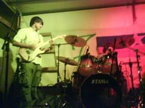

On Monday I went to a little place called Prebold in order to see one of the early performances of the band called Azone. I&#x27;m told it&#x27;s the first with this lineup ... after just five rehersals. Good on them I guess.

The band claims their playing was terrible, that it was slow, full of mistakes and downright rotten. But I guess that&#x27;s for them to know, personally I found it enjoyable and really good. Maybe because I&#x27;ve not heard their playing properly? Who could tell really.

