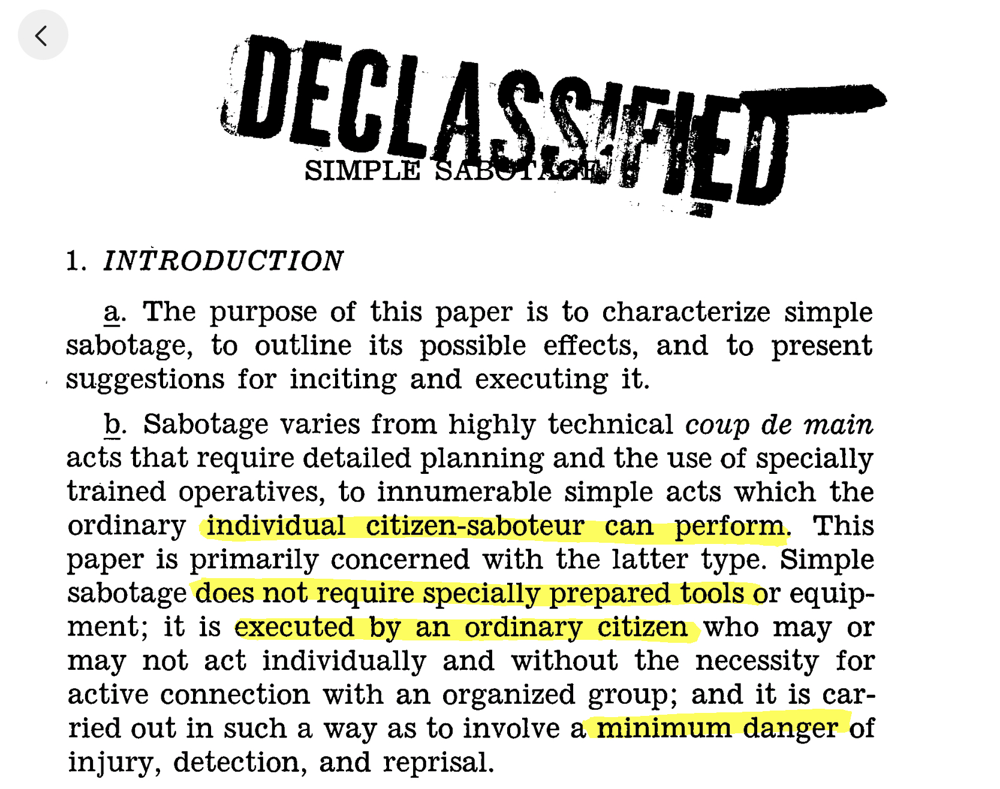
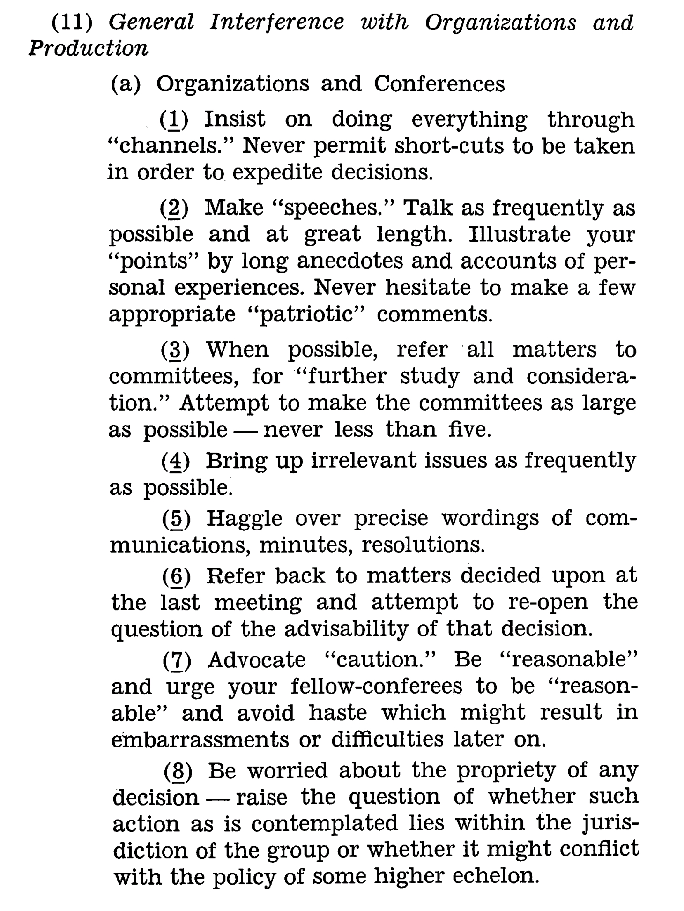

The [CIA Simple Sabotage Manual](https://swizec.com/pdfs/SimpleSabotageFieldManualStrategicServicesProvisional.pdf) talks about little things you can do day-to-day to sabotage an effort. Each on its own looks silly and pointless, but over weeks and months they add up to war-winning delays.

No I'm not kidding. This was a legit tactic used during WW2 to help get civilians in occupied territories involved in the war effort in a way that doesn't put them in danger.

All you gotta do is be lazy a little. Use a dull saw, make mistakes, put decisions off until tomorrow. Create drag.

_PS: you can [read and share this online](https://swizec.com/blog/be-action-oriented/)_

## Little delays add up

As Fred Brooks said in [The Mythical Man-Month](https://en.wikipedia.org/wiki/The_Mythical_Man-Month)

> Delays happen one sick day at a time.

Not because there's anything wrong with taking a sick day. Because you send an email to Jane but she's out so you email Mike but he doesn't know what he's talking about so you wait for Jane to come back and then she asks Mike for a detail she forgot but now Mike's out and then ...

You might recognize this page from the [Simple Sabotage Manual](https://swizec.com/pdfs/SimpleSabotageFieldManualStrategicServicesProvisional.pdf) as the perfect ~~description~~ caricature of corporate life.

Sound like a meeting you've had? 😉

When I showed this page at a workshop in New York that's when the phones came out and the pens started flying. It struck a chord.

And it's easy to do these by mistake! I'm prone to speeches and analogies, for example. It just happens when the caffeine kicks in and someone's gotta stop me. I'm happy that they do.

The simple sabotage manual continues with more great suggestions like:

- demand everything in writing
- hold meetings when there's more important work to do
- multiply paperwork
- apply all rules to the last letter
- work slowly
- invent interruptions
- never pass on your skill

## Little actions speed things up

_"But Swiz, I would never do these things don't be silly"_ I hear you say. But we all do. Every day. Without even noticing.

It's that story you move to done first thing tomorrow instead of last thing today. It's the code review you leave until you're done with lunch instead of taking 5min right after standup. It's the gnarly local environment issue you spend 2 hours resolving and don't tell anyone so they can't fix it globally.

[Work in progress kills your progress](https://swizec.com/blog/workinprogress-kills-your-progress/). And the devil is in those little details. Can your PM in a different timezone validate your work before you even get started or does she have to wait until you deploy first thing in the morning?

We can talk about theory of constraints and fancy [project management techniques](https://swizec.com/blog/how-to-own-projects-like-a-senior-engineer/) all day, but here's the only thing that matters in the end:

- [close PRs](https://swizec.com/blog/how-we-made-the-best-burndown-chart-youve-ever-seen/)
- ship code
- _finish_ things
- [decide fast](https://swizec.com/blog/a-mental-framework-that-helps-you-code-faster/)

_This_ PR is not the final stage. You can fix things later. _This_ code won't make or break your reputation. Hit deploy, see what happens. _This_ tiny detail won't matter, if the big thing's not done. Finish the task, create a follow-up story. _This_ decision won't kill the company. Make a bet and move on.

Getting feedback on 90% of the work beats waiting 2 days to get feedback on 100%. You can do the other 10% while you wait ;)

And never be afraid to make a low-risk decision. [Be a good partner](https://swizec.com/blog/own-the-outcome-not-the-work/)

Cheers, 
\~Swizec
