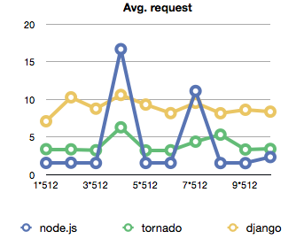
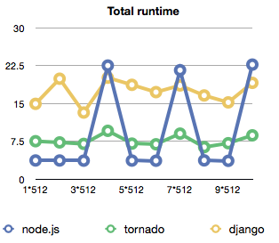
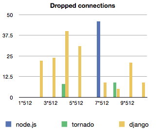

This is a continuation from the last time [I benchmarked node vs. clojure for hard computation](http://swizec.com/blog/comparing-clojure-and-node-js-for-speed/swizec/1593 "Comparing clojure and node.js for speed"), sort of. This time &#x27;round I decided to benchmark how many concurrent requests a single process of technology X can handle. Threading is fine. tl;dr ---&gt; node is fast but a bit unpredictable, django fails a lot, tornado is mediocre Clojure isn&#x27;t included in this test because it isn&#x27;t your average web backend technology and I honestly didn&#x27;t feel like figuring out how to set it up to act as a server ... yes, I know it&#x27;s possible, no, I do not in fact know how to do it. I imagine jetty or tomcat would be the way to go. There are two very \\important server-side languages that I omitted. Ruby and PHP. [Ruby](http://www.ruby-lang.org/ "Ruby (programming language)") \[on Rails], is missing simply because I don&#x27;t know it well enough to implement the test in. There are varied mostly personal and silly reasons as to why this is, but the fact remains. I don&#x27;t know Ruby. [PHP](http://www.php.net/ "PHP") ... This isn&#x27;t because I personally hate PHP (I do), I tried very very very hard to get it working for this test, but it just would not cooperate. I spent as much time trying to get PHP to _run_ as getting all the other benchmarks coded and tested. Not sure why exactly php-fpm hates me, or why it hates nginx, or maybe they&#x27;ve ganged up on me and hate me in unison, but it just did not work. I give up. After it finally looked like it might work it would just vomit 404 errors rather than actually run anything ... yes, I double, tripple and quintoople checked my paths. Either way, I ended up testing node.js and django, then just because the whole test is a bit unfair to django, I added Tornado, which is supposed to work a bit more the same way as node is. Onward to the test!

## The [Benchmark](http://www.benchmark.com/ "Benchmark Capital")

Because this test would be completely invalid if each request didn&#x27;t perform some even remotely real work I went with this flow:

1. Read a [JSON](http://json.org "JSON") string from raw post data
2. Parse the JSON
3. JSON is in the form of {key: &amp;lt;something&gt;, value: &amp;lt;something&gt;}
4. Read the value stored at _key_ from [Redis](http://redis.io/ "Redis (data store)").
5. Store the value to key on Redis
6. Return what was read from Redis

That&#x27;s basically what happens on every request. The idea being that in real life this is some sort of [REST](http://en.wikipedia.org/wiki/Representational_State_Transfer "Representational State Transfer") API running somewhere, the essential tasks being parsing JSON and reading/storing to a database that is possibly an intermediary between the world-facing server and some sort of more real database (like mongo, mysql or whatever). As mentioned, I went to great pains to make sure every technology ran as a single process because otherwise it&#x27;s a rather pointless test. Add very many processes, some load balancing and you can pretty much scale infinitely as long as the hardware allows it. So that&#x27;s silly.

## The Running

All the benchmarks ran on my MBP, with 4GB of RAM and a 2.5GHz core 2 duo. There were some other apps running, but they were the same every time the benchmarks ran and I didn&#x27;t touch the computer during the test, so hopefully that didn&#x27;t influence the result. Everything was run with a set of two scripts (written in node.js). The first spawned processes, one to ten, of which every process made 512 concurrent requests to the server. Or as concurrent as async.map is, I imagine it might be bucketed a little. Every spawned process measured the time it took for requests to finish and returned an average of the times. The main script then calculated the average of these averages, while also measuring the total time taken to run all the requests. When requests failed, the spawned process couldn&#x27;t output an average time, so it was taken to be 10. There were more errors than I originally anticipated (dropped connections mostly) so there is also a graph of the fails. The main script went from 1 sub-process to 10 in one go and the server was not restarted in the mean time. Between every batch there was a two second delay to let everything cool off a bit. When a new benchmark was run the redis server was restarted and flushed of all content. edit: django was run with runfcgi, as per the [django docs recommendations](http://docs.djangoproject.com/en/1.3/howto/deployment/fastcgi/) on running it behind nginx.

## The Code

You can see the rest of the code [on github](https://github.com/Swizec/random-coding/tree/master/serverbench). I&#x27;ll just share the relevant server bits here so we can compare how much code it takes to make this sort of thing in different environments. Node:

```
var redis = require('redis').createClient(),
    http = require('http');

http.createServer(function (req, res) {
    var data = '';
    req.on('data', function (chunk) { data += chunk });
    req.on('end', function () {
	var input = JSON.parse(data);

	redis.get(input.key, function (err, value) {
	    redis.set(input.key, input.value, function (err) {
		res.writeHead(200, {'Content-Type': 'application/json'});
		res.end(value);
	    });
	});
    });
}).listen(8124, '127.0.0.1');
```

[Django](http://www.djangoproject.com "Django (web framework)"):

```
from django.http \import HttpResponse

\import json, redis

r = redis.Redis(host='localhost', port=6379, db=0)

def bench(request):
    data = json.loads(request.raw_post_data)
    value = r.get(data['key'])
    r.set(data['key'], data['value'])

    return HttpResponse(value)
```

Tornado:

```
\import tornado.ioloop
\import tornado.web

\import json, redis

r = redis.Redis(host='localhost', port=6379, db=0)

class MainHandler(tornado.web.RequestHandler):
    def get(self):
        self.write("Hello, world")

    def post(self):
        data = json.loads(self.request.body)
        value = r.get(data['key'])
        r.set(data['key'], data['value'])
        self.write(value)

application = tornado.web.Application([
    (r"/", MainHandler),
])

if __name__ == "__main__":
    application.listen(8124)
    tornado.ioloop.IOLoop.instance().start()
```

As you can see I tried to make sure nobody would be making too many connections to redis because that&#x27;s a waste of time.

## The Results

The most surprising thing I discovered is just how little effect piling on load has on all of the technologies involved. The average time for handling a request between 512 requests and 5120 is pretty much the same throughout. Even the rate of dropped requests doesn&#x27;t seem to follow a really discernible pattern. Maybe I just didn&#x27;t push hard enough, then again, 8 seconds average on django ... that&#x27;s just horrible. Some shiny graphs: \[caption id=&quot;&quot; align=&quot;alignnone&quot; width=&quot;343&quot; caption=&quot;Node, otherwise the fastest, has some weird periodic spikes&quot;]\[/caption] \[caption id=&quot;&quot; align=&quot;alignnone&quot; width=&quot;314&quot; caption=&quot;Tornado proves the most consistent&quot;]\[/caption] \[caption id=&quot;&quot; align=&quot;alignnone&quot; width=&quot;331&quot; caption=&quot;Django consistently drops a bunch of connections&quot;]\[/caption]

## The Conclusion

As we can see, node.js proves to be the fastest in this setting by quite a bit - average request handling takes about a second whereas both tornado and django take at least 3. The more troubling thing are the periodic spikes that seem to happen under load where the average request suddenly took 15 seconds to handle. Unfortunately I have no idea why that might be, my suspicion is something with how the redis library talks to the database. Perhaps it&#x27;s collecting reads and writes and then doing them all in a big batch ... but surely that can&#x27;t be the case right? The greatest thing is that hey, no matter whether it&#x27;s fast or slow, apparently all three of these are well adept at handling a bunch of load almost linearly without becoming increasingly slower when you add more. Just don&#x27;t try running your whole server in a single process, that obviously doesn&#x27;t work too well. Load balance!

###### Related articles

- [NoSQL: Nedis: Redis Implemented With Node](http://themindstorms.blogspot.com/2011/04/nosql-nedis-redis-implemented-with-node.html) (themindstorms.blogspot.com)
- [Redis is now available on Duostack (Node.js/Ruby Platform)](http://blog.duostack.com/post/4530917803/free-redis-database-for-every-duostack-app) (duostack.com)
- [How to Build a Fast News Feed in Redis (and Rails)](http://blog.waxman.me/how-to-build-a-fast-news-feed-in-redis) (waxman.me)
- [webdis: HTTP + JSON API for Redis](http://thechangelog.com/post/2910383164/webdis-a-redis-http-interface-with-json-output) (thechangelog.com)
- [Django protip #1: A better App structure](http://swizec.com/blog/django-protip-1-a-better-app-structure/swizec/1386) (swizec.com)

[](http://www.zemanta.com/ "Enhanced by Zemanta")