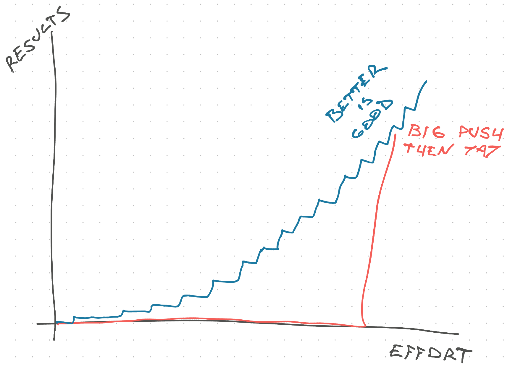

You'll never get a 6 month respite to fix the code.

Not unless the business is dead or has grown so large you can hire a full-time cleanup crew. Tech (and product) debt is your problem to manage _while_ you work on business goals. That's the job.

Here's the thing though: You don't need to make it _good_, you just need to make it _better_. Small changes compound over time _and_ they're easy to make.

## You can always make a small improvement

One of my favorite features of a good engineering culture is that you are always encouraged to make small changes. If you have an idea and it will take less than an hour to implement, do it.

- Function in the wrong place? Move it.
- Code that could be a function? Make a function.
- Variable poorly named? Rename it.
- File structure makes no sense? Move things around.
- Files getting too big? Make new files.
- Function hard to understand? Add a comment.
- Found an edge case? Add a test.
- Need more info to understand a bug? Add logs.
- Bug hard to reproduce? Add tests.
- Function too long? Make it shorter.
- Want to dedupe some code? Do it.

You don't need permission to do these things. I'd even say they're expected as part of your regular work. Like a chef who keeps their workspace tidy so they're not tripping over pots and pans or dipping sleeves in the sauce.

Or as Colette says in Ratatouille: [Keep your station clear!](https://youtu.be/GgiK-HWKPjw)

https://youtu.be/GgiK-HWKPjw

You have to be careful with shortening functions and deduping code – easy to [increase architectural complexity](https://swizec.com/blog/why-taming-architectural-complexity-is-paramount/) by accident – but all other cleanup is almost always welcome. Yes in the same PR you write the feature code.

Never trust an engineer who says feature and cleanup work should be separate. That's sure to leave cleanup work rotting in reviews and fall into bikeshedding hell.

## Avoid the bikeshed

Remember: better is good.

Is the code you're reviewing better than before but not quite perfect? That's okay. Approve with comment and move on. A merged improvement that we can ship is better than a long debate over whether you should use `var` `let` or `const`.

[Bikeshedding](https://en.wikipedia.org/wiki/Law_of_triviality) happens when it's easier to give comments on trivial easy-to-spot details than on the meaty structural part of a proposal. This is almost always true.

And it sucks.

Imagine spending an hour moving code around, fixing tests, improving function names, adding comments, and making sure the next person doesn't need to bang their head against the wall like you did – then some asshole comes around and goes _"yeah but this function name could be more clear and since you're here you could've broken up the code better and look at how long convoluted these models still are_.

(╯°□°)╯︵ ┻━┻

You did everyone a favor and they're shitting all over your hard work. I'd be upset too.

Don't bikeshed. Add a note for future cleanup, make a story on your backlog, merge the improvement, and move on. A small improvement that lands is better than a big improvement stuck in code review. Better is good.

## But also avoid the yak shave

Once you build the small-changes habit, it's easy to fall for a trap: The yak shave.

A [yak shave](https://wiki.c2.com/?YakShaving) is when you begin to avoid your main task by working on an unrelated task "that will make it easier". You sit down to write a new feature, realize you're not quite sure how, and spend the next few hours moving code around, cleaning things up here and there, and making improvements.

By the time you're done, the code is in a much better place. And you've made zero progress on your actual goal.

This is procrastination my friend. You're avoiding the hard work by doing other less important work. I write books, I know the house is always cleanest when a writing deadline is due 😉

Try to do your cleanup at the end. Make it work first _then_ make it right.

Plus this forces reviewers to comment on the meat of your changes, not the superficial style. You haven't done the style yet! They might even recommend the changes you already planned to make.

Even better is to shift left and [have those big discussions before writing any code](https://swizec.com/blog/coordinating-at-the-end-is-too-late/). When there's nothing but the core approach to talk about, no yaks to shave, and no sheds to mention.

Cheers, 
\~Swizec
