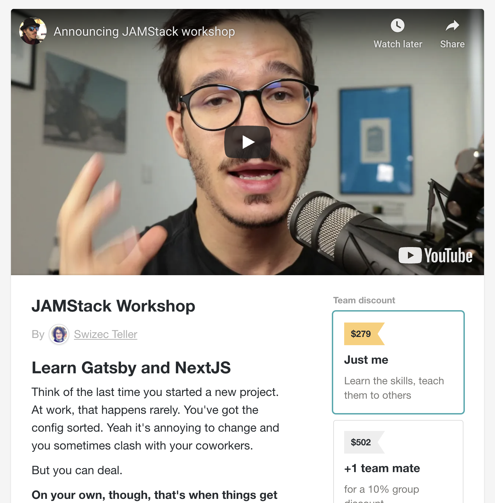

Imagine your next webapp project. At work or otherwise.

You sit down at your keyboard. Wonderful idea in mind, spec in hand, the caffeine is just right, your favorite song plays on &lt;insert-streaming-service>, Slack is quiet.

You run a single command. It bootstraps your whole project.

You add 2 lines of code. It makes everything look good.

You code for 10 minutes. 3 hours passed but you didn't notice. Everything flowed. No frustration. No fiddling.

You make a pull request. A robot wakes up.

It deploys your project on a fresh copy of production infrastructure. You get a custom public URL with your changes.

You click the link. Everything works. You share it with beta testers. They love it. You show it to the PM. She thinks you're brilliant.

You merge. Code goes to production. Users love it.

Oh is that not how it usually goes for you my friend? You spend half your time fiddling with your tooling instead of working on your feature? 🤔

## The JAMStack Workshop

Join The JAMStack Workshop and learn how web development works in 2020 and beyond. Drag your organization into the future and they'll thank you later. Never fiddle with the annoying crap on your side projects.

**Focus on your project**, let your tools handle the rest.

Live at a zoom link near you on **November 9th at 11am Pacific**. Can't join live? Full recording is yours forever. Plus you get life-time access to the self-paced version when it's ready.

### Here's how it works

[Join the workshop](https://gum.co/PdwnF) and you get a 20 minutes of pre-video. Like a mini course on the mindset and theory behind the JAMStack.

You'll learn about what the JAMStack does for you, why it's fantastic, how it helps in large teams, how it works on side projects, which frameworks to use and why, what the frameworks get you, and how to think about static-first sites.

You can think of this portion as _The Mindset_. 3 years of research and experimentation condensed into 11 short videos.

**On November 9th, join for the 4 hour live portion**

4 hours of intense _practice_. Try what you learned in a super hands-on workshop. No boring lectures and slides here. Just you, your code, and the rest of the group.

I've spent the past several years perfecting my teaching style to make sure you get months worth of value.

> I loved the "classroom" feel
>
> Yes, hands-on real world examples scenarios
>
> Wow Swizec this was fantastic! It would take us _months_ to figure this out on our own and you showed us in 4 hours.

You keep the materials and full recording forever. Share it with your team, come back when you've got a question, it's yours :)

Plus you get access to the self-paced version when it's ready.

### What you'll learn, in more detail

[The JAMStack Workshop](https://gum.co/PdwnF) aims to show you the modern tools that make web development insanely productive. What used to take a whole team, you can do yourself.

And it's gonna work better, too. Faster, nicer to use, more accessible, better SEO scores, great UX, no loading spinners.

The stack we use to achieve that involves:

- a JAMStack provider like Netlify or Vercel (we'll try both)
- the mindset
- Gatsby or NextJS (you'll learn both)
- a query approach to APIs (we'll try React Query and Apollo Client)
- a responsive design system (we'll use Theme UI)
- markdown and MDX for content
- static-first data loading
- flexible plugins with component shadowing

[Join The JAMStack Workshop](https://gum.co/PdwnF) today, enrollment closes at midnight.

Got questions? Hit reply

Cheers, 
~Swizec

PS: if $279 is tough right now, [The JAMStack Workshop is also available in installments](https://gum.co/rhBat)
