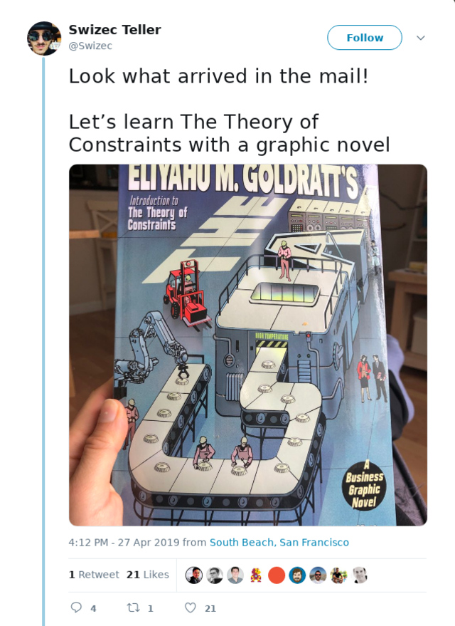
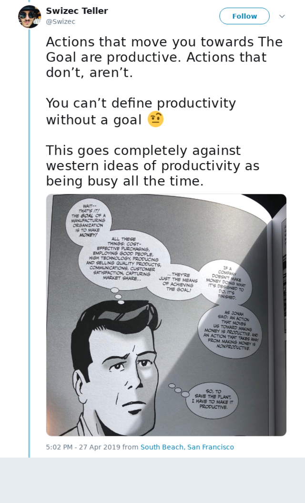
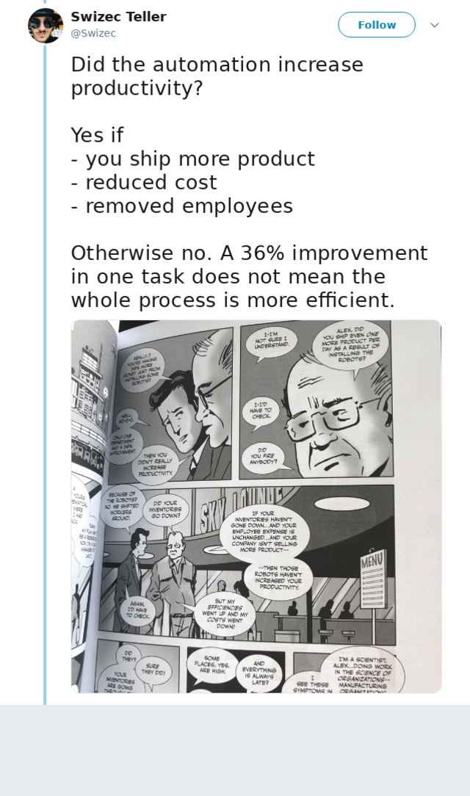
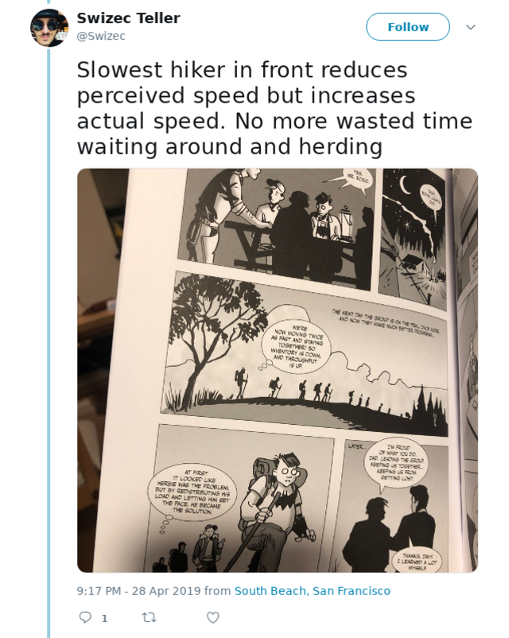
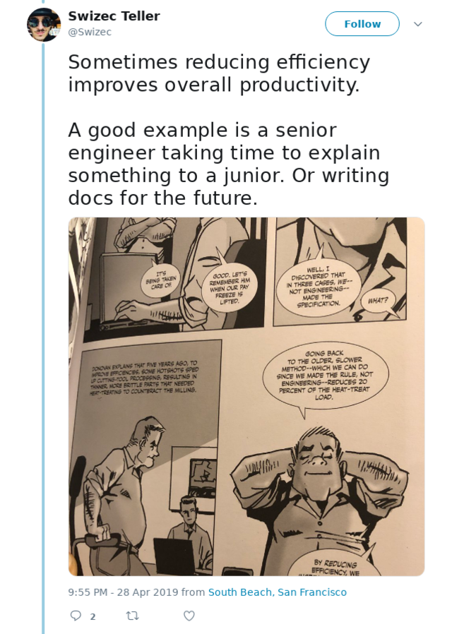
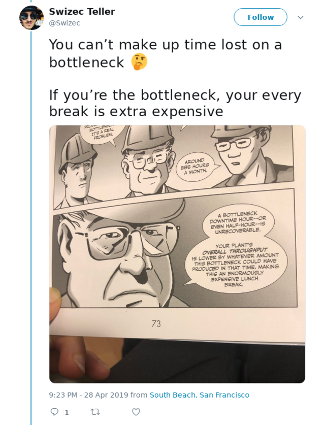
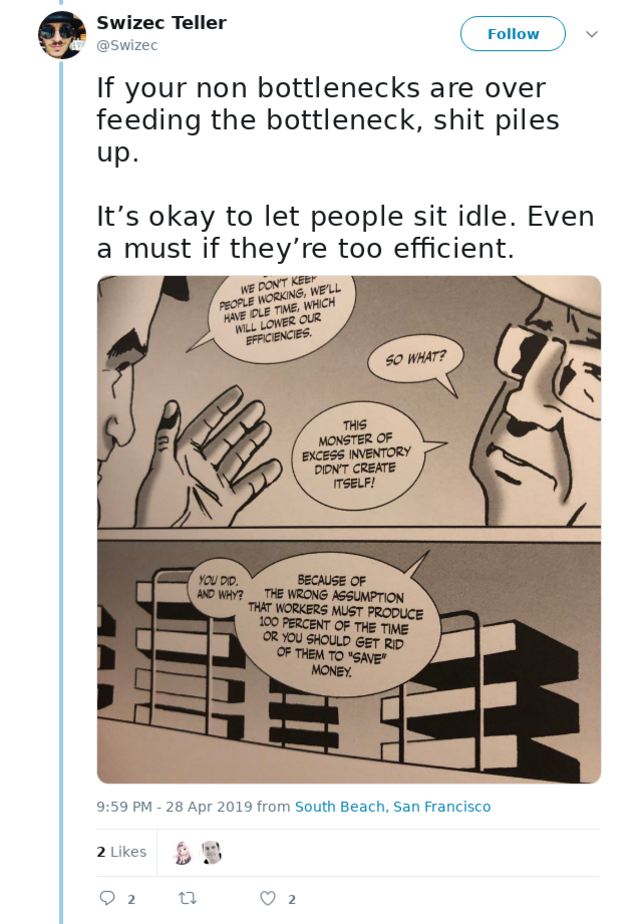
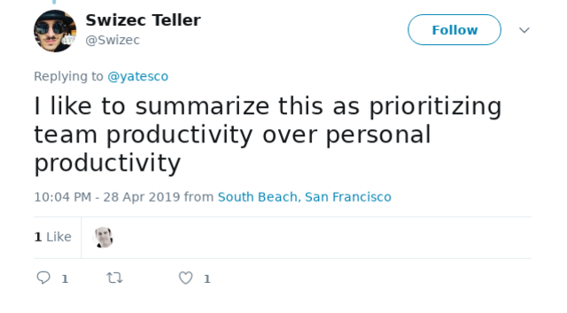
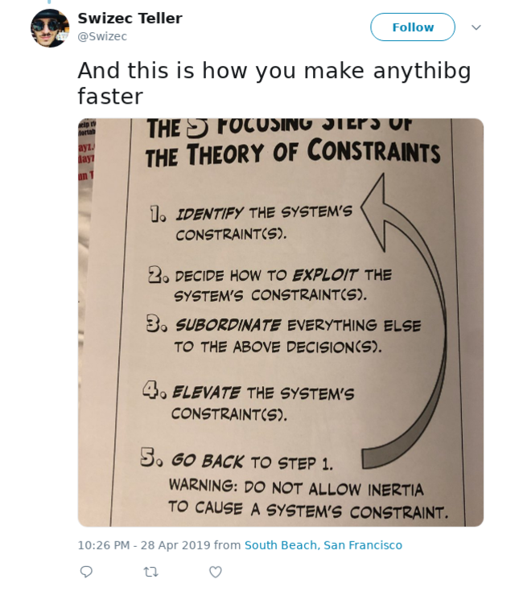

I read a magnificent book this weekend. A business graphic novel. It was marvelous.It&#x27;s called The Goal and here&#x27;s how it applies to software 👇

## What \_is\_ The Goal? 🤔

First you gotta know: What is the goal of your software? The goal of your job? _Your_ goal?

You can&#x27;t proceed without answers to these questions. _Why_ are you doing what you&#x27;re doing?

You&#x27;ve got your quotas and your JIRA tickets and your bug reports and your task management. Your job is to move tickets from one pile to the other. From ToBeDone to Done.

Correct?

Nope.

Your job is to help the company make money. Or achieve social good. Or disrupt the taxi industry and replace it with a different taxi industry. Or to make more movies. Usually it&#x27;s to make money.

If you don&#x27;t know your goal, you should ask your manager. Their manager. Their manager&#x27;s manager ... and keep going until you find someone who knows.

When you know _why_ you&#x27;re doing what you&#x27;re doing, you can know if you&#x27;re productive.

Actions that move you and your company and team towards the goal are productive. Actions that don&#x27;t, aren&#x27;t.

Simple as that.

It&#x27;s not about how busy you are. It&#x27;s not about how much time you spend at the office. It&#x27;s not about how many todo items you tick off the list.

Are you moving towards the goal?

## Are you efficient? 🤔

The more efficient you are, the faster you move from the ToBeDone pile to the Done pile.

You often build automations. That&#x27;s what software is for. Automating parts of the process.

Automation is always good. It&#x27;s faster and more reliable than a person. Eh ... sort of.

Automation almost always improves productivity in one part of the system. But does it always improve _the whole system_? Nope.

Just because one part of the system is faster doesn&#x27;t mean the whole system is faster and more efficient. This is often difficult to realize.

You sped up part of the system, but the whole system became slower. Why is that?

## A puzzle

Say you&#x27;re leading a scout troop on a hike. Who goes in front?

Often it&#x27;s the fastest kid. They race ahead and the group spreads out. When the group gets too spread out, you tell the fast kids to stop.

Slow kids catch up and just as they&#x27;re excited to get some rest you say Okay let&#x27;s go everyone&#x27;s here now.

That&#x27;s shitty.

You now have a group that&#x27;s always spread out. You&#x27;re herding cats and making sure everyone&#x27;s safe. You barely keep it all under control.

Morale is low.

The fast kids are annoyed because they keep stopping. They self-moderate with distraction. Making others wait while they&#x27;re distracted.

The slow kids are exhausted. They never get a break.

Instead, you should take the slowest kid, the bottleneck, and put them in front. The bottleneck sets the pace for the whole group.

Your group stays together. Everyone can keep up with the bottleneck so nobody drags behind. Lighten the bottleneck&#x27;s load and make them faster.

Now the whole group moves faster, more efficiently without distraction, _and_ you spend less time managing it all.

👌

## The bottleneck sets the pace

Your process is never faster than its slowest part. Also known as [Amdahl&#x27;s law](https://en.wikipedia.org/wiki/Amdahl%27s_law).

D&#x27;oh that&#x27;s obvious. Yet we always seem to forget.

When you&#x27;re optimizing your code, or your development process, or your company as a whole, are you focusing on the bottleneck or some random part that strikes your fancy?

When you measure productivity and effectiveness, do you focus on _your tiny part_, or the whole system?

That&#x27;s what I thought 😉

_YOU_ can never be more efficient than the whole system.

If you are, you&#x27;re just creating overhead. Overhead is expensive. Stop working and go help the bottleneck.

If you&#x27;re starved for work, you&#x27;re just idling. Idling is expensive. Stop idling and go help the bottleneck.

Remember, time lost on a bottleneck slows _everyone_ down. Your whole company. Do everything you can to make your bottleneck faster.

## How to identify the bottleneck?

Bottlenecks come in many shapes, forms, and sizes. They show up in your development process, they happen in your company, they also lurk in your code.

_Especially_ when you move beyond writing code and start designing systems. You&#x27;re like a plant manager. Managing systems feeding outputs into other systems&#x27; inputs.

So how do you find a bottleneck?

Easy.

Where is WorkToBeDone piling up? Where does a process keep waiting for its inputs?

The place in between, that&#x27;s a bottleneck.

A bottleneck struggles to keep up with its inputs and inventory piles up. Queue sizes grow. Costs skyrocket. You&#x27;re paying for too much storage.

A bottleneck struggles to deliver fast enough for later processes to stay busy. You&#x27;re running computers and people when they have nothing to do. That&#x27;s wasteful.

## Slow down 🖐

The solution is to slow down.

Yes that&#x27;s right. You gotta slow down.

Why are processes before the bottleneck working at full capacity? There&#x27;s no point. You&#x27;re just filling the queue.

Instead, have them slow down. Maybe even stop when the queue ahead is too full.

Why are processes _after_ the bottleneck working at full capacity? There&#x27;s no point. They&#x27;re throttled by output from the bottleneck.

Instead, have them slow down. Maybe even turn off when there&#x27;s nothing to do.

Maybe there&#x27;s stuff you can move around?

Can you do parts of the process before the bottleneck? Anything that might reduce the queue going into a bottleneck?

Is there other stuff your speedy processes can do? Something to keep productive while they wait for the bottleneck&#x27;s queue to clear? Or their own queue to fill up?

## Team productivity over personal productivity

Quickest way to apply The Theory of Constraints to your personal life is to look at your team.

Are you the bottleneck? Get help.

Are you delivering features super fast? Stop and go do code reviews. Mentor.

Are you always waiting for things? While you wait, go help. Write test cases, make QA faster, do code reviews, write documentation, look at the backlog ...

There&#x27;s always something you can do to make your team faster and more efficient. Even if it means sacrificing your personal productivity.

A personal hour lost is three team hours gained. ✌️

## 5 steps to make anything faster

Follow these five steps to make anything faster. Your code, your team, your company.

Identify the bottleneck, use it fully, slow everything to pace, fix the bottleneck, find the next bottleneck.

Happy hacking, 🤓 ~Swizec
