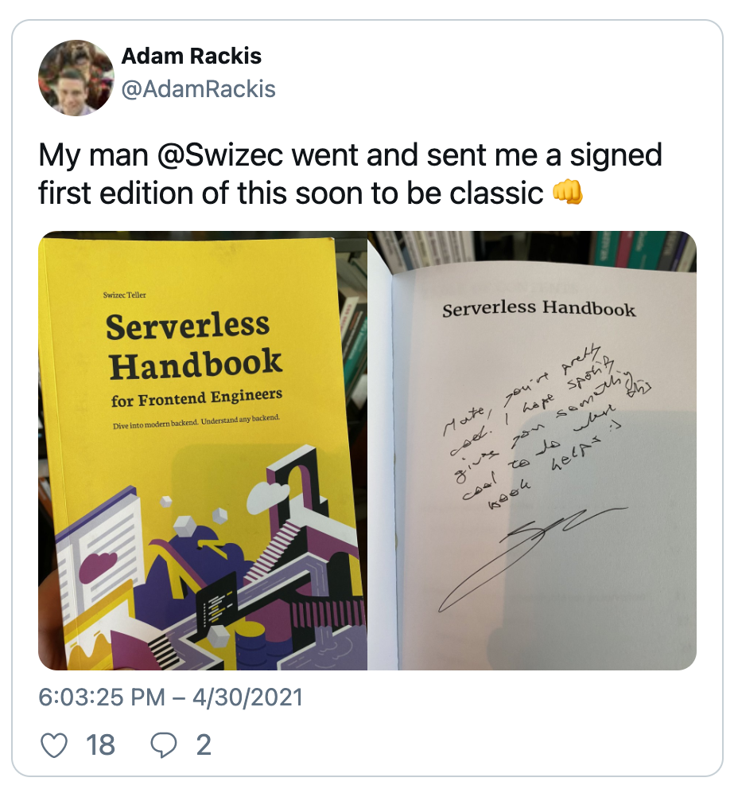

Twitter embeds every tweet on your page as an iframe. Loads 1.2MB of JavaScript, makes 20+ HTTP requests and uses 100+ DOM nodes. 💩

You can _feel_ your browser lagging when there's a few tweets up there. Like running with a parachute.

Last week we set out to fix this with a Gatsby plugin for [Twitter embeds without JavaScript](https://swizec.com/blog/twitter-embeds-without-javascript-pt1-codewithswiz-29/). This week we got it working 🤘

https://twitter.com/Swizec/status/1392156235349192704

Here's the full build, read on for a recap and how it works

https://www.youtube.com/watch?v=KkoEVisK2MU

Full code at [Github Gist](https://gist.github.com/Swizec/806c01c51a898b3404803fc9a9a5d11b), needs cleanup before opensourcing as a library 😇

_CodeWithSwiz is a weekly live show. Like a podcast with video and fun hacking. Focused on experiments and open source. [Join live Tuesday mornings](https://youtube.com/swizecteller)_

## The setup

We're building a plugin for the [gatsby-remark-embedder](https://github.com/MichaelDeBoey/gatsby-remark-embedder) Gatsby plugin. Because that's what I use on my sites :)

You can adapt this technique for anything. Even NextJS.

It works like this:

1.  On page render (during build or server-side-render)
2.  Take tweet ID from URL
3.  Call Twitter API, get data
4.  Construct HTML
5.  Replace URL with HTML

`gatsby-remark-embedder` runs my code on Markdown nodes that look potentially like tweet urls. You could turn it into an MDX plugin, or build a React component.

When users load your page _the tweets are there_. In the initial HTML. No client-side JavaScript, no iframe shenanigans, no tracking.

## Grab tweet data from Twitter

[Last time](https://swizec.com/blog/twitter-embeds-without-javascript-pt1-codewithswiz-29/) we discovered that Twitter's oEmbed API, an embedding standard, doesn't give us everything we need. No author avatars, no like and reply counts, no media links.

You can get those and more from [Twitter API v2 /tweets/:id](https://developer.twitter.com/en/docs/twitter-api/tweets/lookup/api-reference/get-tweets-id).

We're using the opensource [twitter-lite](https://github.com/draftbit/twitter-lite) client. Looks solid, nice API, works great. 👌

### Initialize Twitter client

A memoized function initializes the client.

```javascript
// src/StaticTwitterEmbed.js

// Memoized twitter client instance
let twitterClient = null
async function getAppClient() {
  if (twitterClient) {
    return twitterClient
  }

  // init user-client
  const user = new Twitter({
    consumer_key: process.env.TWITTER_CONSUMER_KEY,
    consumer_secret: process.env.TWITTER_CONSUMER_SECRET,
  })

  // create app-client with higher limits
  const response = await user.getBearerToken()
  twitterClient = new Twitter({
    version: "2",
    extension: false,
    bearer_token: response.access_token,
  })

  return twitterClient
}
```

Global variable holds the client instance. If variable defined, return, if not, initialize.

Each initialization logs into Twitter with an API call for the bearer token. You don't wanna do this for every tweet on your entire website.

### Get a tweet

With an initialized and logged-in client, we can get a tweet using its ID.

```javascript
// src/StaticTwitterEmbed.js
// fetch tweet from API
async function getTweet(tweetId) {
  const client = await getAppClient()

  try {
    const tweet = await client.get(`tweets/${tweetId}`, {
      "tweet.fields": "public_metrics,created_at",
      expansions: "author_id,attachments.media_keys",
      "user.fields": "name,username,url,profile_image_url",
      "media.fields": "preview_image_url,url",
    })

    return tweet
  } catch (e) {
    console.log(e)
  }

  return null
}
```

For simplicity, we always get the client in this function. Makes logic self-contained and we aren't worried about overdoing it thanks to memoization.

`client.get(tweet/:id)` fetches a tweet. Careful incantation of parameters gives us the extra info we need. Author, media, and metrics.

Response looks like this:

```javascript
{
  data: {
    text: 'My man @Swizec went and sent me a signed first edition of this soon to be classic 👊 https://t.co/Gw8cTIY7pH',
    public_metrics: {
      retweet_count: 1,
      reply_count: 2,
      like_count: 18,
      quote_count: 0
    },
    attachments: {
      media_keys: [ '3_1388192274866126849', '3_1388192274874523648' ]
    },
    author_id: '68567860',
    id: '1388192278884331530',
    created_at: '2021-04-30T18:03:25.000Z'
  },
  includes: {
    media: [
      {
        media_key: '3_1388192274866126849',
        type: 'photo',
        url: 'https://pbs.twimg.com/media/E0PZhN9WQAEMhsJ.jpg'
      },
      // ...
    ],
    users: [
      {
        name: 'Adam Rackis',
        profile_image_url: 'https://pbs.twimg.com/profile_images/1183169082243375104/FwXKVe5H_normal.jpg',
        id: '68567860',
        username: 'AdamRackis',
        url: 'https://t.co/sJJo16akDF'
      }
    ]
  }
}
```

Fun gotcha: You have to request `expansions: "author_id,attachments.media_keys"` for `media.fields` and `author.fields` to work. Detail buried in API docs.

## A simplified tweet HTML

The `getHTML` function tells `gatsby-remark-embedder` what to replace a Markdown node with. Tweet comes in as a URL.

Before our plugin, tweets turned into `<blockquote>` elements that the Twitter JavaScript would turn into monster iframes on page load. Often with a big delay. Sometimes breaking on mobile.

Now we do this 👇

```javascript
// src/StaticTwitterEmbed.js
async function getHTML(url) {
  const twitterUrl = url.replace("events", "moments")
  const tweetId = twitterUrl.split("/").pop()

  const tweet = await getTweet(tweetId)

  if (!tweet) {
    console.log("TWEET NOT FOUND", twitterUrl, tweetId)
    return ""
  }

  return buildTweetHTML(tweet)
}
```

We borrowed the `events -> moments` transform from the original plugin. Gonna need to test if that still works. 🤔

`tweetId` is the last element of the URL when split by `/`. This will break if you include any `?...` cruft when embedding.

Like I said, not ready yet for opensource :)

Then we get the tweet and `buildTweetHTML`.

### buildTweetHTML

This function is a mess. You can see it in full at [line 63 of the Gist](https://gist.github.com/Swizec/806c01c51a898b3404803fc9a9a5d11b#file-statictwitterembed-js-L63).

It's a mess because we're handcrafting HTML and can't use React. No JSX transform deep in the bowels of a Gatsby plugin.

And it's very procedural. Reads like a step-by-step recipe.

1.  Get the author

```javascript
// src/StaticTwitterEmbed.js
// buildTweetHTML
const author = tweet.includes.users.find(
  (user) => user.id === tweet.data.author_id
)
```

You can't guarantee author is the first user in the list. Gotta find by id.

2.  Reconstruct the tweet URL

```javascript
// src/StaticTwitterEmbed.js
// buildTweetHTML
const tweetURL = `https://twitter.com/${author.username}/status/${tweet.data.id}`
```

3.  Construct the author HTML

```javascript
// src/StaticTwitterEmbed.js
// buildTweetHTML
const authorHTML = `<a class="author" href="${author.url}"><b>${author.name}</b>@${author.username}</a>`
```

Great candidate for a React component huh 😅


4.  The tweet HTML is easy

```javascript
// src/StaticTwitterEmbed.js
// buildTweetHTML
const tweetHTML = `<blockquote>${tweet.data.text.replace(
  /https:\/\/t.co\/(\w+)/,
  ""
)}</blockquote>`
```


5.  Media HTML is a list of images

```javascript
// src/StaticTwitterEmbed.js

function buildMediaList(media) {
  const width = media.length > 1 ? "50%" : "100%"
  return media
    .map(
      (media) =>
        ``
    )
    .join("")
}

// buildTweetHTML
const mediaHTML = tweet.includes.media
  ? `<div class="media">${buildMediaList(tweet.includes.media)}</div>`
  : ""
```

Tried to use CSS for media widths and couldn't hack it. We know from experience that twitter renders images at 50% and in multiple rows.

`loading="lazy"` is important for Lighthouse scores. Ensures you aren't loading images users can't see.


6.  Finally, the metadata HTML is a complete mess

```javascript
// src/StaticTwitterEmbed.js
// buildTweetHTML

const createdAtHTML = `<div class="time"><a href="${tweetURL}">${new Date(
  tweet.data.created_at
).toLocaleTimeString()} – ${new Date(
  tweet.data.created_at
).toLocaleDateString()}</a></div>`

const likeIntent = `https://twitter.com/intent/like?tweet_id=${tweet.data.id}`
const replyIntent = tweetURL

const statsHTML = `<div class="stats"><a href="${likeIntent}" class="like">${likesSVG}${tweet.data.public_metrics.like_count}</a> <a href="${replyIntent}" class="reply">${repliesSVG}${tweet.data.public_metrics.reply_count}</a></div>`
```

🤮

But it works and that's what matters.


7.  Put it all together

```javascript
// src/StaticTwitterEmbed.js
// buildTweetHTML

return `<div><div class="static-tweet-embed">
        ${authorHTML}
        ${tweetHTML}
        ${mediaHTML}
        ${createdAtHTML}
        ${statsHTML}
    </div></div>`
```

And you get a great looking tweet:



### The CSS styles

You need CSS to make all that HTML look like a tweet.

This little bit gets you most of the way there:

```css
div.static-tweet-embed {
  display: flex;
  flex-direction: column;
  font-family: -apple-system, BlinkMacSystemFont, "Segoe UI", Roboto, Helvetica,
    Arial, sans-serif;
  max-width: 550px;
  width: 100%;
  margin-top: 10px;
  margin-bottom: 10px;
  border: 1px solid rgb(196, 207, 214);
  border-radius: 12px;
  padding: 12px 16px 4px 16px;
}

div.static-tweet-embed blockquote {
  margin: 0;
  font-size: 20px;
  padding: 0px;
  border: 0px;
  color: rgb(15, 20, 25);
  line-height: 24px;
}
```

System fonts, border, rounded corners, padding, correctly sized text.

You can see (and borrow) the rest [on the public gist](https://gist.github.com/Swizec/806c01c51a898b3404803fc9a9a5d11b#file-styles-css).

## The result

Your page _feels_ faster. It's hard to explain, you have to try.

Scroll to the bottom here 👉 https://serverlesshandbook-4d7y3ge3f-swizec.vercel.app/

Now scroll here 👉 https://serverlesshandbook.dev

Feel the difference? Reload at bottom for extra groan

https://twitter.com/Swizec/status/1392516093084790784

Cheers,<br/>
~Swizec

PS: yes, you can measure the impact with Lighthouse, it's not invisible – 43 becomes 54 :)

https://twitter.com/Swizec/status/1392484956383834112
