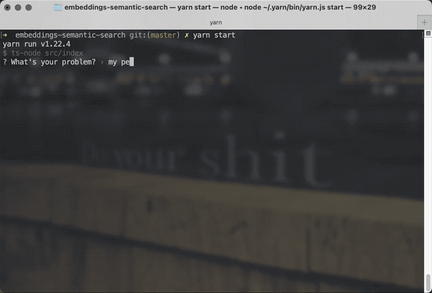
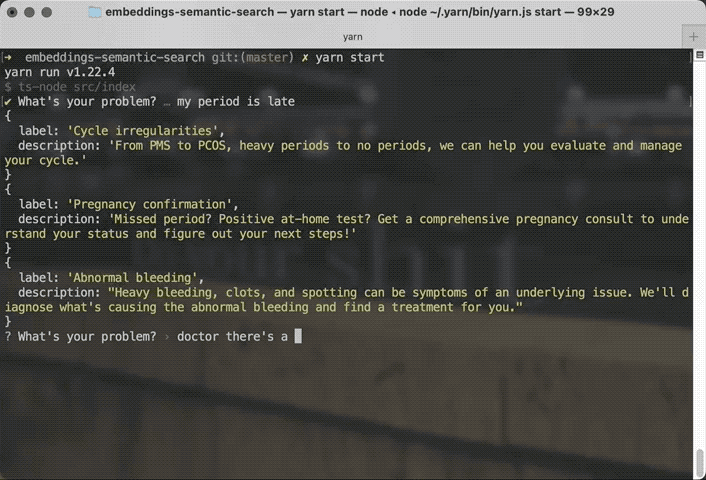

Semantic search used to be a major feat of engineering. This weekend I built one in 2 hours of tinkering with the OpenAI API 🤯

Check this out:



You say "my period is late" and the search is smart enough to recommend Cycle Irregularities and Pregnancy Confirmation as top results. If you say there's a duck stuck in your throat, the search can figure that out too.



It blows me away that a schmuck like me can build this in 2 hours because we live in the future. When I last looked at semantic search in the early 2010's I couldn't even get past the setup instructions for [Solr](https://solr.apache.org), a natural language processing server, and [Lucene](https://lucene.apache.org), the library it's built on.

Here's how it works:

1.  Compute embedding vectors for your data
2.  Compute embedding vector for your query
3.  Sort vectors by similarity

Semantic search with full support for synonyms, metaphors, typos, and similes falls out thanks to the vast background info encoded in the large language model, LLM.

## Compute embedding vectors for your data

Before you can search, you need embeddings for the documents you want to search through. I put mine in a CSV.

The code below reads a 2-column CSV – `label` and `description` – and outputs a 3-column CSV with an `embedding` column. Using the [csv](https://www.npmjs.com/package/csv) library to parse and stringify CSV data.

```typescript
async function addEmbeddingsToCSV() {
  const columns = ["label", "description", "embedding"]

  const readStream = fs
    .createReadStream("./data/input.csv")
    .pipe(csv.parse({ from_line: 2 }))

  const writeStream = fs.createWriteStream("./data/input_with_embeddings.csv")
  const stringifier = csv.stringify({ header: true, columns })

  for await (const row of readStream) {
    const [label, description] = row
    const embedding = await getEmbedding(
      `Title: ${label}; Content: ${description}`
    )

    console.log(label)

    stringifier.write([label, description, embedding])
  }

  stringifier.pipe(writeStream)

  console.log("done")
}
```

[The cookbook](https://github.com/openai/openai-cookbook/blob/main/examples/Semantic_text_search_using_embeddings.ipynb) made it look like encoding your input as `Title: ..; Content: ..` was important. Probably because GPT was trained on articles from the web.

The `getEmbedding` function at the core of our code makes an API request to OpenAPI:

```typescript
async function getEmbedding(input: string) {
  const embedding = await openai.createEmbedding({
    model: "text-embedding-ada-002",
    input,
  })

  return embedding.data.data[0].embedding
}
```

Embeddings won't change in the future so it's best to pre-compute this separately and save the vectors. You'll want to use a vector database for a production app. I've heard the [pgvector](https://github.com/pgvector/pgvector) plugin for Postgres works great.

## Compute embedding vector for your query

Getting a vector for your query is more of the same:

```typescript
const { search } = await prompts({
  type: "text",
  name: "search",
  message: "What's your problem?",
})
const needle = await getEmbedding(search)
```

Get `search` string from user, compute the embedding.

## Sort vectors by similarity

This is where the search happens. You're looking for _"How far away from the input data is the user's query?"_

```typescript
for (const item of haystack) {
  item.similarity = cosineSimilarity(needle, item.embedding)
}

haystack.sort((a, b) => b.similarity - a.similarity)
```

Compute vector cosine similarities and sort the haystack. The top few matches are your search results.

I used the [compute-cosine-similarity](https://github.com/compute-io/cosine-similarity) JavaScript library. For production use you'd want to let your vector database handle this part.

## What _is_ an embedding vector

I don't know. My understanding is that it's a vector that "embeds" your string in the LLM's vast N-dimensional understanding of training data.

Like an index that says "here it is in the brain".

The part I don't get is how come embeddings can have 1536 dimensions when the LLM itself has billions of parameters. Means the embedding can't be just a list of activated neurons 🤔

Cheers,<br/>
~Swizec

PS: I followed OpenAI's [wonderful cookbook example](https://github.com/openai/openai-cookbook/blob/main/examples/Semantic_text_search_using_embeddings.ipynb) to build this
