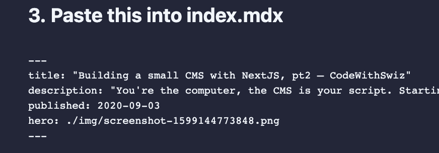
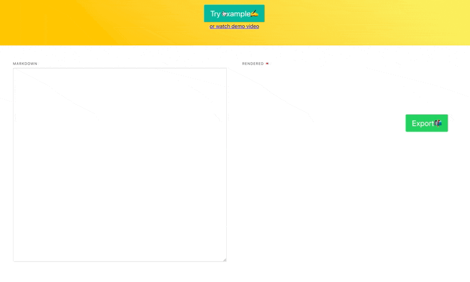
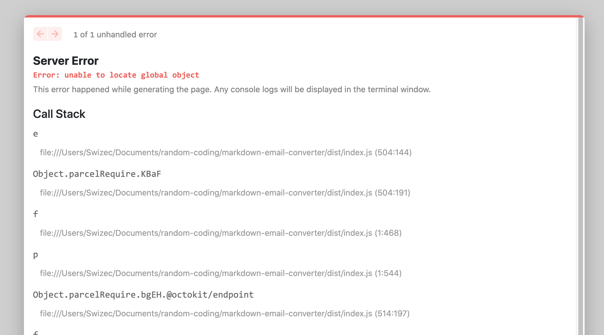

_CodeWithSwiz is a twice-a-week live show. Like a podcast with video and fun hacking. Focused on experiments. [Join live Wednesdays and Sundays](https://youtube.com/swizecteller)_

https://youtu.be/dPGZBQmVNUg

Continuing our NextJS app [where we left off on Sunday](https://swizec.com/blog/your-first-nextjs-app-codewithswiz/), in this episode we made good progress:

- added title slugification
- copypasta instructions to create an article
- extracted social card API into a custom hook
- added hero to frontmatter
- aaaalmost extracted my custom Markdown machinery out of [techletter.app](https://techletter.app)

You can see it live at [swiz-cms.vercel.app](https://swiz-cms.vercel.app). I used it to publish this today 🤘

## Slugs and article creation 🍝

This is a baby CMS and relies on humans to do the work. Means ~~you~~ I can start using this before it's finished and start saving time and effort.

You're the computer, the CMS is your script.

```javascript
import slugify from "slugify"

export const CLICopyPasta = ({ title }) => {
  // creates the slug, hooray libraries
  const slug = slugify(title).toLowerCase()

  return (
    <pre>{`
cd ~/Documents/websites/swizec.com
mkdir src/pages/blog/${slug}
mkdir src/pages/blog/${slug}/img
touch src/pages/blog/${slug}/index.mdx
            `}</pre>
  )
}
```

Yep, simple component. Open source [slugify](https://www.npmjs.com/package/slugify) makes our slug and we write the instructions. Once is better than always.

[Copypasta instructions for article creation](https://i.imgur.com/COaFkQX.png)

You can find someone on Fiverrr or Upwork to do these steps for you. Costs $10/week compared to Contentful which is $400/mo.

🤔

## Custom hook for social cards

A frustration I wanted to solve was adding social cards as hero images to article frontmatter. Fiddly manual process. Error prone as heck.



There's 2 ways you can do this:

1.  Hoist social card fetching out of `<SocialCardImage>` to top component and push state down through props
2.  Create a reusable hook that internally avoids double fetching

Following my [Wormhole state management](https://swizec.com/blog/wormhole-state-management/) principle, reusable hook is the way to go.

```javascript
// components/SocialCardImage
export function useSocialCardQuery(title) {
  return useQuery(["social-card", title], fetchSocialCard)
}
```

Doesn't look like much but therein lies magic. 🧙‍♂️

[React Query](https://github.com/tannerlinsley/react-query) dedupes API calls with the same name. Our hook ensures we use the same name and fetch function everywhere.

You can now pepper `useSocialCardQuery` anywhere in your app. It's always going to have the latest state _and_ avoid refetching, if it knows the result.

## Turn an old project into a library

This part proved tricky. We tried to extract the markdown machinery from [techletter.app](https://techletter.app) into a shared library.



Extraction itself wasn't that hard:

- create new project
- `yarn init` to create `package.json`
- add `microbundle` for packaging
- copy files from old project
- fix relative paths in imports
- add `index.js` file that re-exports the public interface

Run [`microbundle`](https://github.com/developit/microbundle) and see it dies on image imports. It's meant for pure TypeScript and JavaScript projects.

We use images for loading gifs ...

Switch to [`parcel`](https://github.com/parcel-bundler/parcel) and packaging started working. A matter of changing config in `package.json`

```json
"source": "src/index.js",
"scripts": {
    "dev": "microbundle watch",
    "build": "microbundle"
},

👇

"scripts": {
    "dev": "parcel src/index.js",
    "build": "parcel build src/index.js"
},
```

Yes no-config bundlers are _that_ easy. Until you get into the weeds and try to be fancy that is.

Unfortunately it didn't work. `global undefined` whatever the heck that means 🤨

But I think I've got a solution, [join me on Monday 6:30pm Pacific](https://youtube.com/swizecteller).

## Favorite NextJS feature so far?

Initial quick setup was great and those error messages are divine. Beautifully designed, safe as heck, and _fast_.



With client-side bugs you get a blurred-out view of your app behind the error. Useful, no, cool as heck, yeah!

And your browser almost always reconnects to the development server even after a restart.


Cheers,<br/>
~Swizec
