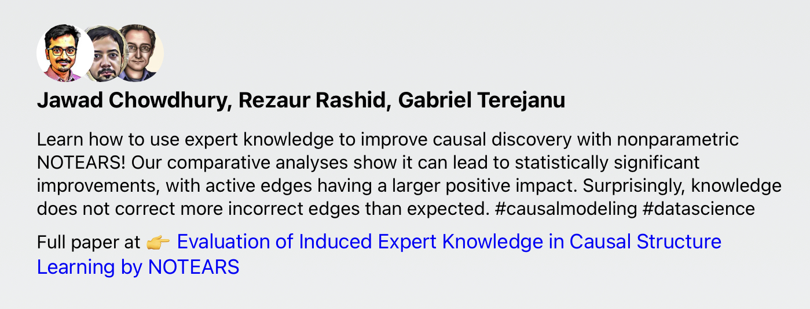
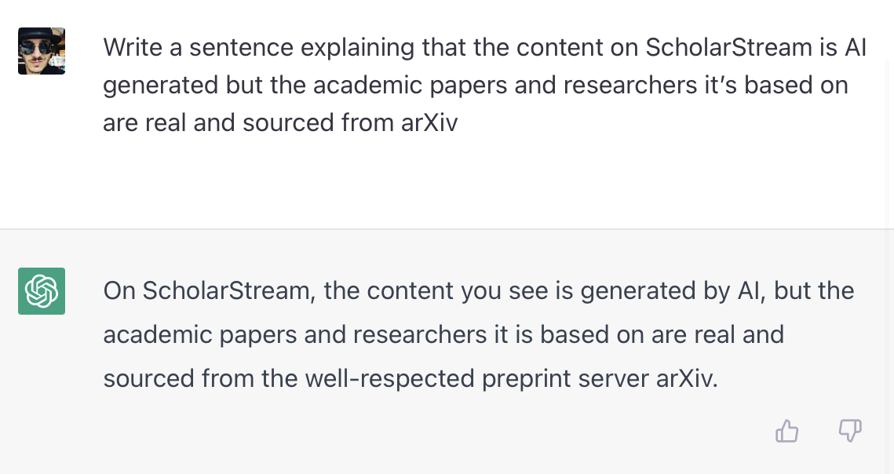
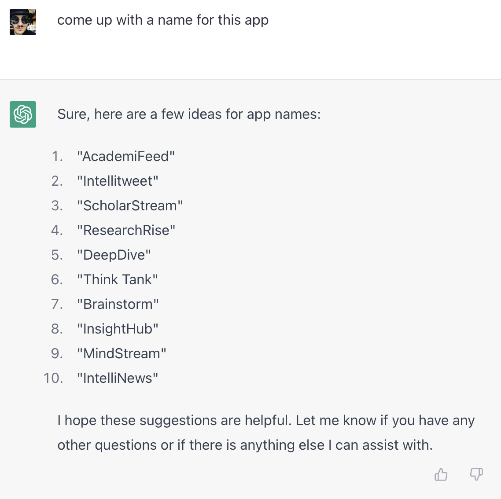

Generative AI has made big strides in recent years. [Diffusion models](https://en.wikipedia.org/wiki/Diffusion_model) make decent art and modern [large language models](https://en.wikipedia.org/wiki/Language_model) can out-write even the best college student on a deadline. Over the holidays I tried it out by building an app.

You can check it out here 👉 [ScholarStream.ai](https://www.scholarstream.ai)

Everything on that page is AI-generated. The landing page copy, the logo, even the app's name. And of course the content itself.

My girlfriend says I haven't been this giddy in years.


My friend, AI is ready for product development by normal people like you and I 😍 The situation is _much_ better than [my early forays 10+ years ago](https://swizec.com/blog/first-steps-with-octave-and-machine-learning/). Back then you needed a PhD, now all you need is an API call.

## What is ScholarStream.ai

I wanted to replace [my bad twitter habit](https://swizec.com/blog/getting-off-twitter-an-experiment/) with interesting academic papers. But browsing [arXiv.org](https://arxiv.org) doesn't scratch that firehose itch and the abstracts make my eyes wanna cry.

[ScholarStream.ai](https://www.scholarstream.ai) shows the latest papers from arXiv in a Twitter-like feed generated by AI.

PS: [you can see the code on GitHub](https://github.com/Swizec/ScholarStream.ai)

## Using OpenAI to write engaging summaries

You have to start every project at the point of highest uncertainty. In this case: Can AI generate engaging summaries that make sense?

I fired up an [OpenAI account](https://openai.com/api/) with a bunch of free credits and dived into [the wonderful quickstart docs](https://beta.openai.com/docs/introduction). An hour of fiddling later, I came up with this:

```typescript
function createPrompt(abstract: string) {
  return `Write an extremely short summary of the following text in the style of an engaging tweet "${abstract}"`
}

export async function getSummary(
  paper: ArxivFeedItem
): Promise<CreateCompletionResponse> {
  const completion = await openai.createCompletion({
    model: "text-davinci-003",
    prompt: createPrompt(paper.contentSnippet),
    temperature: 0.6,
    max_tokens: 100,
  })

  return completion.data
}
```

Works great!



[First version looked much worse](https://twitter.com/Swizec/status/1607391134157864960) but how much nicer is that to read than the original abstract?

> Causal modeling provides us with powerful counterfactual reasoning and interventional mechanism to generate predictions and reason under various what-if scenarios. However, causal discovery using observation data remains a nontrivial task due to unobserved confounding factors, finite sampling, and changes in the data distribution. These can lead to spurious cause-effect relationships. To mitigate these challenges in practice, researchers augment causal learning with known causal relations. The goal of the paper is to study the impact of expert knowledge on causal relations in the form of additional constraints used in the formulation of the nonparametric NOTEARS. We provide a comprehensive set of comparative analyses of biasing the model using different types of knowledge. We found that (i) knowledge that corrects the mistakes of the NOTEARS model can lead to statistically significant improvements, (ii) constraints on active edges have a larger positive impact on causal discovery than inactive edges, and surprisingly, (iii) the induced knowledge does not correct on average more incorrect active and/or inactive edges than expected. We also demonstrate the behavior of the model and the effectiveness of domain knowledge on a real-world dataset.

Yeah no I'm not reading all that just to decide if I'm even curious 😅

## Using OpenAI to generate avatars

https://twitter.com/Swizec/status/1607767249435389953

A plain-text feed always looks boring. But faces are always interesting. 🤔

I decided to ask OpenAI's Dall-E to generate avatars based on researcher names. Took some "prompt engineering" to get it right. Photos were too creepy, generic avatars too random.

```typescript
export async function getAvatar(
  name: string,
  size: "256" | "512" | "1024"
): Promise<string> {
  let imageData: ImagesResponse

  try {
    const response = await openai.createImage({
      prompt: `face closeup, social media avatar, for a researcher named "${name}" in a professional digital art drawing style`,
      n: 1,
      size: `${size}x${size}` as CreateImageRequestSizeEnum,
    })
    imageData = response.data
  } catch (e) {
    console.error(e)
    throw new Error("Image generation failed")
  }

  if (!imageData.data[0].url) {
    console.log(imageData)

    throw new Error("Image generation failed")
  }

  // this URL expires in 1 hour
  return imageData.data[0].url
}
```

What impressed me the most is Dall-E's ability to guess the right ethnic and gender characteristics from a name. All avatars feel unsurprising and even though I know they're fake my mind goes _"Oh yeah that's what the person looks like"_.


Like I said, photos made it feel creepy. I think drawings are okay?

## Using ChatGPT to write copy

I decided to lean into the AI theme and use [ChatGPT](http://chat.openai.com) to write landing page copy.



The AI got carried away and oversold its abilities. I edited down, changed a few words, and kept the rest.

Then I asked ChatGPT for a name:



Here you can see ChatGPT's killer feature – it remembers context between prompts. You can even go back and continue an old conversation.

I leveraged that to add a footnote based on feedback from friends. They said it isn't clear whether the academic papers are also generated by AI.


## Creating the logo

Let's go all the way. Can AI create a logo for this app?

Yes!

I ran image generation code a bunch of times with a few different prompts and lost all the examples. Sorry. Here's the version I picked:


Diffusion models don't understand letters, but they know such a concept exists. I removed that and the background for the final logo. Why the AI thinks those lines and colors represent ScholarStream I don't know. Makes as much sense as the beautiful presentations from design agency executives. 🤷‍♀️

[Try it out](https://www.scholarstream.ai), hit reply and let me know what you think. I'll write about the NextJS 13 portion of this experiment next week :)

Cheers,<br/>
~Swizec

PS: omitted from code examples is a bunch of caching logic that makes this app cheaper to run
