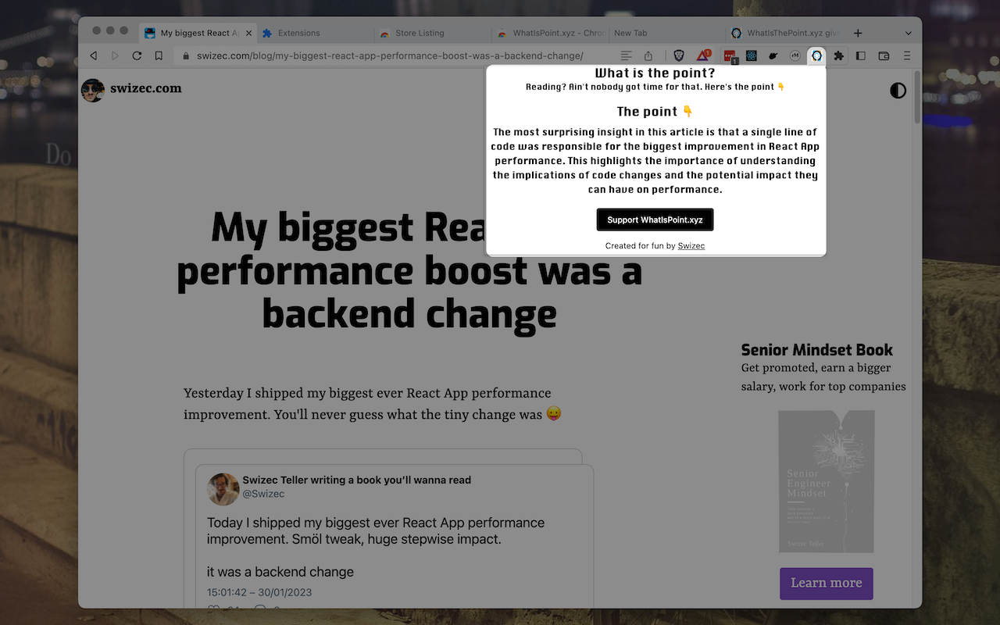
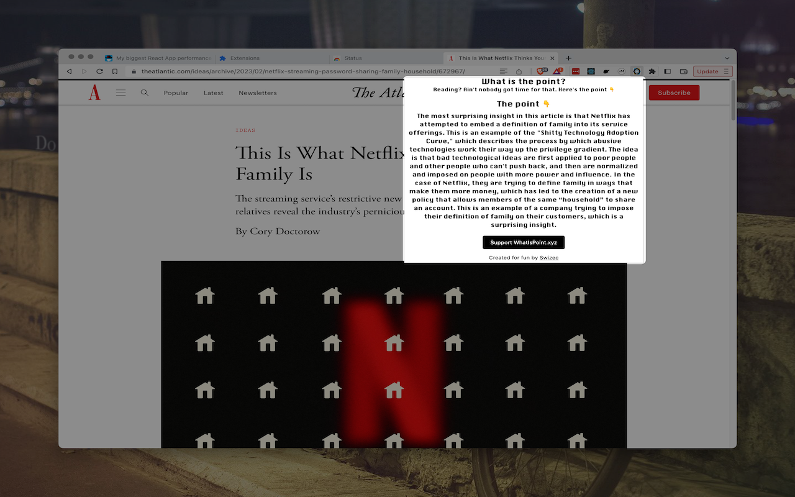
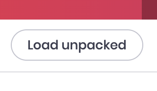
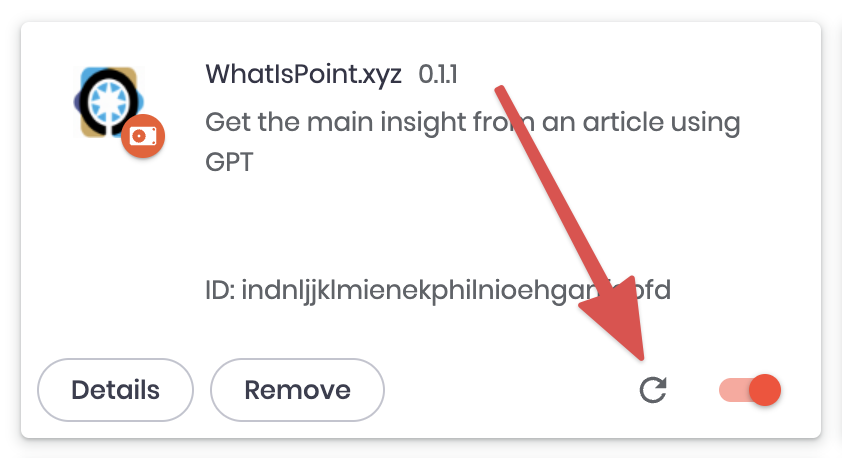

Exploring how GPT can help continues. This time I built a browser extension that tells you the point of an article you're reading.



You can try it out here 👉 [WhatIsPoint.xyz](https://whatispoint.xyz). Full [code on GitHub](https://github.com/Swizec/article-threader), if you'd like to explore.

The backend is a Vercel Serverless function, a NextJS /api route. It uses a NodeJS library to extract main text from a URL and sends it to OpenAI with a prompt. I talked more about those details in [Building apps with OpenAI and ChatGPT](https://swizec.com/blog/building-apps-with-openai-and-chatgpt/).

Now, how do you make that into a browser extension?

## The pain point of building extensions

Browser extensions are Just JavaScript. You get a few special [Chrome APIs](https://developer.chrome.com/docs/extensions/reference/), and you need a manifest file, but other than that you're building a static page with HTML and JavaScript.

Which means you have none of the tools you're used to. Back to vanilla JavaScript with no design system no UI library and no modern affordances. 💩

I don't know about you, but I wasted enough of my youth on vanilla JavaScript. This has always kept me from building extensions.

Enter NextJS.

## Building extensions with NextJS

NextJS has a feature I didn't notice until this weekend – `next export`. It takes your NextJS app and exports it as a static JavaScript+HTML site.

You can use this to make an extension with all the tools you're used to 🤩

Here's what you'll need:

1.  A manifest file
2.  A dedicated page in your NextJS app
3.  A few package.json commands
4.  `gsed`
5.  Optional, remote-enabled /api routes

I based my hackery on a [nextjs-chrome-extension](https://github.com/Pondorasti/nextjs-chrome-extension) repository, which itself is based on [Creating a Chrome Extension with NextJS](https://aaronscherer.me/blog/post/creating-a-chrome-extension-with-nextjs).

Full [code on GitHub](https://github.com/Swizec/article-threader), if you'd like to explore.

### A manifest file

The manifest file specifies details about your app. Name, description, icons, permissions. You plop this `/public`.

```json
// public/manifest.json

{
  "manifest_version": 3,
  "name": "WhatIsPoint.xyz",
  "short_name": "whatispoint",
  "version": "0.1.2",
  "description": "Get the main insight from an article using GPT",
  "icons": {
    "16": "/icons/favicon-16x16.png",
    "32": "/icons/favicon-32x32.png",
    "48": "/icons/favicon-48x48.png",
    "128": "/icons/128x128.png",
    "192": "/icons/android-chrome-192x192.png"
  },
  "permissions": ["activeTab"],
  "content_scripts": [
    {
      "matches": ["https://*/*", "http://*/*"],
      "js": ["inject.js"]
    }
  ],
  "action": {
    "default_popup": "extension.html"
  }
}
```

`inject.js` is a JavaScript file that runs on every page. I don't actually need that, why's it there 🤔

`extension.html` is the page you want to load in a popup.

### A dedicated page in your NextJS app



You don't have to dedicate your entire app to being an extension. Mine also hosts the homepage, for example.

Make a normal NextJS page in `pages/extension.tsx` and that's what users will see when they click the extension icon.

```typescript
// pages/extension.tsx

export default function Extension() {
  const [minHeight, setMinHeight] = useState<number | undefined>()
  const {
    data: keyInsight,
    isLoading,
    mutateAsync,
  } = useMutation(findKeyInsight)

  async function summarizeArticle() {
    // ..
  }

  useEffect(() => {
    summarizeArticle()
  }, [])

  return (
    <Layout minHeight={minHeight}>
      <Heading>What is the point?</Heading>
      // ...
    </Layout>
  )
}
```

You can use any tooling you're used to. Here I'm leveraging React Query to talk to my backend and ThemeUI for styling.

Make sure your path matches the one in `manifest.json`.

### A few package.json commands

These commands help with development. Building your extension, packaging, re-running on change.

```json
"scripts": {
        "dev": "next dev",
        "dev:extension": "npm-watch",
        "build": "next build",
        "start": "next start",
        "lint": "next lint",
        "build:extension": "next build && next export && npm run lint:build",
        "lint:build": "mv out/_next out/assets && gsed -i 's/\\/_next/\\/assets/g' out/**.html",
        "package": "npm run build:extension && zip -r packages/$(date -u +\"%Y-%m-%dT%H:%M:%SZ\").zip out"
    }
```

You'll need to install `node-watch` for `dev:extension` to work and `gsed` for `lint:build`.

The `package` command builds your extension and puts a new `.zip` named as current time into a `/packages` directory. You'll need that, if you want to publish on the Chrome Web Store.

### `gsed`

For reasons unknown extensions can't have underscores in file names. 🤷‍♀️

`gsed` lets us mass rename files and their references to avoid underscores. Yes you could do it with `sed`, but the code I found used `gsed`. It's okay.

Run `brew install gsed` on a mac. You'll know what to do, if you're not on a mac.

### Optional, remote-enabled /api routes

By default NextJS /api routes are _not_ meant to work as an API. They're for local use by your project.

Cross-domain access is blocked by CORS. This is good for security and making sure bad actors don't abuse your endpoint and run up your costs. The URLs aren't secret or anything.

But that won't work for extensions. They run in a browser. A weird "domain".

You can fix this (and enable security issues) by opening up CORS permissions in `next.config.js`.

```javascript
// next.config.js

const nextConfig = {
  reactStrictMode: true,

  async headers() {
    return [
      {
        // matching all API routes
        source: "/api/:path*",
        headers: [
          { key: "Access-Control-Allow-Credentials", value: "true" },
          { key: "Access-Control-Allow-Origin", value: "*" },
          {
            key: "Access-Control-Allow-Methods",
            value: "OPTIONS,POST",
          },
          {
            key: "Access-Control-Allow-Headers",
            value:
              "X-CSRF-Token, X-Requested-With, Accept, Accept-Version, Content-Length, Content-MD5, Content-Type, Date, X-Api-Version",
          },
        ],
      },
    ]
  },
}
```

This allows POST requests to any `/api` route. I should lock it down to specific routes I'm using 🤔

You'll need to deploy somewhere public, I used Vercel, and use the full URL with domain in your client code.

### How to use your extension locally

You can load unpacked extensions in Chrome and derivatives. Go to `chrome://extensions` and click this button:



Point the file dialog to the `/out` directory in your project. Run the `dev:extension` script to keep rebuilding on every change.

You'll have to reload the extension for each change. There's a button.



## In conclusion

You should check out [WhatIsPoint.xyz](https://whatispoint.xyz). I've been using the underlying tech to make sure my emails make a point and that's been great.

And remember: GPT is a hallucinating oracle, don't believe everything it says.

Cheers,<br/>
~Swizec
