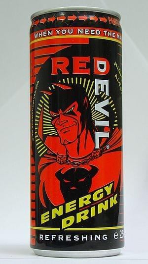

\[caption id=&quot;&quot; align=&quot;alignright&quot; width=&quot;300&quot; caption=&quot;Image via Wikipedia&quot;]\[/caption]

The idea of a data driven lifestyle has really started gaining ground lately. It seems every month at least one such application comes out. Some call it gamification of the world around you, some just want to help you lead a better lifestyle. All have one thing in common: Collecting reams upon reams of data you didn&#x27;t think you needed even a week ago. Sometime last year I somehow got sucked into this cult as well. My [gateway drug](http://en.wikipedia.org/wiki/Gateway_drug_theory "Gateway drug theory") was [Foursquare](http://www.foursquare.com/ "Foursquare") - it made me start logging my locations to see where I&#x27;ve been. &quot;For the lulz!&quot;, so to say. But then I started using an app called [Daytum](http://www.daytum.com/ "Daytum") that lets you log pretty much any random thing and I&#x27;ve been using it to great effect mostly for keeping tabs on how many [energy drinks](http://en.wikipedia.org/wiki/Energy_drink "Energy drink") and cups of tea I drink in a day, but also to keep track of my morning exercising. Toshl is another important mention at this point, I&#x27;ve never analyzed that data, but just the constant nagging blatant reminder of how much I&#x27;m spending makes me behave more responsibly ... I think. Well, last week I got suckered into counting calories. I&#x27;m still not sure how exactly it happened. One moment I&#x27;m having a normal conversation, next thing I know I&#x27;m downloading an app and thinking about what I&#x27;d eaten that day so I could start logging right then and there. It&#x27;s important to always start _NOW_. Not tomorrow. Not next week. _Now!_ I&#x27;m using [MyFitnessPal.com](http://www.myfitnesspal.com/) and it&#x27;s looking pretty good so far. Their web interface sucks more than your average [Geocities](http://www.geocities.co.jp/ "GeoCities") website, but the [iPhone app](http://en.wikipedia.org/wiki/IPhone "IPhone") itself is pretty damn cool. Must admit I find it almost reasonably simple to use and can actually navigate around well enough to accomplish most of my tasks without too much effort. But the damn thing keeps trying to make me eat and eat and eat and then eat some more. Not sure exactly who designed this system, but it seems to be primarily aimed at people trying to lose weight. My settings say that I want to maintain body weight. Now, myfitnesspal also lets you add exercises and what invariably ends up happening for me is that despite feeling full and perfectly content with how much I&#x27;ve eaten on any given day ... it wants more. Take today for example, I&#x27;ve eaten 1928 calories, which is pretty respectable if you ask me. Well, myfitnesspal thinks I should eat another 333 calories. The most interesting in this story is the effect of _seeing_ how many calories I&#x27;m eating is having the exact opposite effect myfitnesspal is trying to convince me it should have. I&#x27;m fairly certain I&#x27;m eating _less _than I was before, which would be awesome if I was trying to lose weight, but I&#x27;m not. Seeing all those calories gives me this subconscious sense of guilt when I eat. It&#x27;s really difficult to explain, but I&#x27;m thinking it&#x27;s the same effect writing down expenses has. Also, it&#x27;s only Wednesday and I&#x27;ve already blown my weekly ration of sugar by four grams ...

###### Related articles

- [Do You Count Calories?](http://www.fitsugar.com/5848166) (fitsugar.com)
- [Reader&#x27;s Request: How to &quot;get healthy&quot;](http://eatspinrunrepeat.wordpress.com/2011/09/20/readers-request-how-to-get-healthy/) (eatspinrunrepeat.wordpress.com)
- [Back to Basics: Calories Explained](http://www.fitsugar.com/2498686) (fitsugar.com)
- [You want fries with that?](http://maureenholland.wordpress.com/2011/09/20/you-want-fries-with-that/) (maureenholland.wordpress.com)
- [Why Nighttime Calories Are Worse for Your Waist](http://eating.health.com/2011/09/19/nighttime-eating-weight-gain/) (eating.health.com)

