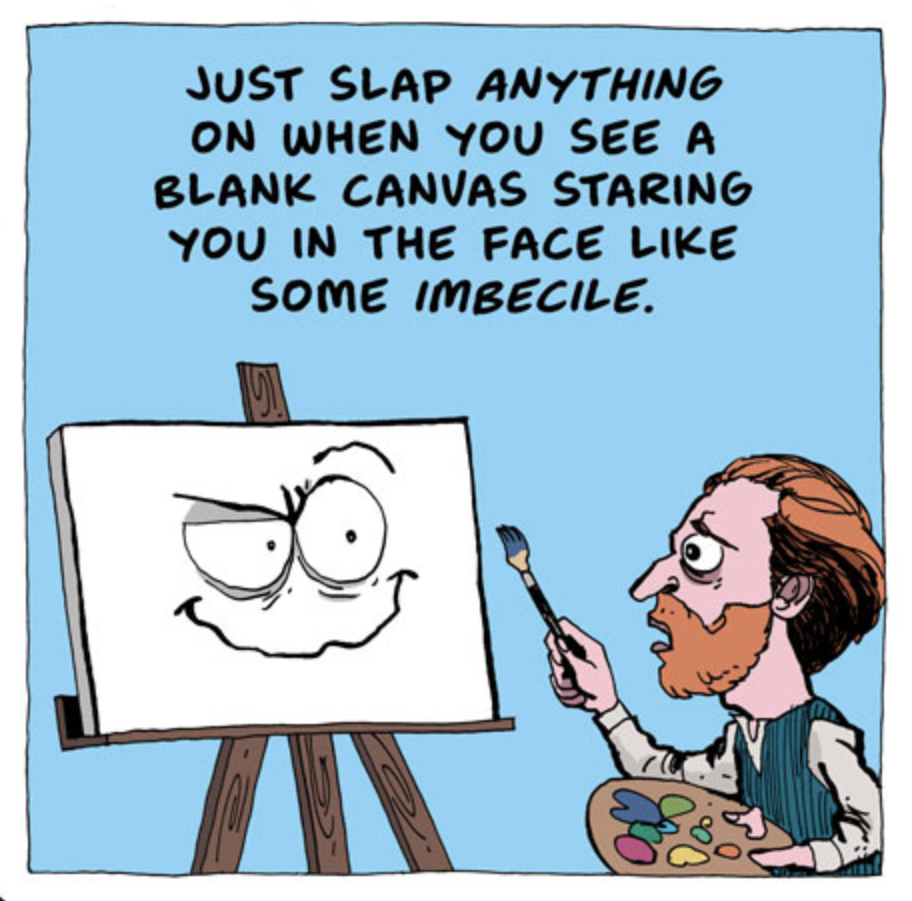

import { ContentUpgrades } from "@swizec/gatsby-theme-course-platform"

Friend, what slows you down most while coding?

It's not lack of skill. I know you're awesome.

It's not lack of ideas. You got plenty.

It's uncertainty. Fear. _"What do I do next? Will reviewers rip this to shreds? Is it good enough? Does it perform okay? Is this the right name to use?"_

You see this with engineers and other creative pursuits. The fear of imperfection, the drive to get it right the first time.

But that's not how it works my friend. You _can't_ get it right the first time.

## The blank file of doom

The blank canvas is your biggest foe.

Click that 👆, it's one of my favorite comics.

Why are you keeping that canvas blank? Start. Type _something_

When a new file scares you, here's what you do: lfaekwjflawkjalc

<ContentUpgrades.SeniorMindset />

Yes really. Slam the keyboard and build momentum. Once you're typing the code starts flowing.

Better yet 👉 _don't open a new file_. Write new code next to the old code. Move it to a new file later.

## Naming is hard

> There are only two hard things in Computer Science: cache invalidation, naming things, and off-by-one errors.

Except naming's not hard. You just don't know what you're building yet.

A trick I learned back in my fiction writing days is The Placeholder. You don't have to decide everything _right now_. Write.

When you [write a novel in a month](https://nanowrimo.org) your target is 1666 words per day. I did it once. You have no time to stop. Heckin' fun.

Same is true for coding. _Build the damn thing_ and you'll find out what it does.

Last week I built a new component, called it `Bloop`.

Then I got dirty. Tried a bunch of things, explored what I'm doing. Used code to think. When the component worked, its true name was obvious.

## Don't fear the mess

embrace the mess! Mess is how you learn.

A fear that stops you in your tracks is that you'll get it wrong. _"Hmmm not sure how this works, I better go research online."_

TRY IT! Just go for it! It's code, it don't bite. I promise.

Like that time I learned a whole new TypeScript concept that blew my mind. _"I wonder if this works ..."_

[https://twitter.com/Swizec/status/1362858124978216960](https://twitter.com/Swizec/status/1362858124978216960)

And it did work!

Kids have us beat in this regard. They try shit and see what happens. It's the fastest way to learn. Get in there and muck about! See how it goes.

What's the worst that can happen? Oh are you gonna get a error? Cool! Fix it :)

## Make bets and let small fires burn

The other thing that slows you down is fear of mistakes. Not like _"oops that's a weird name for a function"_ but mistakes like _"oops I deleted the production database"_

Don't delete the production database.

Do consider the consequences of your decisions. How big are they really? How likely are they?

If your code runs 100 times per day and you wrote a 1-in-10,000 bug ... do you think it's worth worrying about? The bug that happens once every 10 days?

You do have to weigh probabilities against consequences. Don't drop your production database every 10 days 😂

[Thinking in Bets](https://www.penguinrandomhouse.com/books/552885/thinking-in-bets-by-annie-duke/) is a great book about this mindset. You can decide faster if you think like a bet: _"What's the consequence? How likely is it? Okay do the thing"_

Make the decision and move on.

And don't forget, something is always on fire. Focus on the biggest fire, [let small fires burn](https://mastersofscale.com/selina-tobaccowala-let-fires-burn/). Not every bug or detail is worth your time.

## The vomit draft

Another trick from the writing world: The Vomit Draft.

Your first draft gets the ideas out. The code working. An embarrassing mess.

Guess what you can do with an embarrassing mess? Fix it. Edit.

Make a pull request and get feedback. Show screenshots to designers and get feedback. Show it to your product owner and get feedback.

You can polish until it's perfect enough. But an empty file ... can't do much with that.

Start. Don't stop. Keep going. You can always fix it later. ❤️

Cheers, 
~Swizec

PS: this applies to everything
