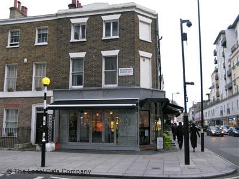

The challenge: Pay one compliment to one complete stranger every day. \[caption id=&quot;&quot; align=&quot;alignright&quot; width=&quot;300&quot; caption=&quot;Tattoo artist at Zvērā Festival 2009 (Latvia). (Photo credit: Wikipedia)&quot;][.")](http://commons.wikipedia.org/wiki/File:TattooArtistZvera2009.jpg)\[/caption] The experiment: See what happens. Every day you will hear someone exclaim: _&quot;Dear fuck, why do people have to be **so** stupid!? Fuck!&quot;_ When people use twitter to vent, there are _a lot_ of these. And it&#x27;s getting somewhat annoying, wherefore all the negativity guys? I wanted to do something about it. So ~3 weeks ago I decided to start giving complete strangers compliments. Just to see what happens. Either with the strangers I talk to, or with my own attitude towards people (not that there was much wrong with it before). At first, I struggled. Everyone is so plain and boring! How could I possibly find somebody to compliment every single day? This is impossible, I better quit while I&#x27;m ahead ... and I did quit. For a little while, until I went to [London](<http://maps.google.com/maps?ll=51.5072222222,-0.1275&amp;spn=0.1,0.1&amp;q=51.5072222222,-0.1275 (London)&amp;t=h> "London") two weeks ago. London is a strange city full of interesting people. Surely I&#x27;d manage a compliment there?

## The Experiences

\[caption id=&quot;&quot; align=&quot;alignright&quot; width=&quot;320&quot; caption=&quot;La Mere Blanc&quot;]\[/caption] On Friday, 11th of May 2012, at [La Mere Blanc](http://www.yelp.co.uk/biz/la-mere-blanc-london) near [Vauxhall Bridge](<http://maps.google.com/maps?ll=51.4875,-0.126944444444&amp;spn=0.01,0.01&amp;q=51.4875,-0.126944444444 (Vauxhall%20Bridge)&amp;t=h> "Vauxhall Bridge") in London, I had just finished my breakfast when I noticed the cashier person has an awesome tattoo. He started punching numbers and all I could think about was _&quot;Is it socially acceptable to comment on a tattoo you can see in a guy&#x27;s cleavage?&quot;_. \*ding\*, the cash drawer opened_ should I do it? It&#x27;s a challenge ..._I reach for my wallet _I mean it&#x27;s just a challenge. For shits and giggles?_ I hand him the money, struggling to make eye contact while checking out the tattoo anyway. _Should I do it? Will it be weird?_ He hands me the change, &quot;Thanks&quot;, I say, &quot;Oh and by the way, your tattoo looks nice.&quot; There, it&#x27;s done, reach for the door and I&#x27;m out of here before anything weird happens! Instead, &quot;Oh thanks man! My sister made it, she&#x27;s a [tattoo artist](http://en.wikipedia.org/wiki/Tattoo_artist "Tattoo artist") you know?&quot;, the cashier said. What followed was a five minute conversation about tattoos, his sister as a tattoo artist, and his grandmother who got her first tattoo when she was 65 and just keeps wanting more and more. **Everything went better than expected!** Since then, walking up to complete strangers just to give them compliment has grown increasingly easy. Sometimes the exchange is very brief - like the case of telling a girl her hair looks nice and her just squeezing a _thanks_ through her breath as she rushed by - sometimes they turn into whole conversations. I had a particularly interesting experience yesterday. It was rainy in [Ljubljana](<http://maps.google.com/maps?ll=46.0555555556,14.5083333333&amp;spn=0.1,0.1&amp;q=46.0555555556,14.5083333333 (Ljubljana)&amp;t=h> "Ljubljana") so there weren&#x27;t a lot of people around. By 4pm I was starting to get desperate, interesting people were growing thin and when I did see someone I chickened out, or hesitated for slightly too long until they were gone. As I stepped out of a coffee shop there was a lass. She had funky hair. Casually, walking past, I pointed at her and said _&quot;Hey, you have cool hair!&quot;_ and walked off into the sunset. (she smiled and whispered a thanks) Except a hundred meters later, I realized I&#x27;d forgotten my umbrella. Went back feeling shy, the girl was still there ... fuck this is going to get awkward! This time _she_ was the first to talk to me. Paid me two compliments in fact, tried to keep me in a conversation as long as possible. We even went so far as introducing each other! But I was already late for class so all I&#x27;m left with is a name and an image of funky hair - _Mirela_ ... what an interesting name. There was at least ten more minutes of conversation in the name alone.

## The Observations

While doing the challenge, I&#x27;ve noticed two things: \[caption id=&quot;&quot; align=&quot;alignright&quot; width=&quot;160&quot; caption=&quot;Cécile, Tattoo Artist - Tattoo Art Fest (009) - 18-20Sep09, Paris (France) (Photo credit: philippe leroyer)&quot;][ ...")](http://www.flickr.com/photos/52499764@N00/3933165538)\[/caption]

1. People are a **lot** nicer than you think. Walk up to someone with a smile and something positive to say, you are _guaranteed _nice things will happen. Nobody will get annoyed, it will _not_ get awkward or weird. Girls especially react well to this, even if you very bluntly say they just look cute.
2. I notice people more. The city is no longer a nameless faceless mass of humans rushing past each other, there is some small interesting thing about almost everybody. Some of them are even worth mentioning.

All of this might sound touchy feely and kind of lame, but I think not enough people realize they&#x27;re awesome. If I&#x27;m not doing some big startup, I should at least be making the world a better place one simple compliment at a time. And you never know where a chance interaction might take you. Some random guy might actually be a big VC just looking for someone like me. Or a girl desperately wanting some company ... or a business owner who needs a freelancer.

###### Related articles

- [Top tattoo artists win hearts of Moscow&#x27;s eccentrics](http://www.rt.com/news/prime-time/tattoo-convention-moscow-artists-796/) (rt.com)
- [The New York City Tattoo Convention: What We Overheard](http://coedmagazine.com/2012/05/21/the-new-york-city-tattoo-convention-what-we-overheard/) (coedmagazine.com)
- [Has a Stranger Ever Asked Where You Get Your Hair Done?](http://www.bellasugar.com/Has-Stranger-Ever-Asked-Where-You-Get-Your-Hair-Done-3249967) (bellasugar.com)
- [Friday Roundup: Focus on Your Humanity](http://donhall.blogspot.com/2012/05/friday-roundup-focus-on-your-humanity.html) (donhall.blogspot.com)
- [What&#x27;s Your Most Complimented Beauty Feature?](http://www.bellasugar.com/Whats-Your-Most-Complimented-Beauty-Feature-15866788) (bellasugar.com)

