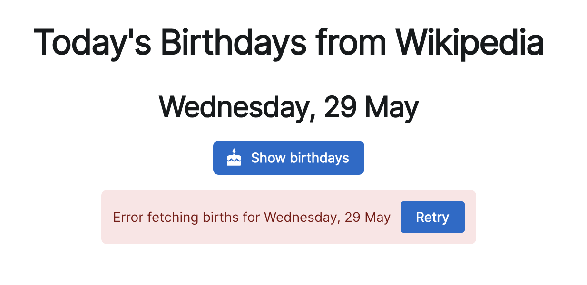

What makes code hard to read and think about? A combinatorial explosion of states and execution paths.

This happens when you put everything inside your component. Data loading, transformations, error handling, loading states, and that's before you even think about user interactions.

Need to coordinate 2 or more data loaders? Fuggedaboutit.

```typescript
if ((loading1 || loading2) && !error1 || ...)
```

The number of bugs I've caused this way is too damn high 🫠

Code like this leads to high [cyclomatic complexity](https://swizec.com/blog/forget-complicated-code-focus-on-the-system/), which is less problematic than architectural complexity, but does make smoke come out your ears. The code is brittle and likely to break any time you sneeze wrong.

## Suspense to the rescue

Ever since [using TanStack Router](https://swizec.com/blog/tanstack-router-modern-react-for-the-rest-of-us/), where these patterns are built-in at the router level, I'm increasingly a fan of solving these problems with React Suspense.

https://x.com/Swizec/status/1792051188432839105

The code shows a piece of UI that renders when `showBirthdays = true`. Like when you click a button to start loading.

`Suspense` handles the loading state. `ErrorBoundary` handles the error state.

You can [try it out here](https://suspense-example-swart.vercel.app/) and [see full code on GitHub](https://github.com/Swizec/suspense-example).

### Main component – happy path


That leaves your component to implement the happy path.

```typescript
const Birthdays: FC<{ day: Date }> = ({ day }) => {
  const births = useBirths(day)

  return <Table data-testid="birthday-list">// ...</Table>
}
```

No loading states. No error handling. Just a data loader and rendering. You could add more data loaders and assume everything's perfect in the rendering portion of your component.

### Data loader – leverages suspense

The data loader leverages suspense to suspend rendering while data loads. I'm using `useSuspenseQuery` from [React Query](https://tanstack.com/query/latest/docs/framework/react/overview), but similar tools exist in other popular libraries.

```typescript
function useBirths(day: Date) {
  const query = useSuspenseQuery<BirthEntry[]>({
    queryKey: ["wikipedia-birthdays", day],
    queryFn: async () => {
      const response = await fetch(
        `https://en.wikipedia.org/api/rest_v1/feed/onthisday/births/${
          day.getMonth() + 1
        }/${day.getDate()}`,
      );

      if (!response.ok) {
        throw new Error("Error fetching births");
      }

      const { births } = (await response.json()) as {
        births: BirthEntry[];
      };
      births.sort((a, b) => b.year - a.year);

      return births;
    },
  });

  return query.data;
}
```

Notice that I can just throw an Error when it happens. This is important. You want any error during processing or rendering to throw so that the `ErrorBoundary` can catch it and show feedback to the user.

Another important detail is that I'm sorting and parsing data directly in the loader. That improves your render performance because you're caching the data you use, not just the data you fetch.

https://x.com/Swizec/status/1794136049276669977

### Error component – for the errors



The `ErrorBoundary` renders an error component when something's wrong. This component lets users recover from an error by resetting the boundary and refetching the data.

```typescript
const LoadError: FC<{ day: Date }> = ({ day }) => {
  const queryClient = useQueryClient()
  const { resetBoundary } = useErrorBoundary()

  function refetch() {
    resetBoundary()
    queryClient.refetchQueries({
      queryKey: ["wikipedia-birthdays", day],
    })
  }

  return (
    <Alert color="danger">
      Error fetching births for {getPrettyDate(day)}{" "}
      <Button onClick={refetch}>Retry</Button>
    </Alert>
  )
}
```

Powered by the popular [react-error-boundary](https://www.npmjs.com/package/react-error-boundary) component from B Vaughn, a former member of the React team.

### Loading component – for loading states


The loading component in my case is just a `<CircularProgress>` spinner. You can make it as fancy as you want.

## Why this helps

No more god components that do everything! No more god hooks that try to coordinate a bazillion different states.

Keep your happy path, loading state, and errors separate. Think about one at a time ✌️

\~Swizec
