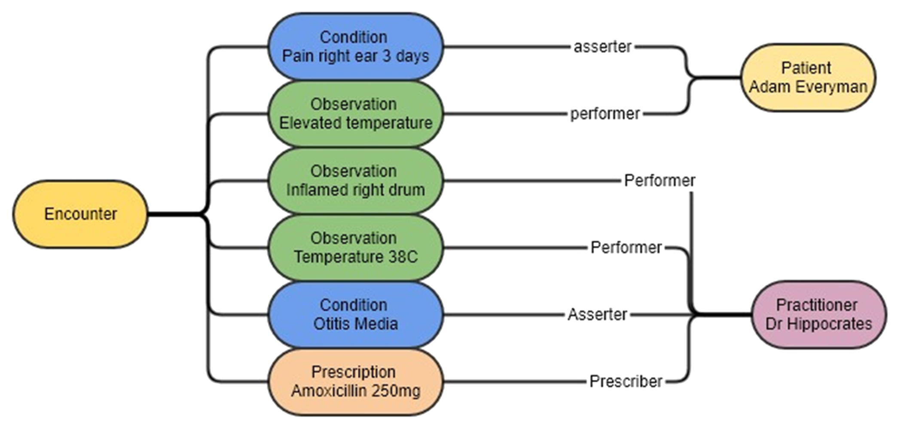
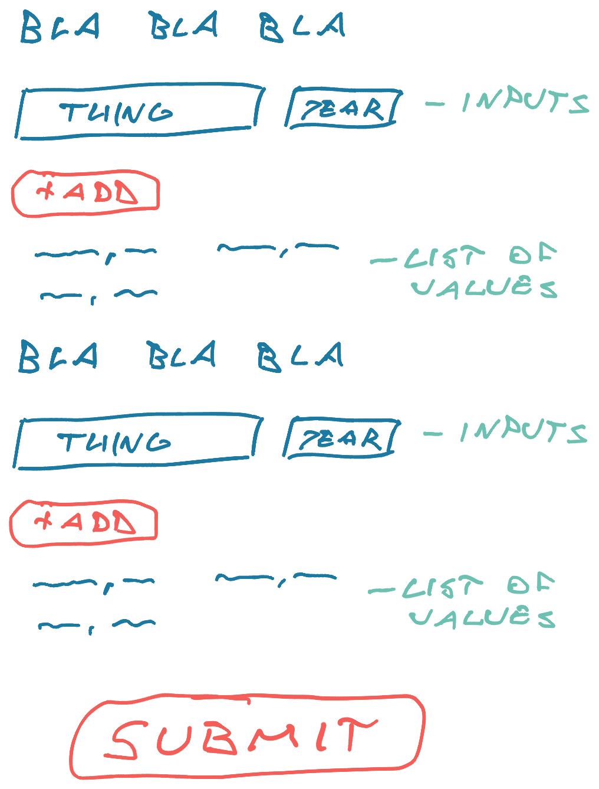

Do you ever get stuck on a project that the more you look at it, the harder it gets? We faced that the other week and with 1 tweak to requirements it became easy, almost trivial. Here's the story.

## The project

We're building a new electronic health record, a way for patients and providers to collaborate on medical data in a standards compliant way that can integrate with other health systems. It is the gnarliest domain modeling project I've seen.

How do you store data such that it is flexible enough to model complex reality, but structured enough to be analyzable? The [FHIR](http://fhir.org) standard.

We decided implementing full FHIR is too hard, but took lots of inspiration. Lean hard into the idea of `resources` and `actors`, have [a proper REST API](https://swizec.com/blog/better-tooling-wont-fix-your-api/), and use a gaggle of database tables to store structured data. Great.

## The problems explode in our face

After months of planning and implementing backend services, the time came for my team to build our first patient-facing UI. A way to enter your past and current conditions.

Together with design and product, we envisioned a UI like this:

You have a page with questions. Each question can store multiple entries. Then you hit save.

Can you spot the problem?

Yeah we thought it would be easy, too. It's a form, how hard can it be, we've built thousands ...

### Validations

Validations were first to blow up.

You have to validate the `<thing, year>` pair before adding to the list of values for each question. No future years, for example.

Then you have to validate the form as a whole before enabling the big fat Submit button. Are all questions answered? Do they have conflicts?

We re-learned that you can't use nested forms. We failed to [use field arrays](https://react-hook-form.com/api/usefieldarray/). We then created a monster piece of logic that re-implemented half of [react-hook-form](https://swizec.com/blog/why-reacthookform-is-my-new-favorite-form-library/).

It _almost_ worked.

### Distributed transactions

Next we faced a [distributed transactions](https://en.wikipedia.org/wiki/Distributed_transaction) problem. How do you ensure everything does or doesn't save together?

Each entry for a question is considered a `resource`. The backend expects an API call to save or update each.

User adds 5 conditions, 3 of them save, 2 fail because of a network error. How does the user resolve this? How do we even tell the user what happened?

You could retry failures for a while, but there's no guarantee you'll succeed. And you can't clean up the 3 that saved either. Hard to send DELETE requests, if you can't talk to the server 💩

I set a meeting with the backend team and our architect and after a collective set of groans we agreed: Maybe we can build bulk APIs. Let the UI save multiple resources at once.

That solves atomicity per question.

What about atomicity per page? Each page may have questions from _different_ resources. You don't want a single bulk API to save a few active conditions, a couple genetic mutations, and perhaps an allergy or two.

You could build a backend-for-frontend as an intermediary 🤔 but you're just smearing the problem around ...

## The change in perspective

The fundamental issue is that we had the wrong design. The UI and API disagree on what counts as 1 atomic write.

You can _hide_ that with clever technical hackery, but you can't _solve_ it.

I wrote up my findings in a long Slack message that should've been a meeting and asked our product owner what we can do to meet in the middle with API constraints. We can do bulk APIs per resource, but not per page.

_"What about save as you go?"_, our manager came in with a celeb shot.

Brilliant! 💡

Product owner loved it, design said okay after we explained. Saving every answer _as soon as it's added_ solved all our problems 😍

Input fields, click add, save to backend. 1 atomic operation.

Validation runs on change and enables the `Add` button. Hit add, show loading state in button. If it works, clear fields and add to list. If it doesn't, keep fields and show an error same as you would for validations.

By the time users get through a page everything is saved. The big fat submit button becomes purely navigational. Heck yeah!

After 2 days of struggling with the old approach, we built the new way in 2 hours. But we needed the struggle to think of it.

## The lesson

What I like about this story is that it shows the leverage you can have as a senior+ engineer. By talking to other teams and involving the product owner you make a whole class of technical problems vanish _and_ save time on related future stories.

Plus the UX is better and users are happy. 🤘

And remember: If everything's a struggle, your approach is wrong.

Cheers, 
~Swizec
