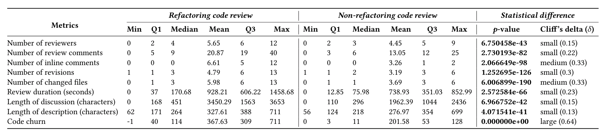
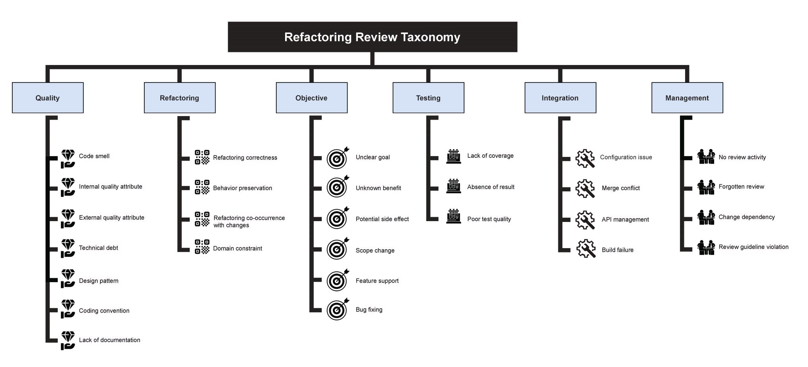

Do you review refactoring pull requests differently than you do others? An empirical study of OpenStack, an open source cloud platform, says that you do and finds the 6 criteria you care about.

In [Code Review Practices for Refactoring Changes: An Empirical Study on OpenStack](https://arxiv.org/abs/2203.14404) AlOmar et al aimed to answer:

- Do refactoring code reviews take longer?
- What are the criteria reviewers look for?
- Could tools be developed to make it easier?

They studied 11,010 code changes on OpenStack and created a taxonomy of 28 criteria used to accept or reject code refactors. Tools exist, but can't replace a human.

## The purpose of code review

Under related research, the authors explored _why_ we do code review. You and I have gut feels about this, but research boils it down to 3 factors:

1.  Finding defects
2.  Improving the code
3.  Increasing knowledge transfer

Whether that matches outcomes, they don't say. The authors do list a study that found [95% of code review _doesn't_ decrease code smells](https://fpalomba.github.io/pdf/Conferencs/C36.pdf). A fun future read. 😅

Other research shows that 63% of refactoring happens while implementing new features and only 31% of changes that contain refactoring are _explicitly_ about refactoring.

The long discussion and disagreement on refactoring code reviews [_increases_ design degradation](https://conferences.computer.org/icsme/pdfs/ICSME2020-1oOutvkGTwF4GyVvNtr3Mm/561900a511/561900a511.pdf). 🤔

## Study design

The authors combined a qualitative and quantitative approach. Numbers to see if refactoring takes longer to review, manual review to see what people look for.

They examined multiple projects and landed on [OpenStack](https://en.wikipedia.org/wiki/OpenStack) because of its high level of activity, full review coverage (100% of code is reviewed), and a high number of refactoring code review. Changes that _explicitly_ say they're about refactoring.

The authors focused on pull requests that contained the word "refactor" in both subject and body. This feels limiting, but makes sense for the focus of this research.

## Do refactoring code reviews take longer?

As you may have guessed, reviewing a refactor indeed takes longer. There's more discussion, more disagreement, and more code thrash.

The table compares various metrics between refactoring and non-refactoring code reviews. On average you get

- 1 more reviewer
- 60% more comments
- 2 more code changes
- more files changed
- 75% longer comments in total
- 82% more code churn

Refactoring leads to higher code churn and that creates longer discussion. Interestingly, having more reviewers does not increase review length. Code changes do.

## What are the criteria reviewers look for?

Two researchers manually reviewed thousands of pull requests to build a taxonomy of important criteria. An engineer from industry validated their findings with _"Sounds about right"_.

They found 6 categories of review criteria and what makes them difficult to achieve.

**1. Quality** (of design) is a vital part of refactoring review. There is no systemic way to gain a full understanding of the software evolution, which leads to locally optimal refactors that don't fit. The more you change the same set of files, the better your design gets.

**2. Refactoring** that leads to a safe and stable design is considered "correct". Because this often happens as part of other code changes, bugs are easy to miss.

**3. Objective** challenges mean that someone eventually asked _"What's the purpose of this pull request?"_. You can't tell if the change is appropriate, if you don't understand its intent. Better PR descriptions help.

**4. Testing** is meant to ensure that refactoring doesn't change behavior. Ideally relying on the existing test suite. Adding new tests is fine when a refactor reduces coverage.

**5. Integration** of refactoring changes can run into challenges with complex merges, changes in configuration, and subtle changes in API surface. [Hyrum's Law](https://swizec.com/blog/what-i-learned-from-software-engineering-at-google/#beyonce-rule-and-hyrums-law) looms large. This includes library upgrades, which leads to even longer discussions about whether the upgrade is worth it.

**6. Management** is a common source of longer reviews. Sometimes people just forget you're waiting.

## Can we have tools for this?

There are tools that can help with refactoring. Nothing that stands out as magical yet.

Until then strict type coverage makes refactoring easier as does a decent test suite. The better your software design, the easier your refactoring.

https://twitter.com/Swizec/status/1516169480107307012

The authors recommend establishing common guidelines for refactoring reviews, avoid refactoring as part of other changes, use continuous integration, and agree on a convention for structuring your code. All that saves time.

Good luck.

Cheers, 
~Swizec
