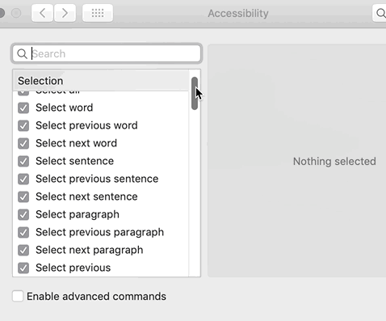

Wednesday my hands were very sore tried dictation to write my code then I put my hands on break.

No seriously, that sucked.

You can see the [full video here](https://www.youtube.com/watch?v=RfGKIZOZPRY) 👇 took me 30 minutes to write 8 lines of code, a React adder component.

https://www.youtube.com/watch?v=RfGKIZOZPRY

## What&#x27;s it like to write code with your voice

Move left, move left, move left, move left, delete that, delete that, move left, function, undo, undo, delete that, move left, move left, undo, agh damn it why did you write that, crap, undo, undo, undo, ok, no wait, uaaaaa

Like that.

I learned that I curse under my breath when things go wrong. When your computer is listening and types out everything you say ... 😅

With MacOS Dictation you press command twice and off you go in voice control mode. Anything you say, the computer tries to translate into written text.

So easy to forget to turn it off. Especially when you mumble or you mispronounce something, the computer gets confused and goes down a weird rabbit hole.

You then have to stop dictation and reset from scratch. This happens a lot.

Dictating text worked well. Code and voice commands ... urgh.

MacOS Advanced Dictation gives you a bunch of special commands. Like move left, delete that, capitalize that, move to end of word, etc.



All great in theory, but half the time my computer would type out the command instead of doing the thing. Replacing uppercase letters with lowercase was a constant chore.

Say you want to write `function`, here&#x27;s how you do it 👇

```undefined
<code>🗣 *function*
Function |

🗣 *move left*
Functio|n

🗣 *move left*
Functi|on

🗣 *move left*
Funct|ion

🗣 *move left*
Func|tion

🗣 *move left*
Fun|ction

🗣 *move left*
Fu|nction

🗣 *move left*
F|unction

🗣 *delete that*
|unction

🗣 *lowercase f*
f|unction
</code>
```

🙃

Imagine your hands break down and that&#x27;s your life for a few weeks or months? Oof.

You&#x27;d get better at it, find other software than built-in dictation, but still ... we take our keyboards and impressive typing speeds for granted don&#x27;t we?

Gotta be careful with that.

Keyboards will wreck your hands. That warning label on the back saying _&quot;Prolonged use of this device can cause serious injury&quot;_ is not joking around.

## But why can&#x27;t voice do code?

If voice works so well for Alexa and dictating text messages, why not for writing code?

It&#x27;s all got to do with how [speech recognition](https://en.wikipedia.org/wiki/Speech_recognition) works.

Speech recognition is a tough fuzzy computational problem. Everything from signals processing to machine learning has to work just right.

In a nutshell (because I&#x27;m no expert) 👇

1. Listen to a microphone
2. Find the human voice
3. Filter out noise
4. Filter out irrelevant background humans
5. Tokenize human voice into words _(this is based on trained machine learning models using many different dialects and accents)_
6. Decide how well you recognized individual words
7. Feed certainty weighted words into a statistical model, often a [hidden markov model](https://en.wikipedia.org/wiki/Hidden_Markov_model) _(more trained machine learning models)_
8. Use statistics to fill in the blanks
9. Try a few options to get the likeliest sequence
10. Turn result back into text

Lots of fuzziness and statistics. Each step of the way, something can go wrong. And it does.

Computer can misunderstand a word, mishear something, you might pronounce it weird, or there might just be too much noise. Computer fills in the blanks with an educated guess.

Sometimes as you keep talking, you change the meaning and the computer realizes it made a mistake. Goes back to fix the word so it makes more sense.

You can see this working beautifully when dictating text messages. It&#x27;s gotten so good I _prefer_ to dictate my texts when I&#x27;m on the go. Much easier than the iOS keyboard 😇

### You recognize speech the same way

You do this all the time inside your brain.

Ever noticed how it&#x27;s easier to understand a good friend at a noisy bar than it is a stranger? Or how difficult bar conversation becomes when you&#x27;re with non-native speakers?

That&#x27;s because you&#x27;re better at guessing what your friend says than a stranger. And your foreign friends have accents that are harder to filter out from the noise so there&#x27;s more guessing.

Or vice-versa if you&#x27;re the foreigner.

Very hard to chat in a loud bar coz you can&#x27;t follow what&#x27;s going on. Or at least I can&#x27;t ...

## So why not code?

With deep learning and big data, speech recognition has become really good for prose. Amazing even. If I didn&#x27;t type at 120wpm on my keyboard, I&#x27;d be dictating this article right now.

I already speak into my phone, for texting, almost as often as I type. It&#x27;s easier.

So why not code?

It&#x27;s all got to do with steps 7 and 8 in our list. You are speaking in symbols and indentation and weird words in weird sequences.

```undefined
<code>🗣 *use state*
</code>
```

What is that? Is it `Use state` or `UseState` or `useState`? How is a computer supposed to know?

Based on all its data, all the training sets, `Use state` is its best bet. You are likely starting a new sentence. It&#x27;s a weird sentence, but the computer don&#x27;t judge.

To get `useState`, the computer would have to understand your code. It would need to know you are writing a React Hook, not just a code comment.

But it can&#x27;t. It doesn&#x27;t have the context. And even if it did, you&#x27;d still need a model trained specifically on React code. And a model trained on JavaScript. And a model for Vue. And another for C/C++. And one for ...

You get the picture 👉 you need a new trained statistical model for every language you want to dictate.

Works great for English. Might take a while for all these weirdo esoteric programming languages we like to use. I wouldn&#x27;t hold my breath 😅

## What do?

So what can you do to avoid this right now?

Invest in a good keyboard, get a good mouse, learn how to relax your hands, type without moving or bending your wrists too much. Do it now before it&#x27;s too late.

You won&#x27;t like coding with your voice.

Happy Monday,

~Swizec

PS: before you ask, I like the Truly Ergonomic keyboard and a good Logitech mouse. Apple has the worst least ergonomic input devices. Make sure your forearms are at a comfortable angle to your keyboard, do not try to keep them perpendicular. Yes even on a laptop keyboard. Plop your mouse hand on the mouse like a dead fish. Do not grab. Try to move with your forearm, not your wrist or fingers.
