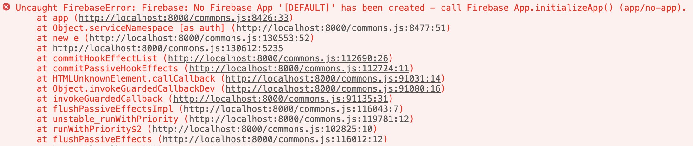
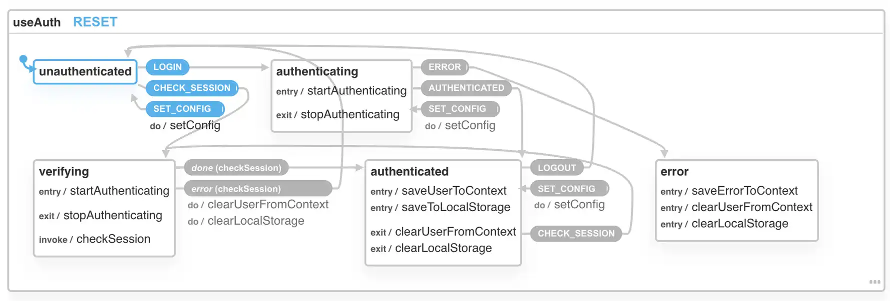

Support for Firebase Auth is one of the most requested features for [useAuth](https://useauth.dev) and I figured what the heck, how hard can it be?

_CodeWithSwiz is a weekly live show. Like a podcast with video and fun hacking. Focused on experiments. [Join live Mondays](https://youtube.com/swizecteller)_

[https://www.youtube.com/watch?v=qMtaaI-xjJM](https://www.youtube.com/watch?v=qMtaaI-xjJM)

Friend, it can be very hard. Google docs are shit. The perfect example of For Engineers, By Engineers.

You find out everything that's possible. All the little trees, every detail. Want user/pass auth? Here's the code. Email link? Do this. OAuth with xyz provider? Here.

You know what they don't say?

_How to set up fricken Firebase_ 😡

## The setup

```javascript
// Initialize the FirebaseUI Widget using Firebase.
var ui = new firebaseui.auth.AuthUI(firebase.auth())
```

Ok Google, how do I import this? Where's my API key?

Is there Google magic afoot and they can guess? Ask me after initialization like the [Netlify Identity widget](https://useauth.dev/docs/netlify-identity) can?

Nope.



We later found the right [docs to follow for initial setup](https://firebase.google.com/docs/web/setup#using-module-bundlers). Even explains how to correctly import for a smaller bundle size.

pt2 will go swimmingly 💪

## Creating an auth provider for useAuth

My favorite result of [refactoring useAuth from React.Context to XState](https://swizec.com/blog/react-context-without-context-using-xstate-codewithswiz-14-15) is that we can support multiple auth providers. Core logic is the same, details pluggable.



There's an abstraction layer and [basic documentation on what to do](https://useauth.dev/docs/auth-providers). We're putting my docs to the test 😅

### 1. stub your provider

You start with copypasta of the abstract implementation.

```typescript
// src/providers/YourThing.ts

// Auth Wrapper for Auth0
export class Auth0 implements AuthProviderClass {
  private auth0: Auth0Client.WebAuth
  private dispatch: (eventName: string, eventData?: any) => void
  // Auth0 specific, used for roles
  private customPropertyNamespace?: string
  // Initialize the client and save any custom config
  constructor(params: AuthOptions) {
    // You will almost always need access to dispatch
    this.dispatch = params.dispatch
    // Auth0 specific, used for roles
    this.customPropertyNamespace = params.customPropertyNamespace
    // Init your client
    this.auth0 = new Auth0Client.WebAuth({
      ...(params as Auth0Options),
    })
  }
  // Makes configuration easier by guessing default options
  static addDefaultParams(params: ProviderOptions, callbackDomain: string) {
    const vals = params as Auth0Options
    return {
      redirectUri: `${callbackDomain}/auth0_callback`,
      audience: `https://${vals.domain}/api/v2/`,
      responseType: "token id_token",
      scope: "openid profile email",
      ...vals,
    }
  }
  public authorize() {
    // Open login dialog
  }
  public signup() {
    // Open signup dialog
  }
  public logout(returnTo?: string) {
    // Logs user out of the underlying service
  }
  public userId(user: Auth0UserProfile): string {
    // Return the userId from Auth0 shape of data
  }
  public userRoles(user: AuthUser): string[] | null {
    // Return user roles from Auth0 shape of data
  }
  public async handleLoginCallback(): Promise<boolean> {
    // Handle login data after redirect back from service
    // Dispatch ERROR on error
    // Dispatch AUTHENTICATED on success
    // include the user object and authResult with at least an expiresIn value
  }
  public async checkSession(): Promise<{
    user: Auth0UserProfile
    authResult: Auth0DecodedHash
  }> {
    // verify session is still valid
    // return fresh user info
  }
}
```

### 2. fill abstract implementation

Fill in those methods to fit your auth provider. Here's what we tried for Firebase Auth. Don't know yet if it works.

```typescript
// src/providers/FirebaseUI.ts

constructor(params: AuthOptions) {
    // You will almost always need access to dispatch
    this.dispatch = params.dispatch;

    // Init your client
    this.ui = new FirebaseAuthUI.AuthUI(firebase.auth());
}

public authorize() {
    // Open login dialog
    this.ui.start("#firebaseui-auth-container", {
        signInOptions: [firebase.auth.EmailAuthProvider.PROVIDER_ID]
    });
}
```

Don't quote me on that yet :)

### 3. use the provider

Use in your app. We created a Gatsby-based example on stream

```jsx
// gatsby-browser.js
export const wrapRootElement = ({ element }) => (
  <ThemeProvider theme={theme}>
    <AuthConfig
      authProvider={FirebaseUI}
      navigate={navigate}
      params={
        {
          /* ... */
        }
      }
    />
    {element}
  </ThemeProvider>
)
```

Render `<AuthConfig>` and provide the new auth provider. We don't know yet which params Firebase Auth is going to use. Find out next time :)

### 4. contribute to useAuth 🙏🏻

To contribute the FirebaseUI auth provider to the core library we needed an extra step 👉 adding it to the library.

That happens in `package.json`:

```json
    "source": [
        "src/providers/auth0.ts",
        "src/providers/NetlifyIdentity.ts",
        "src/providers/FirebaseUI.ts",
        "src/index.ts"
    ],
    // ...
    "files": [
        "src",
        "dist",
        "auth0.js",
        "netlify-identity.js",
        "firebase-ui.js"
    ],
```

The `"source"` config tells [microbundle](https://github.com/developit/microbundle) to build `FirebaseUI.ts` as its own library. Creates a bunch of files in `dist/*` that aren't connected with the rest.

The `"files"` config tells NPM to keep `./firebase-ui.js` when publishing. That file is a hack.

```javascript
// ./firebase-ui.js

// this is a hack to improve DX
// TODO: figure out a better way
const { FirebaseUI } = require("./dist/FirebaseUI")
module.exports = { FirebaseUI }
```

Only way I could find to:

1.  Reduce bundle size and let you use different providers without installing all of them
2.  Have understandable imports like `import FirebaseUI from "react-use-auth/firebase-ui"`

If you know a better way please hit reply.

## In conclusion

[Understanding beats knowledge](https://swizec.com/blog/why-understanding-beats-knowledge). Knowing how several details of Firebase work, does not mean you can make it fit together.

Keep that in mind next time you write docs for your team.

Cheers,<br/>
~Swizec

PS: it's beyond cool that TypeScript lets you define _"An auth provider must conform to this API"_ and enforces it at the compiler level. Makes this way easier 😍
