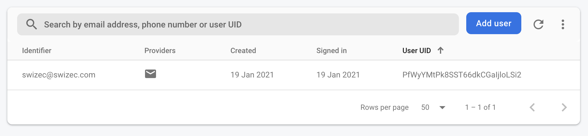
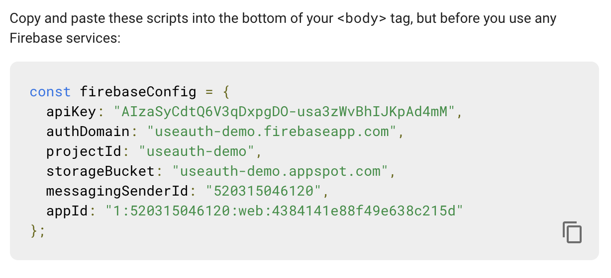
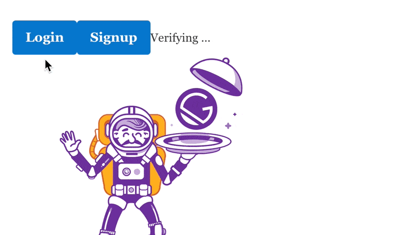

Firebase continues to be 💩. No wonder people keep asking for support in [useAuth](https://useauth.dev).

[https://twitter.com/tannerlinsley/status/1348848141496328192](https://twitter.com/tannerlinsley/status/1348848141496328192)

_CodeWithSwiz is a weekly live show. Like a podcast with video and fun hacking. Focused on experiments and open source. [Join live Mondays](https://youtube.com/swizecteller)_

[https://www.youtube.com/watch?v=GmTd0_2AFc4](https://www.youtube.com/watch?v=GmTd0_2AFc4)

Good progress this week! We got a [Firebase UI](https://firebase.google.com/docs/auth/web/firebaseui) login dialog to show up 🥳


To be honest, I was expecting more from a module that adds 64kB[^1] of JavaScript. Guess styles come separately?

## Where we at

Signup flow ends with an error. Return `false` from a callback or provide a URL. Documentation mentions both the URL and the callback somewhat off-hand. Hard to find.

An [issue from 2016](https://github.com/firebase/firebaseui-web/issues/3) mentions the URL is required. 5 years later documentation and error message say it isn't. 🥲

```javascript
signInSuccessWithAuthResult: function(authResult, redirectUrl) {
  // User successfully signed in.
  // Return type determines whether we continue the redirect automatically
  // or whether we leave that to developer to handle.
  return true;
},
```

We do get an earlier error about our callback config. 🤔

On the bright side, a user shows up in Firebase. That means login works and useAuth isn't resolving it correctly.



Huzzah!

## How we got here

[In part 1 of Firebase Auth](https://swizec.com/blog/codewithswiz-19-firebase-auth-support-in-useauth-pt1) we sketched out a new provider for useAuth. Configured imports, initialized FirebaseUI, set up the provider class.

This episode we:

1.  Improved imports
2.  Figured out how to initialize Firebase
3.  Discovered the `onAuthStateChange` observer
4.  Got frustrated at Google's SEO where any error message you google points to Firebase docs that _do not_ mention that error message
5.  Fiddled with TypeScript types
6.  Fired off the login flow

### Improved imports

Here's the correct way to import Firebase and the Auth UI.

```typescript
import { auth as FirebaseAuthUI } from "firebaseui";
import Firebase from "firebase/app";
import "firebase/auth";
```

Firebase is a library from the before times and likes to modify globals. In the name of "making it easy".

You import `firebase/auth` into nothing. Refer to it through the `Firebase` object.

Just like we used to do in 2010 when "JavaScript Bundler" meant _"Joe with a pickaxe crafting a giant file with `<script>` tags in exactly the right sequence"_


### Correctly initialize Firebase

We found the incantantion to init Firebase. You must create an app. A project is not enough.

Then you click the app and find a `firebaseConfig` object.



Don't worry about stealing those secrets, they're for the demo app. I intend to share them with the quick start guide.

Use them in the auth provider constructor:

```typescript
// src/providers/FirebaseUI.ts
export class FirebaseUI implements AuthProviderClass {
	// ..
	constructor(params: AuthOptions & FirebaseOptions) {
		// ..
		this.firebase = Firebase.initializeApp(
            firebaseConfig,
            "useAuth"
        );
```

Obvious in retrospect. Surprisingly hard to find.

The 2nd argument – `"useAuth"` – tells Firebase to initialize this as a separate app. Avoid overwriting any global Firebase config you might have.

Final API will have to let you choose. 🤔

### `onAuthStateChange` observer

`onAuthStateChange` was a great find! Lets you hook into the authentication flow and update your state machine.

```typescript
// src/providers/FirebaseUI.ts

this.firebase.auth().onAuthStateChanged(this.onAuthStateChanged);

private onAuthStateChanged(user: Firebase.User) {
    console.log("HAI", user);
}
```

Start in exploration mode 👉 print current user when state changes. First you get a `null`, then you go through the signup flow and get ... something.

[https://twitter.com/Swizec/status/1351367255095820291](https://twitter.com/Swizec/status/1351367255095820291)

Minified private TypeScript fields, [I'm told](https://twitter.com/_developit/status/1351399122952216576). You call `.toJSON()` to get the real value.

Reload the page after signup and callback prints this again. Login works 🤘

We'll use it next time to update useAuth's understanding of current user.

### Fire off the login flow

To fire off the login flow you need to pass all the config. Bit weird but sure.

```typescript
public authorize() {
    // Open login dialog
    this.dispatch("LOGIN");

    this.ui.start("#firebaseui-auth-container", {
        signInOptions: this.signInOptions,
        signInFlow: "popup",
        signInSuccessWithAuthResult: function(
            authResult: any,
            redirectUrl: string
        ) {
            console.log({ authResult, redirectUrl });

            this.dispatch("AUTHENTICATED", {
                user: this.firebase.auth().currentUser,
                authResult
            });
            return false;
        }
    });
}
```

useAuth calls this method when user clicks the login button. We put XState into the logging-in state with `dispatch('LOGIN')` then fire up the UI.

[Full options listed here](https://firebase.google.com/docs/auth/web/firebaseui#sign_in), if you scroll down.

On success, we print the auth result and current user. Tell useAuth and it handles the UI. Redirecting back to destination or at least re-render.

But it never gets there 🤔

## Thank you

Aaaaand I figured out what's wrong! You have to wrap `signInSuccessWithAuthResult` in a `callbacks:{}` object. Because of course you do.



You're a great rubber ducky my friend.

Cheers,<br/>
~Swizec

[^1] size difference measured by removing imports, deploying to Vercel, and looking at network tab.
