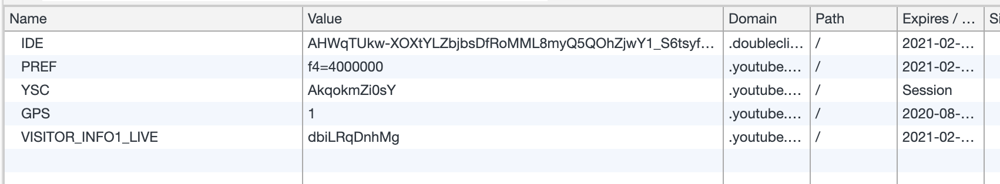

Friend, here's a new old experiment 👉 regular livecoding. It's like a podcast with video, show notes, regular cadence, and we both learn something new.

For me it's a regular timebox – **Wednesdays 6:30pm Pacific and Sundays 2pm Pacific** – to play with new technology, explore ideas, work on open source, and _hack_.

For you it's a chance to hear about new libraries and technologies, peek behind the curtain, ask any and all questions you'd like, and with luck see cool things get built.

Show notes work like a short recap.

---

https://www.youtube.com/watch?v=1TABvFT1X7Q

_PS: you can [read and share this online](https://swizec.com/blog/codewithswiz-privacy-focused-embeds-for-youtube-twitter-et-al)_

When websites embed 3rd party content like YouTube, Twitter, Facebook, et all, those embeds come with a bunch of cruft. Shitload of JavaScript, heavy code in iframes, and tracking scripts.

You don't want that.

Privacy is important and so is performance. A blank page with a single YouTube embed makes 18 requests and loads 2.2 megs of data.


5 cookies 😳



What if instead of embedding with an iframe, you showed a thumbnail first? Load dynamic content when user interacts and shows intent. Says _"Yes, I wanna see this"_

The way [TechLetter.App](https://techletter.app) works for emails. But without taking you to a new page on click.

Here's the plan:

- take existing AWS Lambda screenshot machinery
- make a Gatsby plugin that turns embeds into thumbnails
- inject vanilla JavaScript to turn into proper embeds

Started with a dirty proof of concept. It worked 🤘

https://www.youtube.com/watch?v=2JztRv9Q6Q8

Time to build a plugin! That did not go well.

First, we ran into issues with plugin building for Gatsby. You have to keep clearing cache, rebuilding the whole site, and waiting a lot.

When your computer is busy streaming, you're waiting _a lot_.

Should've written tests instead 😅

But fear not, we got the thumbnail part working. First for YouTube, later we can expand. It's a remark plugin like this:

```javascript
export default async function (
    { cache, markdownAST },
    pluginOptions: PluginOptions
) {
    const transformations = [];

    visit(markdownAST, "link", (linkNode) => {
        const url = linkNode.url as string;

        if (url.match(/^http(s)?:\/\/(www\.)?(youtube\.com|youtu\.be)/)) {
            transformations.push(async () => embed(linkNode, "youtube"));
        }
    });

    await Promise.all(transformations.map((t) => t()));

    return markdownAST;
}
```

Visits all `link` nodes in your document, checks if they're YouTube, and turns them into a thumbnail `embed`.

Transformation to an embed looks like this:

```javascript
async function embed(linkNode, embedType: "youtube") {
  const originalUrl = linkNode.url;
  const thumbnailUrl = await getThumbnail(originalUrl);

  if (thumbnailUrl) {
    linkNode.type = "image";
    linkNode.url = thumbnailUrl;
    linkNode.title = "A youtube video";
    linkNode.alt = "A youtube video";
    linkNode.children = null;
    linkNode.data = {
      ...linkNode.data,
    };

    linkNode.data.hProperties = {
      ...linkNode.data.hProperties,
      "data-embed-url": getYouTubeIFrameSrc(originalUrl),
      "data-embed-type": embedType,
    };
  }

  return linkNode;
}
```

`linkNode.data.hProperties` is how you can add HTML properties to your Markdown nodes. Didn't know that before, stole it from another plugin on stream ✌️

The `getThumbnail` method talks to my AWS Lambda running Chrome Puppeteer. Takes a screenshot of the YouTube video, saves it to S3, and returns the URL.

You can read about that in [Serverless Handbook: Chrome puppeteer chapter](https://serverlesshandbook.dev/serverless-chrome-puppeteer).

We're using `data-embed-url` and `data-embed-type` to tell the injected JavaScript what to do. Meant to turn this thumbnail into an iframe when you click.

Gatsby lets us inject JavaScript on page load. Export an `onRouteUpdate` method from `gatsby-browser.js`.

```javascript
exports.onRouteUpdate = () => {
  if (document.querySelector("[data-embed-url]")) {
    addJS(`
for (let embed of document.querySelectorAll('[data-embed-url]')) {
    embed.addEventListener('click', (event) => {
        const embed = event.currentTarget;

        const type = embed.dataset.embedType;
        const url = embed.dataset.embedUrl;
        const dimensions = embed.getBoundingClientRect();

        if (type === 'youtube') {
            const el = document.createElement('p');

            el.innerHTML = '<iframe title="Youtube embed" width="'+dimensions.width+'px" height="'+dimensions.height+'px" src="'+url+'" frameborder="0" allow="accelerometer; autoplay; encrypted-media; gyroscope; picture-in-picture" allowfullscreen=""></iframe>';

            embed.replaceWith(el);
        }
    })
}
        `);
  }
};
```

Yeah writing code in a string sucks. You don't have React either. And I gotta say vanilla JavaScript has improved lots in the past few years.

This code looks for all elements with a `data-embed-url` property and adds a `click` listener. When you click, it replaces the element with an HTML string.

Adding it to the page is a matter of injecting a new `<script>` tag into document head.

```javascript
function addJS(jsCode) {
  const s = document.createElement(`script`);

  s.type = `text/javascript`;
  s.innerText = jsCode;
  document.getElementsByTagName(`head`)[0].appendChild(s);
}
```

Where I'm stuck now is with Gatsby shadowing and moving all this code to the existing [gatsby-remark-embedder](https://github.com/MichaelDeBoey/gatsby-remark-embedder) plugin. Got the thumbnails to work, but not the in-browser JavaScript.

[Gatsby shadowing](https://www.gatsbyjs.com/docs/how-shadowing-works/) says you can put `gatsby-browser.js` in your plugin and Gatsby will run that code. But it's not working for me 🤨

Next time!

Cheers,
~Swizec
