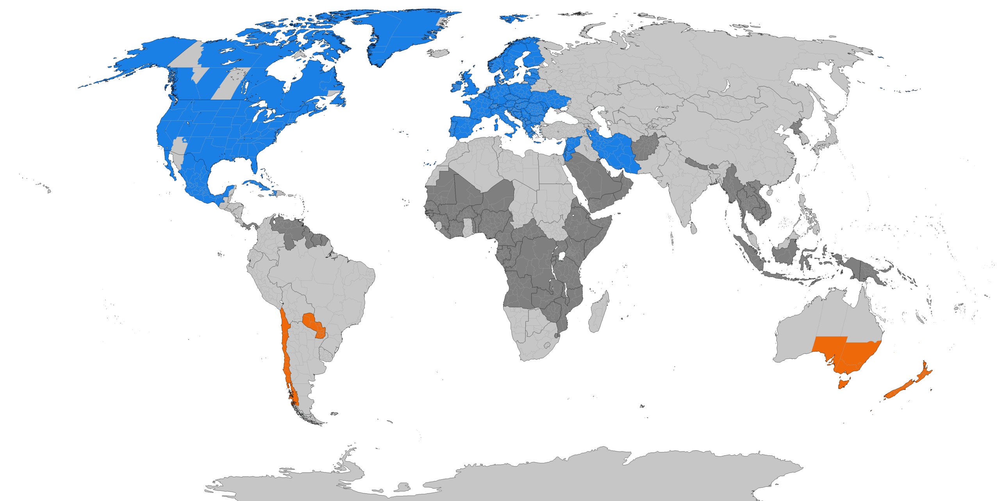
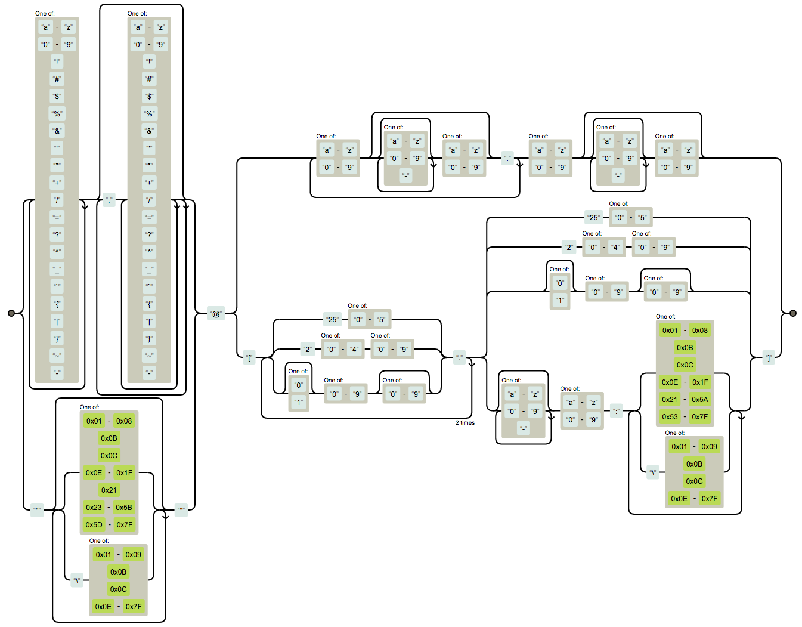

You know how a pen works, right? A nice ballpoint pen that you use every day.

Now explain how it works. 5 minutes. Write down how a pen works in as much detail as you can muster.

No worries if you can't. Neither could participants in a 2002 study into [The Illusion of Explanatory Depth](https://www.ncbi.nlm.nih.gov/pmc/articles/PMC3062901/pdf/nihms268518.pdf).

We think we understand problems until we try to solve them. Then all sorts of nasty little details crop up. Tiny gotchas you never could've guessed.

Say you're writing a loop that calculates times in 7 day intervals. You might write something like this:

```javascript
function getTimes(startAt, N) {
  let times = [];

  for (let i = 0; i < N; i++) {
    times.push(addDays(startAt, 7 * i));
  }

  return times;
}
```

Add multiples of 7 days to the start time until there's `N` timestamps in your array. Not the prettiest code in the world, but it works and it's easy to read.

## You find more depth

The code has a problem. Works great for UTC because there's no daylight savings. +7 days is +7 days no matter when.

Translate those UTC timestamps into human time and they shift around by 1 hour depending on season. Depending on where in the world you are.

For users in USA, except Arizona, the shift happens on March 13th and November 6th. In Europe it happens on March 27th and October 30th.

figure}]

To support human time, your code needs to become timezone aware. Like this:

```javascript
function getTimes(startAt, N, timezone) {
  let times = [];

  const zonedStartAt = utcToZonedTime(startAt, timezone);

  for (let i = 0; i < N; i++) {
    times.push(zonedTimeToUtc(addDays(zonedStartAt, 7 * i), timezone));
  }

  return times;
}
```

The code converts `startAt` from a UTC timestamp to the right time in our target timezone. Then it adds multiples of +7 days in a loop while converting from zoned time to UTC time.

`utcToZonedTime` and `zonedTimeToUtc` use the [IANA Timezone Database](https://www.iana.org/time-zones) to lookup the correct time conversions for any date. When the database changes in the future, we'll need to upgrade the `date-fns-tz` library.

## The rabbit hole goes deep, always

_But_ that still doesn't work for all dates.

The transition from Julian to Gregorian calendar in 1582 removed 15 days of that year. Few date-time libraries and execution environments support that change correctly.

You can't run this code on a satellite either. For that you'd need to take relativistic effects into account. Especially, if you need millisecond precision.

Let's not even get into leap seconds and how UTC is measured as the average between multiple atomic clocks spread around the world.

Rabbit holes are common in programming because we translate fuzzy understanding into exacting specifications.

Like what is the best way to store a [person's name](https://www.kalzumeus.com/2010/06/17/falsehoods-programmers-believe-about-names/)? Or a [billing address](https://www.mjt.me.uk/posts/falsehoods-programmers-believe-about-addresses/)? Or [map data](https://solutionspace.blog/2022/06/18/map-data-v-false-assumptions-programmers-make/)?

Popular misconceptions are common enough that [Falsehoods programmers believe about X](https://hn.algolia.com/?q=falsehoods) emerged as a genre of internet writing. The real world is messy.

## Even the invented world is messy

Even something as well-defined as an email address can be full of hidden complexity. Check out this [state machine that validates an email address](https://stackoverflow.com/a/201378)



Yeah, I never would've guessed it either.

Next time you look at convoluted code and think _"wow terrible, needs a rewrite"_, take a moment to consider you're missing some nuance.

Or you've learned the nuance and see that the code looks wrong. Sometimes you code around a problem in circles. The insight of understanding simplifies it all.

Cheers,<br/>
~Swizec
