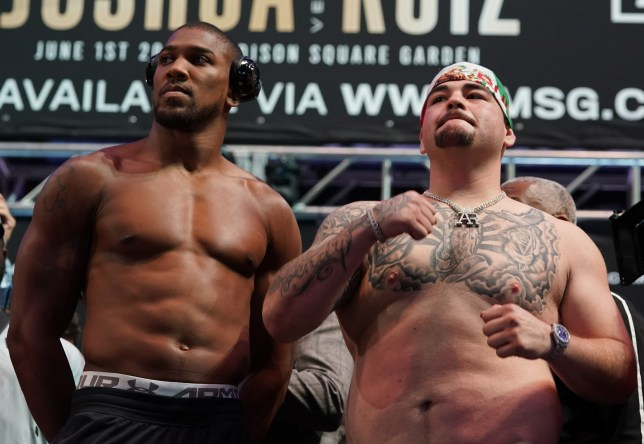
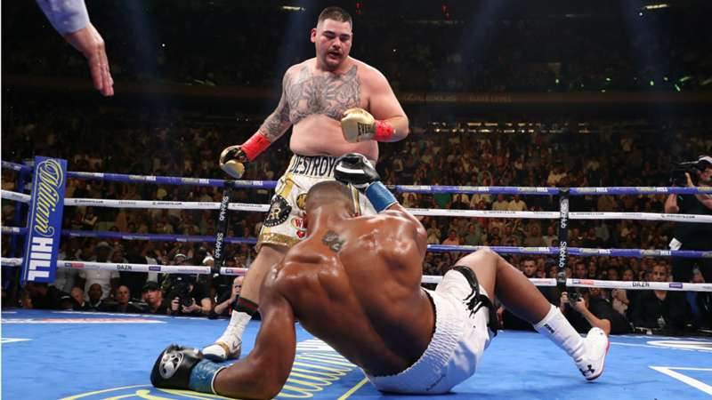
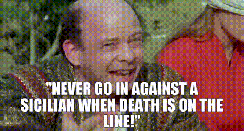

Building software in a business context is not about elegant solutions to brain-tickling puzzles. It's a brawl. A slugfest to see who's standing at the end of round 12.

I use a boxing analogy because boxing is the perfect analogy. And [I've been saying this for 12 years](https://swizec.com/blog/why-every-entrepreneur-should-take-up-boxing/).

In a boxing ring good technique can help, but you win by landing more punches. Or even by landing one lucky punch that gets a knockout. Plenty of great fighters lose to a worse fighter.

## An interesting fight

In 2019 Anthony Joshua fought Andy Ruiz. Joshua was the unified world champion from England. A towering greek god of muscle. Ruiz was a last minute stand-in for a disqualified fighter (drugs). He looks like he just walked off a backyard barbecue.

Wanna bet?

Here's how the fight ended:

Ruiz won by knockout in round 7 and became the world heavyweight champion. You can watch the [full final moments of that fight, here](https://www.dazn.com/en-US/news/boxing/anthony-joshua-vs-andy-ruiz-jr-results-highlights/ps7zbggv7clk1gpmk5rw3zbgn). Watching how tired and confused Joshua gets when Ruiz knocks him down twice in 30 seconds is beautiful. You can tell he wasn't expecting this schmuck to put up much of a fight.

But that's how boxing goes. How good you look, or how great your technique, or how perfect your philosophy doesn't matter. _Are you landing punches?_

## A famous battle of wits

It's a lot like challenging a Sicilian to a battle of wits.

The Man in Black challenges Vizzini to a battle of wits – 2 chalices, 1 is poisoned. Who gets to die?

Everybody knows that this is one of the classic blunders - the most famous of which is "never get involved in a land war in Asia" - but only slightly less well-known is this: "Never go in against a Sicilian when death is on the line"!

Vizzini shows his dizzying intellect through a wild sequence of logical inferences, psychological tricks, and underhand shenanigans. Then he drinks his cup and ... dies.

The Man in Black had spent years building up his tolerance to iocaine powder. Both cups were poisoned.

It doesn't matter who can logic harder, only who wins.

## Why I'm telling you this

Ok so why should you care about this?

The economy is being weird. Tech continues to struggle, inflation is forcing people to start making choices and cut optional subscriptions, investors are pushing startups to stop coasting and start winning.

We're in a fight. Your job is to ship. The code doesn't need to be perfect, or even good. It needs to be _shipped_. And it needs to work.

https://twitter.com/Swizec/status/1775283081110598023

Forget what the internet tells you about best practices and get shit done. If it doesn’t help you ship, it’s not a best practice. Land those punches.

Hard times help you deeply understand what matters. You can't tell a must-have from a nice-to-have until you face constraints that force you to make tough choices. And if your business leaders aren’t telling you these constraints, _ask_.

Would you prefer a 0.3% faster app or a new feature with 5% higher margins?

https://twitter.com/AdamRackis/status/1775237113811804451

When the business is flush with cash, you can justify anything. When customers start to pull back ... well.

Cheers, 
\~Swizec
