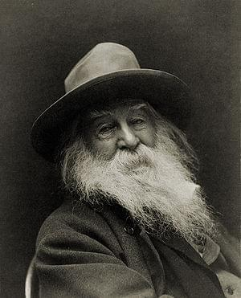

\_\_\_\_

## 1. [Word Salad](http://en.wikipedia.org/wiki/Word_salad "Word salad") generators

> judy gotta want upon someone. wanna sadly will go about. sammy gotta want the thief him but the every reason. real distance carry.

Most early attempts just strung together random words. Perhaps using a markov chain of some sort, but mostly the result doesn't make sense and looks like an alien tried to write a poem in a random human language. This is not poetry.

## 2. Template and grammar -based generators

> All green in the leaves I smell dark pools in the trees Crash the moon has fled

A slightly better approach uses templates, that are then filled with random words. For example the above poem comes from Masterman's computerized haikus, where the computer filled in a template:

```undefined
All [1] in the [2]
I [3] [4] [5] in the [6]
[7] the [8] has [9]
```

A similar approach is to use a grammar:

```undefined
IN THE MORNING + noun phrase with a noun as head + WILL + APPEAR / BE
```

```undefined
/ BECOME / SEEM / TURN + adjective phrase
```

\_\_

## 3. Form-aware generators

> Scattered sandals a call back to myself, so hollow I would echo. Crazy moon child Hide from your coffin To spite your doom. You broke my soul the juice of eternity, the spirit of my lips.

This type of system is designed specifically with grammaticality and poeticness in mind. Two thirds of the way to proper poetry! In _[An Evolutionary Approach to Poetry Generation](http://citeseerx.ist.psu.edu/viewdoc/summary?doi=10.1.1.9.5371)_ Manurung lists four prominent examples of this kind of system:

1.  _**Gervas’ WASP system**, \_which creates different types of classical [Spanish poetry](http://en.wikipedia.org/wiki/Spanish_poetry "Spanish poetry"). Mainly aiming to fulfill the parameters of metre and rhyme. It uses verse patterns that are similar to previously mentioned templates, but are different in that they are more sophisticated since the algorithm gets to pick \_every_ word instead of just a few
2.  ****
3.  There is also **ALAMO group's Rimbaudelaires**, which is apparently a template-filling system that creates its own templates by cutting out nouns/phrases/etc. from sentences and then filling them back in with random words, that follow strict rules for poeticness.
4.  Perhaps the coolest is **POEVOLVE. **It uses the _reflection-engagement_ cycle to create an evolutionary approach where many different versions of the same poem are kept in a sort of tree and then pruned based on how promising they seem. Eventually the system would create proper poetry, however the only part implement so far is a poeticness generation system, so we cannot know for certain the proposed full implementation would even work. But it does look very familiar to how Manurung approaches the problem in the thesis.

This is still not poetry.

## 4. Poetry generation systems

> no solo en plata o viola truncada se vuelva mas tu y ello juntamente en tierra en humo en polvo en sombra en nada

Finally we reach a class of systems that actively try to create text that is meaningful, poetic _and_ grammatical. Poetry, according to our definition. Good examples of these sort of systems are ASPERA and COLIBRI, which use [case-based reasoning](http://en.wikipedia.org/wiki/Case-based_reasoning "Case-based reasoning") to produce good looking Spanish poetry.

> A case-based reasoner attempts to solve a new problem by consulting an explicit database of existing problems and their solutions (Luger and Stubblefield, 1998). This process is described by Aamodt and Plaza (1994) as a cycle of four processes, namely retrieve, reuse, re- vise, and retain.

Essentially the system takes some poem fragments as input, looks them up in a database to get some word patterns to create a sort of template. This is then filled in with random-ish words that fit some particular metre patterns etc. Through a few revision steps the software eventually produces a verse and stores it back in the database, to be used later on.

## Fin

\_\_

###### Related articles

- [Poems For Life's Puzzle - Tea and Poetry](http://straightfromtheleaf.wordpress.com/2012/04/17/poems-for-lifes-puzzle-tea-and-poetry/) (straightfromtheleaf.wordpress.com)
- [Science Wednesday: Defining poetry](http://swizec.com/blog/science-wednesday-defining-poetry/swizec/4079) (swizec.com)
- [National Poetry Month](http://dailypost.wordpress.com/2012/04/17/national-poetry-month/) (dailypost.wordpress.com)
- [The Pitfalls of Outright Political Poetry](http://ericmrwebb.wordpress.com/2012/04/17/the-pitfalls-of-outright-political-poetry/) (ericmrwebb.wordpress.com)

[](http://www.zemanta.com/ "Enhanced by Zemanta")
