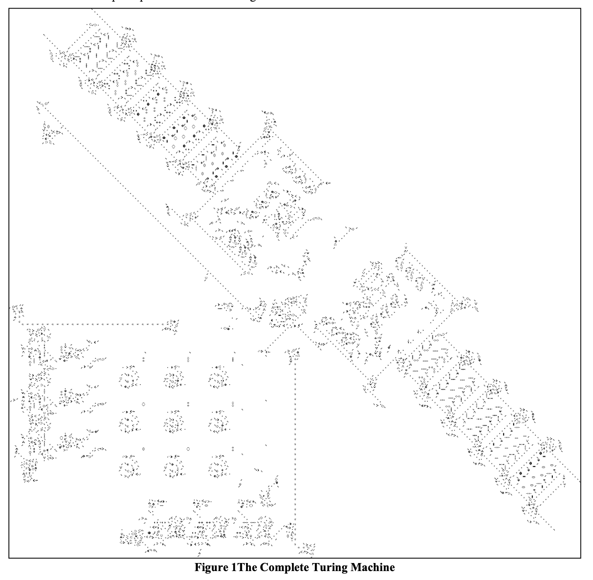

Friend, would you rather work with a complex system or a complicated system? 🤔

On Twitter, everyone said "complex". They're wrong.

https://twitter.com/Swizec/status/1421857743699251200

A car engine is complicated (lots of moving parts), a rocket is complex (tightly balanced explosion), which do you think is easier and cheaper to build?

## Complex systems

[From Wikipedia](https://en.wikipedia.org/wiki/Complex):

> [Complexity](https://en.wikipedia.org/wiki/Complexity), the behaviour of a system whose components interact in multiple ways so **possible interactions are difficult to describe**
>
> /../ many parts where those parts interact with each other in multiple ways, culminating in a higher order of emergence greater than the sum of its parts

A complex system is like weather. Local rules are easy to follow, global behavior is emergent and complex. Any action may lead to unpredictable results down the line.

Take [Conway's Game of Life](https://en.wikipedia.org/wiki/Conway%27s_Game_of_Life) for example. Simple rules, complex results.

The game follows 3 rules:

1.  Any live cell with two or three live neighbours survives.
2.  Any dead cell with three live neighbours becomes a live cell.
3.  All other live cells die in the next generation. Similarly, all other dead cells stay dead.

Simple, right?

It is, but you can implement [A Turing Machine in Conway's Game of Life](https://citeseerx.ist.psu.edu/viewdoc/download?doi=10.1.1.386.7806&rep=rep1&type=pdf), if you choose the right starting conditions. That's a universal computer built with 3 basic rules. 🤯

This is what complexity gets you – mindblowing results from simple rules. One of Conway's original design goals was that

> There should exist small initial patterns with chaotic, unpredictable outcomes.

Good luck debugging any of that.

_PS: when you add probabilistic behavior, your complex system becomes a [chaotic system](https://en.wikipedia.org/wiki/Chaos_theory)_

## Complicated systems

A complicated system is like a [Rube Goldberg machine](https://en.wikipedia.org/wiki/Rube_Goldberg_machine).

Complicated systems have lots of moving pieces, but they're all connected in predictable ways. Actions lead to predictable outcomes.

You can debug a complicated system by tracing a path from action to result. Function A calls B, which calls C, which does D, which produces result E.

A → E

The problem is that steps B, C, and D may break. The more steps there are, the likelier something goes wrong, the harder your code is to understand.

Remove steps until there's nothing left to remove.

## Complex + complicated systems

Ideally your system is neither complex nor complicated. Unfortunately it's going to be both.

Complicated code happens when you don't understand the requirements yet. When you add exception on top of exception because the underlying rules aren't clear.

Compare how complicated the solar system had to be to fit observed reality to the model that earth is at the middle. Change that assumption and wow 😍

**Complicated code is a good sign your mental model is wrong**. Step back and rethink your approach.

Complex systems arise when minimally complicated (simple?) systems interact. We use this to break down large problems into smaller pieces. Makes them easier to think about.

**Every large system is complex system**

You end up with a series of internally "complicated" modules that talk to other modules through an API. The behavior that emerges is ruled by complexity.

Make those interactions explicit and you'll be fine. Use observables and spooky events-at-a-distance and welcome to hell. 😈

Cheers, 
~Swizec

PS: working on your code as a team is always a complex system, because humans
