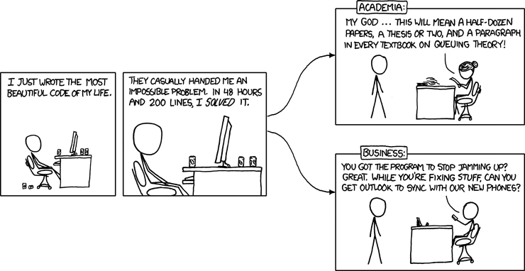

import { ContentUpgrades } from "@swizec/gatsby-theme-course-platform"

> Wow, college was such a waste of time ... when did you ever invert a binary tree outside of an interview?

Honestly I never inverted a binary tree in college either ☹️

Maybe I skipped that day ... I was a terrible student. The kind who oversleeps 10 minutes and says _"Ah screw it, might as well not go to class today"_

And despite working at it for 5 years and never graduating,[^1] studying computer science was one of the best things I ever did for my career. We talked about it with Noah Gibbs on his new podcast, [Computer Science: Just the Useful Bits](http://justtheusefulbits.com/jtub/swizec-teller-the-value-of-theory-and-why-not-to-build-an-analytics-service/). You should give it a listen.

Computer science didn't prepare me for software engineering. This is true.

There were classes about engineering. Freshman year. Intro to Java 101. Sophomore year, product management blow off class.

And that's it. 5 years, 10 semesters, 40 classes. 2 on software engineering

To be perfectly honest, the air of superiority in my college was ... thick. We looked down on software engineers.

We were computer scientists damn it! Going into industry is a waste of talent. We're here to advance the field!!

<ContentUpgrades.SeniorMindset />

Then we discovered money. We all work in startups building technically boring apps where the biggest challenge is how to engineer this thing so a large team can work together without killing each other 😅

## Why study computer science then?

What I got from computer science are the timeless truths of our field. And a lot of math.

Everything from how transistors work to proving equivalence between different theories of computation. The [understanding that beats knowledge](https://swizec.com/blog/why-understanding-beats-knowledge/). The core truths that don't change every 5 years.

And that's been invaluable my friend. It changed everything.

I started as a self-taught dev and I remember what it's like. When you know every tree in detail and don't realize there's a whole forest. That trees work together. That they're all the same.

A tree is a tree is a tree. Some have leaves, some have needles, some are tall, some are short. And they're all trees.

Just like JavaScript frameworks.

Some have JSX, some have templates, some split CSS and JS, some merge it all together. Some like observers, others like passing props. And they all make you faster.

## How to get the most out of a comp sci degree?

If you have a choice between a comp sci and a software engineering career, go for comp sci. One prepares you for a wide swath of careers, the other gives you tools for today.

Bootcamps in particular are all about _get job NOW_. Oh you need skills that work 5 years from now? Good luck.

Comp sci is forever.

Well there was that one time I taught my databases professor about [NoSQL](https://en.wikipedia.org/wiki/NoSQL) and he was shooketh. Asked me to do a seminar and the entire class hated me when that material was on the exam.

Next year NoSQL was part of the official curriculum 🤘

That was 2010. Now it's 2020 and NoSQL is a strong _you shouldn't use this unless you have a very specific use-case or reason in mind_.

[Relational databases](https://en.wikipedia.org/wiki/Relational_database), a comp sci thing, are the default way to store data for 50 years and counting.

**Make sure you code on the side!**

That's the trick. That's how you get the most out of your degree. _Apply your skills and knowledge in real time_.

You can see the effect of that on my old articles. Like when I built a [Turing machine simulator in 133 bytes of JavaScript](https://swizec.com/blog/a-turing-machine-in-133-bytes-of-javascript/). Yes it's useless. Learned a lot though.

Even better if you can launch an app, get a freelance gig, moonlight at an agency, anything that teaches you software engineering. **Engineering is best learned on the job.**

If you're an old fart like me, pick up a CS book once in a while. Read an article. Study a paper.

Shannon's [A Mathematical Theory of Communication](http://people.math.harvard.edu/~ctm/home/text/others/shannon/entropy/entropy.pdf) is a fantastic paper with broad applications to modern web engineering and systems. I read it every few years.

## What if you never studied comp sci?

I bet you know more than you realize!

You pick up lots of computer science on the job. Things you never even realized were part of comp sci.

Like the fact that you can't parse HTML with Regex, or that reading from a database is slower than from memory. Or that you should have a cache and avoid slow operations.

And that async code is faster than sequential code, but [never faster than the slowest non-parallelized part](https://en.wikipedia.org/wiki/Amdahl%27s_law).

I don't have an answer for how to pick up computer science later. And I don't know that you need to. But it won't hurt.

Try a textbook or a good paper like [Shannon's above](http://people.math.harvard.edu/~ctm/home/text/others/shannon/entropy/entropy.pdf) (very approachable). Tannenbaum's [Modern Operating Systems](https://en.wikipedia.org/wiki/Modern_Operating_Systems) is a great practical place to start.

You should listen to [the full podcast episode with Noah Gibbs](http://justtheusefulbits.com/jtub/swizec-teller-the-value-of-theory-and-why-not-to-build-an-analytics-service/) where we talked about what comp sci was like for me and why I think it was great.

Happy Friday ❤️

Cheers, 
~Swizec

[^1] I dropped out in 2012 after missing graduation by 2 credits. The credits were in separate semesters and I'd have to stay in school for a whole 'nother year. Decided to go full time on my freelancing business instead.

PS: the credits were for a notoriously difficult freshman course in low level computer architecture. CPU pipelines and such. Prof was one of the college founders 💪
