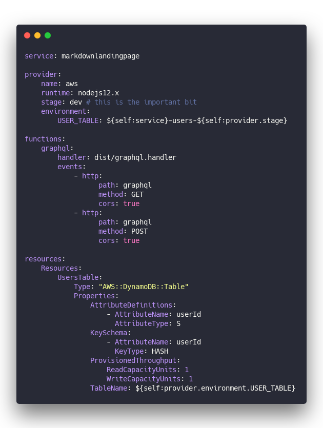

You should always keep development and production separate my friend, but how do you pull that off when everyone has your back and tries to keep your app secure?

wait what 🤨

Here's the problem 👉

You've built a cool app. Static JAM on the frontend, Serverless functions on the backend, nearly free to host, super fast to load. It's amazing and you're proud as heck.

Time to show off!

You know dev and production should be separate. Wouldn't want users to see a bug next time you mess around with code. Sure as heck don't want to mix test and production data.

## Prod vs. Dev on your serverless backend

Separating development and production on your backend is easy as pie. Change the `stage:` in serverless.yml and voila.

Using the demo app from [ServerlessReact.Dev](https://serverlessreact.dev) for example:

&t=seti&l=yaml&ds=true&wc=true&wa=true&pv=48px&ph=32px&ln=false&code=service%3A%20markdownlandingpage%0A%0Aprovider%3A%0A%20%20%20%20name%3A%20aws%0A%20%20%20%20runtime%3A%20nodejs12.x%0A%20%20%20%20stage%3A%20dev%20%23%20this%20is%20the%20important%20bit%0A%20%20%20%20environment%3A%0A%20%20%20%20%20%20%20%20USER_TABLE%3A%20%24%7Bself%3Aservice%7D-users-%24%7Bself%3Aprovider.stage%7D%0A%0Afunctions%3A%0A%20%20%20%20graphql%3A%0A%20%20%20%20%20%20%20%20handler%3A%20dist%2Fgraphql.handler%0A%20%20%20%20%20%20%20%20events%3A%0A%20%20%20%20%20%20%20%20%20%20%20%20-%20http%3A%0A%20%20%20%20%20%20%20%20%20%20%20%20%20%20%20%20%20%20path%3A%20graphql%0A%20%20%20%20%20%20%20%20%20%20%20%20%20%20%20%20%20%20method%3A%20GET%0A%20%20%20%20%20%20%20%20%20%20%20%20%20%20%20%20%20%20cors%3A%20true%0A%20%20%20%20%20%20%20%20%20%20%20%20-%20http%3A%0A%20%20%20%20%20%20%20%20%20%20%20%20%20%20%20%20%20%20path%3A%20graphql%0A%20%20%20%20%20%20%20%20%20%20%20%20%20%20%20%20%20%20method%3A%20POST%0A%20%20%20%20%20%20%20%20%20%20%20%20%20%20%20%20%20%20cors%3A%20true%0A%0Aresources%3A%0A%20%20%20%20Resources%3A%0A%20%20%20%20%20%20%20%20UsersTable%3A%0A%20%20%20%20%20%20%20%20%20%20%20%20Type%3A%20%22AWS%3A%3ADynamoDB%3A%3ATable%22%0A%20%20%20%20%20%20%20%20%20%20%20%20Properties%3A%0A%20%20%20%20%20%20%20%20%20%20%20%20%20%20%20%20AttributeDefinitions%3A%0A%20%20%20%20%20%20%20%20%20%20%20%20%20%20%20%20%20%20%20%20-%20AttributeName%3A%20userId%0A%20%20%20%20%20%20%20%20%20%20%20%20%20%20%20%20%20%20%20%20%20%20AttributeType%3A%20S%0A%20%20%20%20%20%20%20%20%20%20%20%20%20%20%20%20KeySchema%3A%0A%20%20%20%20%20%20%20%20%20%20%20%20%20%20%20%20%20%20%20%20-%20AttributeName%3A%20userId%0A%20%20%20%20%20%20%20%20%20%20%20%20%20%20%20%20%20%20%20%20%20%20KeyType%3A%20HASH%0A%20%20%20%20%20%20%20%20%20%20%20%20%20%20%20%20ProvisionedThroughput%3A%0A%20%20%20%20%20%20%20%20%20%20%20%20%20%20%20%20%20%20%20%20ReadCapacityUnits%3A%201%0A%20%20%20%20%20%20%20%20%20%20%20%20%20%20%20%20%20%20%20%20WriteCapacityUnits%3A%201%0A%20%20%20%20%20%20%20%20%20%20%20%20%20%20%20%20TableName%3A%20%24%7Bself%3Aprovider.environment.USER_TABLE%7D>)

This configures a `/graphql` endpoint served by an AWS Lambda and a DynamoDB table to store your data. Both the DynamoDB table and the GraphQL endpoint use stage as part of their name.

Change that to `stage: dev` to `stage: prod`, run `yarn deploy`, and you get a whole new copy of your backend infrastructure. A new AWS Lambda, new DynamoDB table, everything.

### Making your stage easy to change

Changing serverless.yml on deploy is tedious. You'll commit the wrong version to git, too.

Define your stage with command line arguments instead!

Like this:

&t=seti&l=yaml&ds=true&wc=true&wa=true&pv=48px&ph=32px&ln=false&code=provider%3A%0A%20%20%20%20stage%3A%20%24%7Bopt%3Astage%7D>)

Now you can add a helpful little bash script – because I couldn't figure out how to do this with Node and Bash is just fine. 😇

&t=seti&l=bash&ds=true&wc=true&wa=true&pv=48px&ph=32px&ln=false&code=%23%20deploy.sh%0A%0ASTAGE%3D%24%7B1%3A-dev%7D%0Ayarn%20build%0ANODE_ENV%3D%24STAGE%20sls%20deploy%20--stage%20%24STAGE>)

Add to your `package.json` ...

&t=seti&l=json&ds=true&wc=true&wa=true&pv=48px&ph=32px&ln=false&code=%20%20%20%20%22scripts%22%3A%20%7B%0A%20%20%20%20%20%20%20%20%22deploy%22%3A%20%22sh%20deploy.sh%22%0A%20%20%20%20%7D%2C>)

And you can run `yarn deploy prod` to deploy to production, or `yarn deploy` to get development by default.

Wonderful.

## Prod vs. Dev on your JAMStack frontend

Separating production and development on the JAM is easy in theory 👉 push to a branch and you get a deploy preview. Press a button or push to a special branch and you get production.

Both Netlify and Zeit do that. I'm sure others do, too.

That was easy.

Now, how do you tell your app that production data lives on `...amazonaws.com/prod/graphql` and development should talk to `...amazonaws.com/dev/graphql`?

That's where it gets tricky.

I've found 3 approaches with varying levels of success and different tradeoffs.

### 1. The Gatsby way

Gatsby comes with [built-in support for `.env` files](https://www.gatsbyjs.org/docs/environment-variables/). Put your environment variables in `.env.development` or `.env.production`, access through `process.env` and let Gatsby handle the rest.

Say you want to tell Gatsby which GraphQL endpoint to use when building your JAMStack app.

Go in `gatsby-config.js` and add your server as a source

&t=seti&l=javascript&ds=true&wc=true&wa=true&pv=48px&ph=32px&ln=false&code=%2F%2F%20gatsby-config.js%0A%0A%2F%2F%20load%20the%20appropriate%20.env.X%20file%0Arequire(%22dotenv%22).config(%7B%0A%20%20path%3A%20%60.env.%24%7Bprocess.env.NODE_ENV%7D%60%2C%0A%7D)%0A%0A%2F%2F%20your%20config%0A%2F%2F%20..%0A%20%20plugins%3A%20%5B%0A%20%20%20%20%7B%0A%20%20%20%20%20%20resolve%3A%20%22gatsby-source-graphql%22%2C%0A%20%20%20%20%20%20options%3A%20%7B%0A%20%20%20%20%20%20%20%20typeName%3A%20%22MDLAPI%22%2C%0A%20%20%20%20%20%20%20%20fieldName%3A%20%22mdlapi%22%2C%0A%20%20%20%20%20%20%20%20url%3A%20process.env.GATSBY_GRAPHQL_URL%2C%0A%20%20%20%20%20%20%7D%2C%0A%20%20%20%20%7D%2C>)

You can now configure the `GATSBY_GRAPHQL_URL` environment variable in 2 files to differentiate production and development.

&t=seti&l=null&ds=true&wc=true&wa=true&pv=48px&ph=32px&ln=false&code=%2F%2F%20.env.development%0AGATSBY_GRAPHQL_URL%3Dhttps%3A%2F%2F...%2Fdev%2Fgraphql>)

&t=seti&l=null&ds=true&wc=true&wa=true&pv=48px&ph=32px&ln=false&code=%2F%2F%20.env.production%0AGATSBY_GRAPHQL_URL%3Dhttps%3A%2F%2F...%2Fprod%2Fgraphql>)

Gatsby will choose production when you run `gatsby build` and development when you run `gatsby development`.

You can even use these in the browser!

&t=seti&l=javascript&ds=true&wc=true&wa=true&pv=48px&ph=32px&ln=false&code=const%20IndexPage%20%3D%20()%20%3D%3E%20%7B%0A%20%20%2F%2F%20this%20works%20and%20is%20available%20at%20runtime%20%F0%9F%98%B1%0A%20%20console.log(process.env.GATSBY_GRAPHQL_URL)%0A%20%20%0A%20%20return%20(%0A%20%20%20%20%3CLayout%3E%0A%20%20%20%20%20%20%3CSEO%20title%3D%22Home%22%20%2F%3E%0A%20%20%20%20%20%20%3Ch1%3EHi%20people%3C%2Fh1%3E>)

👌

#### The tradeoff

The Gatsby way breaks down when you deploy.

Both Zeit and Netlify helpfully strip your `.env` files during deploy. Wouldn't want to store secrets in plaintext on their servers.

This is great from a security perspective.

And it breaks Gatsby support for .env files. They aren't available during build. 🤦‍♂️

### 2. The Zeit way

[The Zeit way](https://zeit.co/docs/v2/build-step#using-environment-variables-and-secrets) is more secure. You store secrets and configs in their secure storage. Encrypted, easy to rotate, not part of your code.

Now you gotta jump a couple more hoops.

First you add your secret to Zeit

&t=seti&l=shell&ds=true&wc=true&wa=true&pv=48px&ph=32px&ln=false&code=now%20secrets%20add%20graphql_url%20https%3A%2F%2F...%2Fdev%2Fgraphql>)

Then you create a `now.json` file

&t=seti&l=json&ds=true&wc=true&wa=true&pv=48px&ph=32px&ln=false&code=%7B%0A%20%20%20%20%22build%22%3A%20%7B%0A%20%20%20%20%20%20%20%20%22env%22%3A%20%7B%0A%20%20%20%20%20%20%20%20%20%20%20%20%22GRAPHQL_URL%22%3A%20%22%40graphql_url%22%2C%0A%20%20%20%20%20%20%20%20%7D%0A%20%20%20%20%7D%0A%7D>)

And _then_, you use it in `gatsby-config`

&t=seti&l=javascript&ds=true&wc=true&wa=true&pv=48px&ph=32px&ln=false&code=%2F%2F%20gatsby-config.js%0A%0A%2F%2F%20your%20config%0A%2F%2F%20..%0A%20%20plugins%3A%20%5B%0A%20%20%20%20%7B%0A%20%20%20%20%20%20resolve%3A%20%22gatsby-source-graphql%22%2C%0A%20%20%20%20%20%20options%3A%20%7B%0A%20%20%20%20%20%20%20%20typeName%3A%20%22MDLAPI%22%2C%0A%20%20%20%20%20%20%20%20fieldName%3A%20%22mdlapi%22%2C%0A%20%20%20%20%20%20%20%20url%3A%20process.env.GRAPHQL_URL%2C%0A%20%20%20%20%20%20%7D%2C%0A%20%20%20%20%7D%2C>)

When you deploy to Zeit, the build process takes your `now.json`, replaces `@variable` with values from storage, loads the configs into `process.env`, and Gatsby can use them while building.

Sounds complicated ... 🤨

But it works. Sort of

[Netlify has a similar approach](https://docs.netlify.com/configure-builds/get-started/), by the way.

#### The tradeoff

Notice there's no prod vs. dev. You get _a_ config and that's it. Zeit says they'll have native support for environments soon.

The other tradeoff is that these configs aren't available at runtime. You get them when compiling and can't use them in the browser.

And you can't `import 'now.json'` either. Zeit deletes that file ☹️

### 3. The way that actually works

In the end, here's what works best:

1.  Put your configs in JSON files
2.  Import in gatsby-config.js
3.  Add to `siteMetadata`
4.  Access via static queries

Kinda bonkers but it works.

You start with 2 JSON files similar to the original `.env` approach.

&t=seti&l=json&ds=true&wc=true&wa=true&pv=48px&ph=32px&ln=false&code=%2F%2F%20config.development.json%0A%7B%0A%09%22GRAPHQL_URL%22%3A%20%22https%3A%2F%2F...%2Fdev%2Fgraphql%0A%7D>)

&t=seti&l=json&ds=true&wc=true&wa=true&pv=48px&ph=32px&ln=false&code=%2F%2F%20config.development.json%0A%7B%0A%09%22GRAPHQL_URL%22%3A%20%22https%3A%2F%2F...%2Fprod%2Fgraphql%0A%7D>)

Import in `gatsby-config.js`

&t=seti&l=javascript&ds=true&wc=true&wa=true&pv=48px&ph=32px&ln=false&code=%2F%2F%20gatsby-config.js%0Aconst%20config%20%3D%20require(%60.%2Fconfig.%24%7Bprocess.env.NODE_ENV%7D.json%60)%0A%0Amodule.exports%20%3D%20%7B%0A%20%20siteMetadata%3A%20%7B%0A%20%20%20%20%2F%2F%20...%0A%20%20%20%20%2F%2F%20this%20makes%20configs%20available%20in%20static%20queries%0A%20%20%20%20myConfig%3A%20%7B%0A%20%20%20%20%20%20graphql_url%3A%20config.GRAPHQL_URL%2C%0A%20%20%20%20%7D%2C%0A%20%20%7D%2C%0A%20%20plugins%3A%20%5B%0A%20%20%20%20%7B%0A%20%20%20%20%20%20resolve%3A%20%22gatsby-source-graphql%22%2C%0A%20%20%20%20%20%20options%3A%20%7B%0A%20%20%20%20%20%20%20%20typeName%3A%20%22MDLAPI%22%2C%0A%20%20%20%20%20%20%20%20fieldName%3A%20%22mdlapi%22%2C%0A%20%20%20%20%20%20%20%20url%3A%20config.GRAPHQL_URL%2C%0A%20%20%20%20%20%20%7D%2C%0A%20%20%20%20%7D%2C>)

Use the configs directly in your build-time code via `config.X`. Works just fine.

You can import JSON files in the browser, sure, but you won't know which environment. Put them in `siteMetadata.myConfig` instead, so you can get configs with static queries anywhere in your app.

Like this

&t=seti&l=javascript&ds=true&wc=true&wa=true&pv=48px&ph=32px&ln=false&code=const%20IndexPage%20%3D%20(%7B%20%7D)%20%3D%3E%20%7B%0A%0A%20%20const%20%7B%20site%20%7D%20%3D%20useStaticQuery(%0A%20%20%20%20graphql%60%0A%20%20%20%20%20%20query%20%7B%0A%20%20%20%20%20%20%20%20site%20%7B%0A%20%20%20%20%20%20%20%20%20%20siteMetadata%20%7B%0A%20%20%20%20%20%20%20%20%20%20%20%20myConfig%20%7B%0A%20%20%20%20%20%20%20%20%20%20%20%20%20%20graphql_url%0A%20%20%20%20%20%20%20%20%20%20%20%20%7D%0A%20%20%20%20%20%20%20%20%20%20%7D%0A%20%20%20%20%20%20%20%20%7D%0A%20%20%20%20%20%20%7D%0A%20%20%20%20%60%0A%20%20)%0A%20%20%0A%20%20console.log(site.siteMetadata.myConfig.graphql_url)>)

And you get ...

#### The tradeoff

You're storing configs in version control. In plaintext. They better not be secret 😉

And you'll have to re-deploy any time you change a value.

But hey at least it works.

## In conclusion

There's no perfect solution here yet, I'm afraid. The JSON approach combined with static queries seems best for now. If you've found something better, I'd love to know.

Happy hacking ✌️

Cheers,

~Swizec

PS: I like to use AWS SecretsManager on the backend for real secrets, maybe there's an API you could use from the browser 🤔
