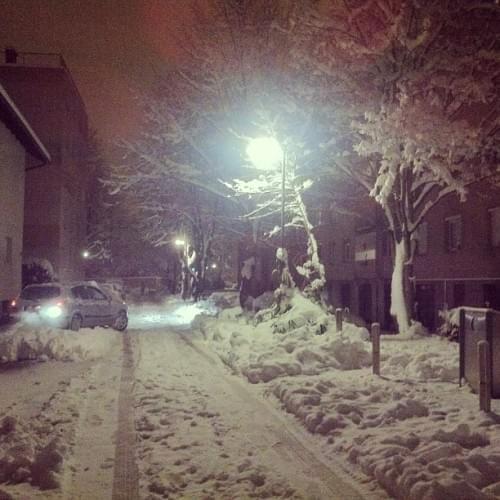

**\_\_**

###### Related articles

- [How to tell a cold from the flu](http://www.wfaa.com/news/health/How-to-tell-a-cold-from-the-flu-186353402.html)
- [Welcome to our Snowbank - or - What to Do For Fun When it is -20 Degrees Outside](http://www.tarasviewoftheworld.com/2013/01/welcome-to-our-snowbank-or-what-to-do.html)
- [Why refactoring?](http://brunopedro.com/2012/12/18/why-refactoring/)

