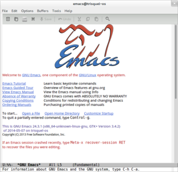

When does an [Emacs](http://www.gnu.org/software/emacs) user use [Vim](http://www.vim.org)? To change a server config via ssh.

Ha, haha! Ha! Awesome joke ... it's funny because it's true! It hurts so much :(

I've been an emacs user for a while now. Still don't know all the keyboard shortcuts, text selection still confuses me to no end and I still think the Ctrl+W command to cut is rather unfortunate because I keep clsoing windows in other environments.

But I love Emacs to bits!

The main reason I started using this operating system is that I don't have to think about code indentation. Almost any language I dare use, Emacs knows how to indent code according to community standards. You might need to install something called a _major mode_ for the language, but hey - package management system!

If you haven't tried coding without thinking about indentation before, you really should. It's marvelous, lets you focus on the important stuff.

That said ... I always used vim via ssh. Always. Perhaps a remnant from my times before Emacs, when I thought Vim was _the default thing you use when working without a [GUI](http://en.wikipedia.org/wiki/Graphical_user_interface)._ Yes, I'm not a neckbeard, I like my GUI and non-[tiling window managers](http://en.wikipedia.org/wiki/Tiling_window_manager) to write code.

## Enter tramp-mode

Over the past few weeks I've been working on a project that frowns upon the idea of working locally - something about data security when dealing with banking-like systems. Whatever.

The only access to my code was the humble _ssh_. Now fucking what?

Running emacs via _[ssh -X](http://en.wikipedia.org/wiki/Secure_Shell)_ was painfully slow. Using Vim for more than config editing? Surely, you're joking \[mr. Feynman]!?

After a week of miserably living my life via _ssh -X_ I finally broke down and googled for a solution. Took me long enough ... My surprisingly short search (took me all of 10 minutes) discovered something called _tramp-mode_ - a remote-editing mode for emacs.

Since emacs22 it comes bundled with the basic install, so there's no need to add anything.

It. Is. Amazing.

_C-x C-f //_ and away we go. Enter username@ (lovingly autocompleted by the file finder thingy), add the hostname (also autocompleted). Asks for the password and voila, I'm browsing a remote computer via _ssh_.

From what I understand, tramp-mode doesn't actually keep you connected via ssh for live editing on the remote machine. That would be slow, a [TCP](http://en.wikipedia.org/wiki/Transmission_Control_Protocol) round-about for every keystroke ... no good. Instead it uses _scp_ to copy files locally, let you edit them and when you save the file is copied back into its original location.

For added awesomeness, _C-x C-f_ undestands you're editing remotely so it always starts finding files relative to the remote location.

Magic. All the flexibility of editing locally, all the whatever-you-need-this-for of secure remote connections.

...

But I will still edit configs with Vim. It's only natural.