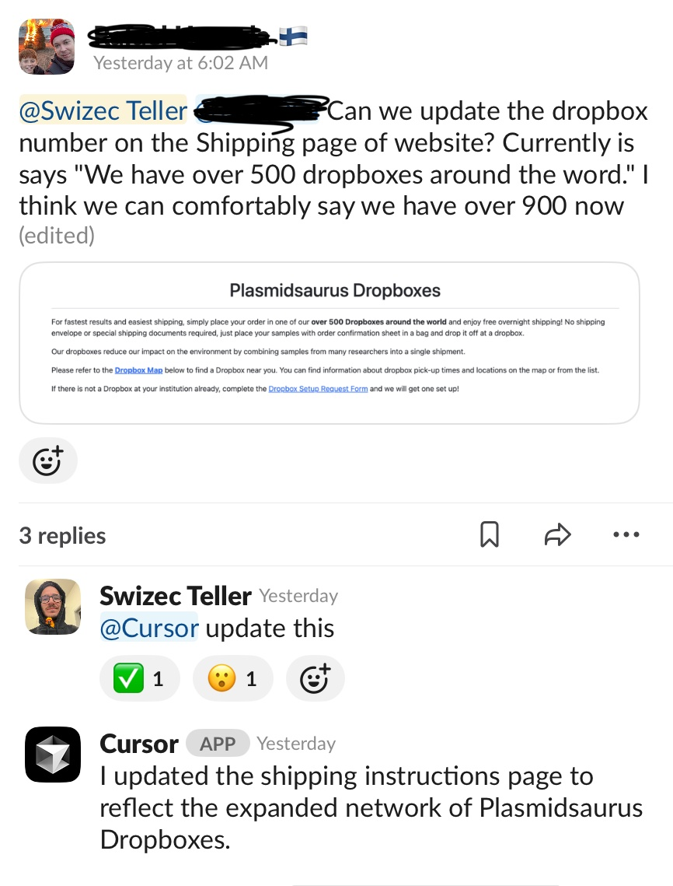
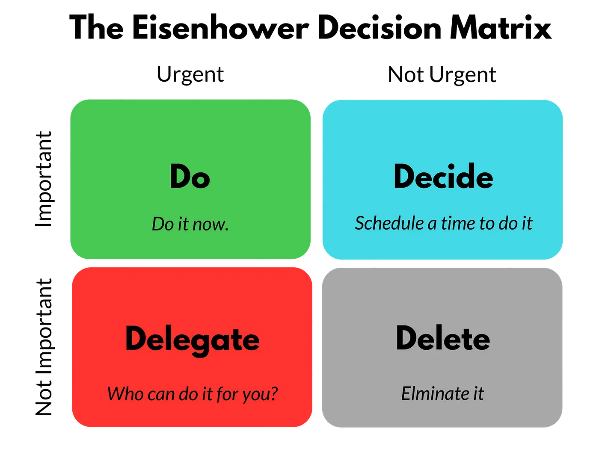
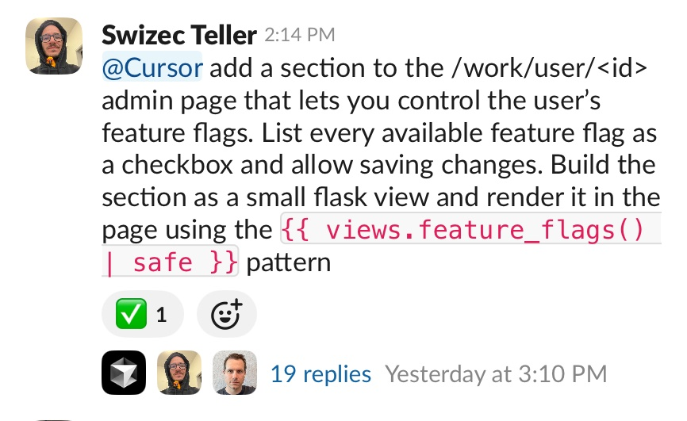

A couple weeks ago Cursor launched a Slack integration and ... wow. First time I can say AI _changed_ my workflow.

## What's a slack cursor background agent anyway?

You say `@cursor do my work` in Slack and

1. some infrastructure spins up,
2. clones your target repository
3. runs a Cursor agent with your prompt
4. opens a pull request
5. messages you with the link

Agent is the same as what you see running in Cursor. An LLM loop that "thinks", executes tasks, and edits code.

You can ask for followup changes in the thread and keep tabs on what happened with the PR. The bot messages back when the PR is merged or approved.

## How the Slack integration changed my workflow

As a lead/manager I have a lot on my mind and [less and less time to code](https://swizec.com/blog/its-like-surfing/). Getting more than 20 minutes of focus time feels like a luxury. Entire days happen where I write zero code.

Part of that is [keeping threads running in my brain](https://swizec.com/blog/stateless-decision-making/).

https://twitter.com/Swizec/status/1929273920978305227

If I see a ping, it opens a thread in my brain. Have to keep thinking about it until I do the thing – **write it down, hand it off, get it done**. It's my job to make sure loose ends don't stay loose. Unless the problem has an owner, I'm the owner.

### The traditional approach to not-a-priority

Many of those pings are urgent but not important, important but not urgent, or even not important and not urgent. Things that should get done but honestly meh.

We don't delete ideas – that's what the asana/jira abyss is for! Deleting them makes people feel unheard. Saving them in a box you'll never look at lands better.

You get these pings, all day every day from everyone. You collect things in your brain and feel frazzled. Eventually you find patterns and turn those ideas into projects. Small things get jotted down so you don't forget, but they'll never be a high enough priority to get worked on.

Your task tracker becomes a wasteland.

### The new approach

Just get it done 🤯

Don't even bother with a task tracker or delegation or opening an IDE. The same time it takes you to make a ticket and link the relevant context, you can `@cursor` and tell it what to do.

Works best when you know how to do the thing or it's small enough to be obvious. I like to give fairly detailed instructions on how to do the task.

Like I'll say _"@cursor write a migration to update column in such and such table"_ or something like _"@cursor add this feature, make it do the thing, follow pattern from this other feature in that file"_. A lot like how you'd work with a junior engineer who can code, knows how to find the right files and interpret fuzzy context, but can't do architecture.

## More things are worth doing

The biggest improvement is that **we don't have smol tasks lying around**. Those kill focus by being a type of [work in progress](https://swizec.com/blog/workinprogress-kills-your-progress/).

Get it done and move on.

This has made more things worth doing. Nice-to-have ideas that we'd never get around to building can now get done with a Slack message. Even whole features.

We would _never_ have made time to build a feature flag management UI. Never. There are so many more important things we need to get done.

But now we have it.

Cheers, 
\~Swizec

PS: the agent quickly falls apart when you need to iterate on its solution or it needs to work in a messy part of the code. Best for greenfield additions and small tweaks. I once wasted 2 hours untangling the mess it made after I asked for more than it could handle.
