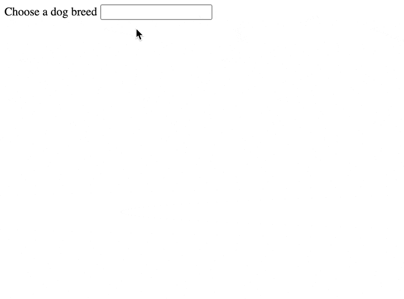
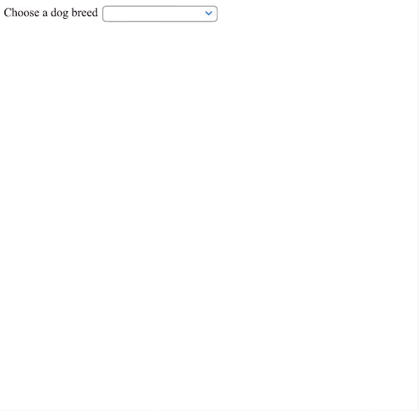
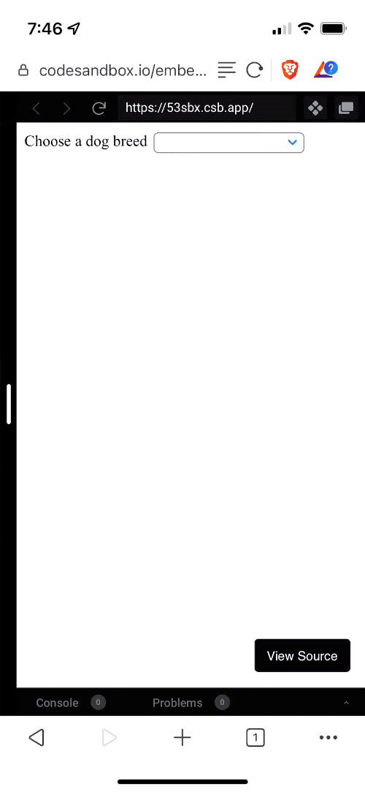
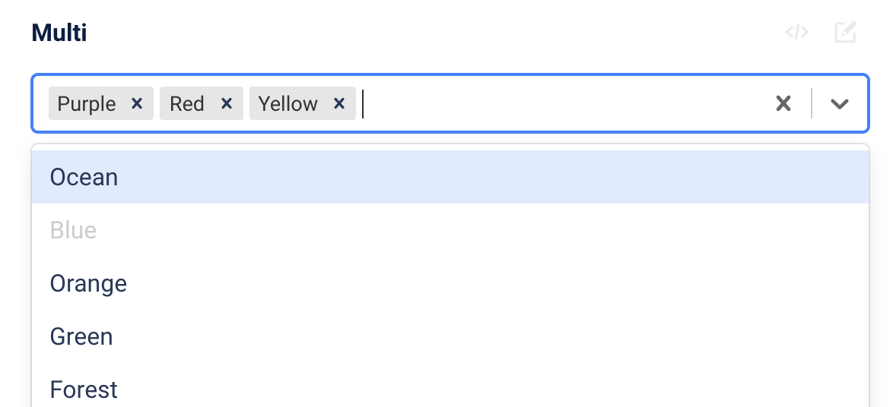

If you ever want to build a searchable typeahead field, `<datalist>` can do that for you. On all browsers. Across devices. Standards compliant. With no JavaScript. 🤯

https://twitter.com/Swizec/status/1469075720995414016

I learned about `<datalist>` from a candidate in an interview. It was great.

Let's dig in.

## The `<datalist>` element

Searchable dropdown components are a combination of an `<input>` field and a list of options. Typing filters the options so they're easier to find.



You get fuzzy search, keyboard navigation, mouse navigation, and enter to select. Dropdown appears on focus, hides on blur. The selected value is textual.

I got the list of dog breeds from the [dog.ceo API](https://dog.ceo/dog-api/).

An iPad with a keyboard attached shows this:



And it even works on a phone 🤩



You can [try it yourself on CodeSandbox](https://codesandbox.io/s/nameless-meadow-53sbx)

https://codesandbox.io/s/nameless-meadow-53sbx

## How you can use `<datalist>`

You start with an input field:

```html
<input name="dogBreed" list="breeds" />
```

The `list` attribute defines which datalist you want to use. This is a globally unique identifier on the page.

Add a datalist component with your options:

```html
<datalist id="breeds">
  <option value="affenpinscher"></option>
  <option value="african"></option>
  <option value="airedale"></option>
  <option value="akita"></option>
  <option value="appenzeller"></option>
  <option value="australian shepherd"></option>
  <option value="basenji"></option>
  <!-- ... -->
</datalist>
```

And that's it. The `id` identifies your list and the browser handles the rest. You now have a standards compliant full featured typeahead field that works in any browser.

If you want to package this as a reusable component, you'll have to generate the `id` and `list` attributes on render. Needs to be unique on the page.

## `<datalist>` as a React component

A reusable React datalist needs to

1.  work as multiple instances on the page
2.  render options from a list
3.  return values with a callback

No. 3 is optional. You can do that using [form machinery like react-hook-form](https://swizec.com/blog/why-reacthookform-is-my-new-favorite-form-library/).

You end up with a component like this:

```javascript
const Datalist = ({ name, options, onChange }) => {
  // this is a bad id for example purposes
  // in React 18 you'd use useId()
  const id = new Date().getTime()

  return (
    <>
      <input name={name} list={id} onChange={onChange} />
      <datalist id={id}>
        {options.map((o) => (
          <option value={o} />
        ))}
      </datalist>
    </>
  )
}
```

We use a poor man's unique identifier – the current time in milliseconds. It's _okay_, but you'll want to use `useId` when React 18 comes out and find a more robust solution until then.

We call `onChange` for every input change. This may be annoying for consumers of our component.

https://codesandbox.io/s/delicate-wood-yg5x0?file=/src/App.js

A nice option would be to check the value against your list of options on every change and call an `onSelected` callback when there's a match. That way you can catch when the user makes an explicit selection. Probably.

### `<datalist>` as a dynamic React component

If you have too many options to list or need richer search behavior, you could expand this component with a dynamic search. Like this:

```javascript
const DynamicDatalist = ({ name, api, onChange }) => {
  // this is a bad id for example purposes
  // in React 18 you'd use useId()
  const id = new Date().getTime()

  const [options, setOptions] = useState([])

  async function runSearch(event) {
    const value = event.currentTarget.value
    // you'll want to debounce this
    const data = await fetchFrom(`${api}?search=${value}`)
    setOptions(data.suggestions)
  }

  return (
    <>
      <input name={name} list={id} onChange={runSearch} />
      <datalist id={id}>
        {options.map((o) => (
          <option value={o} />
        ))}
      </datalist>
    </>
  )
}
```

Assume this is pseudocode.

You watch for changes, run API requests, and use those to populate the options list dynamically. Be careful about blindly running requests on every keystroke.

https://twitter.com/ericbureltech/status/1469344338593390602

## What `<datalist>` can't do

You can't style a datalist. I think this is strictly better.

https://twitter.com/Swizec/status/1469092706299179010

You also can't use this to build the multiselect combobox thingy that's popular these days. The inputs that show your choices as pills next to your typing.



You can't use rich option values like objects. It's a text. Unless you build it yourself as part of a `<Datalist>` component.

And you'll have to make your own validation that the final value is on the list. A normal `<select>` might be a better option there.

https://twitter.com/ashleyepryan/status/1469387663732088843

Next time you build a typehead, consider the `<datalist>`. It might serve you better than a [81kb React library](https://github.com/JedWatson/react-select).

Cheers,<br/>
~Swizec

PS: `<datalist>` works with Vue, Svelte, etc. I used React because that's more comfortable for me
