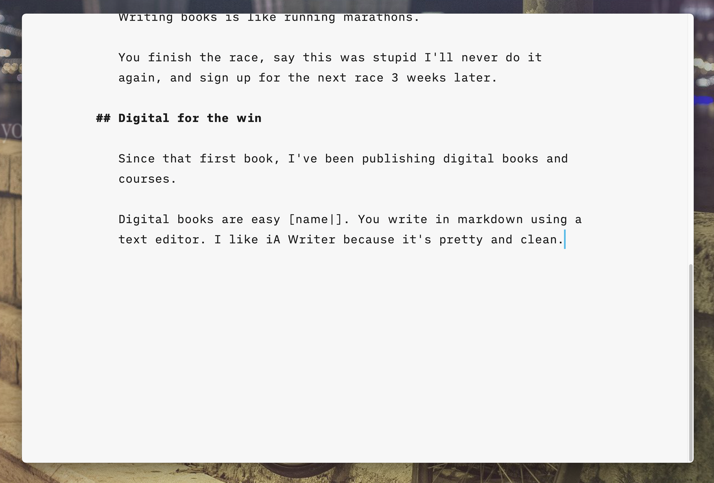
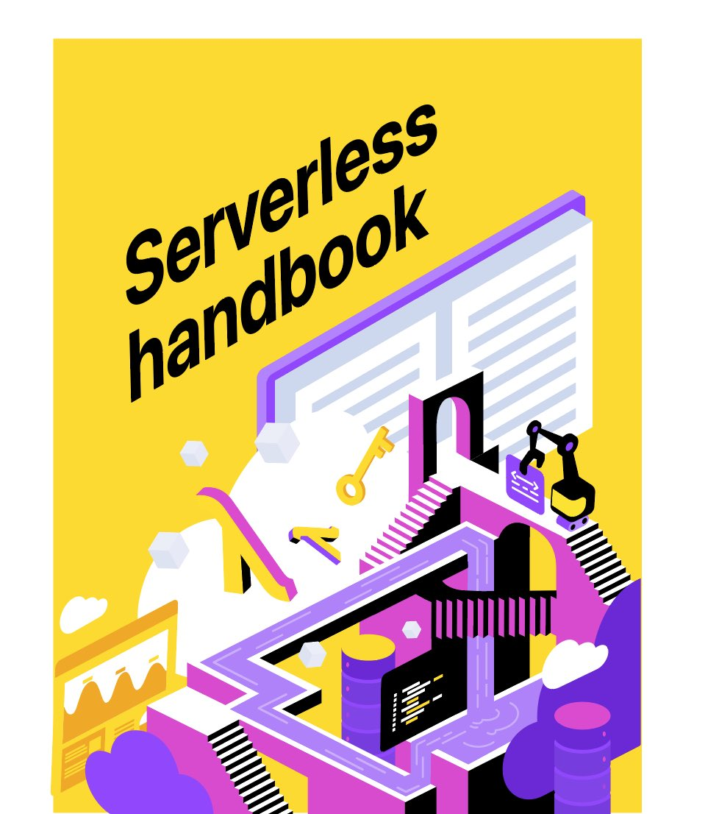

import { ContentUpgrades } from "@swizec/gatsby-theme-course-platform"

Ever wondered what it's like to make a physical book? It ain't as easy as shipping code lemme tell ya 😅

It's been 8 years since I published a physical book. Back then a publisher reached out and said _"Hey wanna write a book based on this cool blogpost of yours?"_

Heck yeah I do!

By the time it was done, I was so sick of the process that I never picked up my copies from the post office. Even gave a talk vowing never to do that again.

[https://www.youtube.com/watch?v=w1L2SgQuv6Q](https://www.youtube.com/watch?v=w1L2SgQuv6Q)

Writing books is like running marathons.

You finish the race, say this was stupid I'll never do it again, and sign up for the next race 3 weeks later.

<ContentUpgrades.ServerlessHandbook />

## Digital for the win

Since that first book, I've been publishing digital books and courses.

Digital books are easy. You write in markdown using a text editor. I like iA Writer because it's pretty and clean.

Put that on GitHub and you get version control _and_ render previews on the web. Wonderful.

Add a pdf/epub generator like [Leanpub](https://leanpub.com/) or [Remarq](https://www.remarq.io/) and you can offer "books". Ebooks were big as email signup freebies for a few years.

Desktop is where my e-books go to die. Never read a single freebie e-book that I downloaded. 😂

That's why I always added a price to my ebooks. Figured people would value them more. And if you value it more, you read it. And if you read it, it becomes valuable.

## Digital is Agile ❤️

Agile is a bad word among cynical engineers, but it's way better than waterfall.

Waterfall being the approach where you plan a big project in every detail, get to work, discover your plan is all wrong, and keep trying to hit the deadline. Then you wonder why everyone's tired and burned out.

Agile means you tinker. Garden your way to perfection.

Little trim here, supporting touch there, sprinkle a dash of love, hit submit. Then do it again tomorrow.

You iterate.

That's why Serverless Handbook started as an interactive website, not even a pdf. Oh there's a typo? A bug? Weird wording?

1.  tweak
2.  `git commit`
3.  `git push master`

Changes live in production in 2 minutes 😍

Look at how many "editions" it's had!

528 days since first going up 🤯

## Paper means waterfall

And then I had a bright idea. What if Serverless Handbook became a _real_ book? How hard can it be!

By mid January, the book was finished. All chapters done. Huzzah! 💪

[Lulu](https://www.lulu.com/) can do print on demand, Gumroad can do sales, hook them together and that should work. Tell early supporters book is coming out by mid February.

Wait shit, you can't edit a physical book!

Editing to the rescue!

Went through the whole book and fixed a bunch. Whole paragraphs got cut, an entire chapter, and I reshuffled topics for better flow.

While doing that, I asked [Stas](https://twitter.com/stas_kulesh), who designed the original chapter art, for a cover. He said yes!

A few days later we had a cover. And I kept editing.

### The waterfall keeps waterfalling

A physical book _cannot_ change after print. You have to read all 300+ pages out loud to find odd wordings.

That helped.

And then came the layouting. Oh god the layouting ...

Everyone who sells book layouting on Fiverr laughed me out of the chatroom. Serverless Handbook is way too complex 😅

[Remarq](https://www.remarq.io/) to the rescue! One of the output modes is a print ready pdf. This'll be a breeze.

It was not a breeze.

Getting everything _into_ Remarq was easy enough. I outsourced that part 😇

## We broke the layouting tool

Serverless Handbook was so complex it broke Remarq. Many times over. The founder said it was like a stress test of his technology. Fixed a bunch of bugs we uncovered 🤘

I ordered the first test print. Mid February by now.

It kinda looked like shit ...

[https://twitter.com/Swizec/status/1367163107974541315](https://twitter.com/Swizec/status/1367163107974541315)

The pages were weird, the cover looked bad, everything was terrible.

Back to Remarq! Painstakingly adding page breaks, tweaking image sizes, chapter by chapter, page by page.

And then Stas was like _"Hey Swiz, I need exact dimensions, especially thickness, to make a nice cover"_. Can't know that until the layout is perfect can you 😅

It took over 2 weeks to get that ready. WEEKS! To finish a finished book.

But hot damn it looks great 😍

[https://twitter.com/Swizec/status/1371919072342855680](https://twitter.com/Swizec/status/1371919072342855680)

And guess what?

There's a typo on the cover and the inner margins are too small. Code on right pages goes into the spine and you can't read it.

New test print coming next week 🤘

And the publisher I hired to help with global distribution committed to a Mar 31st publication date. Stay tuned

Cheers, 
~Swizec

PS: despite the frustrations, it worked pretty well

https://twitter.com/Swizec/status/1471577369802526723
