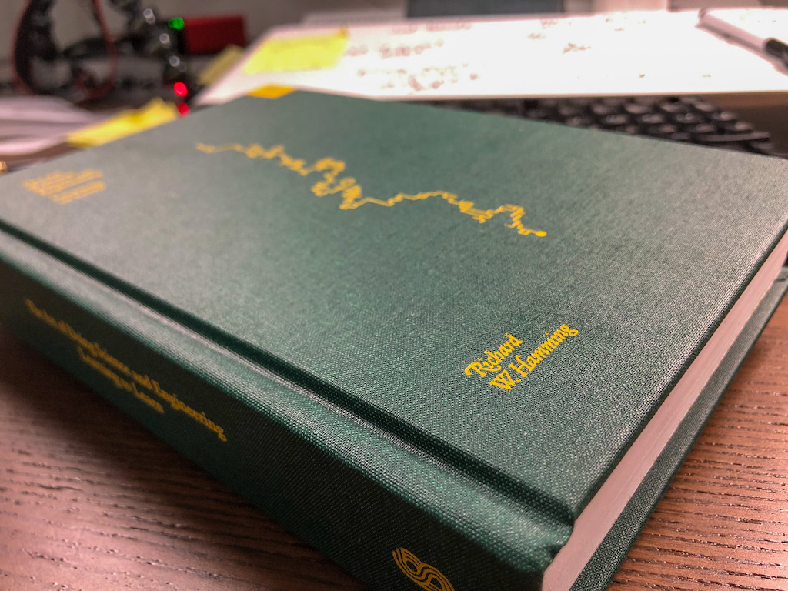

import { ContentUpgrades } from "@swizec/gatsby-theme-course-platform"

Lately I've been reading Richard Hamming's wonderful book, [The Art of Doing Science and Engineering](https://en.wikipedia.org/wiki/The_Art_of_Doing_Science_and_Engineering). It's about style in engineering, art.

An anecdote from his time at Bell Labs stands out:

> _"It ain't what you do, it's the way that you do it."_
>
> I was conned into doing on a digital computer, in the absolute binary days, a problem which the best analog computers couldn't do. And I was getting an answer.
>
> When I thought carefully and said to myself: _"You know, Hamming, you're going to have to file a report on this military job; after you spend a lot of money you're going to have to account for it and every analog installation is going to want the report to see if they can't find flaws in it."_
>
> I was doing the required integration by a rather crummy method, to say the least, but I was getting the answer. And I realized that in truth the problem was not just to get the answer; it was to **demonstrate for the first time, and beyond question**, that I could beat the analog computer on its own ground with a digital machine.
>
> I reworked the method of solution, created a theory which was nice and elegant, and changed the way we computed the answer; the results were no different.
>
> The published report had an elegant method which was later known for years as Hamming's Method of Integrating Differential Equations. It is somewhat obsolete now, but for a while it was a very good method.
>
> **By changing the problem slightly, I did important work rather than trivial work.**

This exact formulation is from his lecture, [You and Your Research](https://www.cs.virginia.edu/~robins/YouAndYourResearch.html).

https://youtu.be/a1zDuOPkMSw

The anecdote stands out because same thing happened to me recently and I almost didn't notice.

<ContentUpgrades.SeniorMindset />

I built [a demo of a new React feature](https://swizec.com/blog/a-better-react-18-starttransition-demo/) and it was exciting as heck. A thing that's been hard forever is now easy 😍

In my excitement to share, I slapped together a quick article, and sent it out. Then I shared it with the React team.

_"I think we're missing an opportunity here. You wrote a okay story, but it doesn't explain the feature and only benchmark nerds will understand your demo."_

That was a gut punch [name|my friend] not gonna lie.

But they were right!

I had created the first public demo that effectively showed off a new feature in the world's most popular frontend framework. Even the core team hadn't released one yet!

**In my excitement, I almost turned important work into trivial work by rushing the last step** 🤦‍♂️

With that realization, I polished the article. Explained _why_ this feature is cool and what the demo shows (i.e. it's not just a dumb way of doing something slow). Turned the story into proper explanation and less of a goofy tale.

[The demo itself](https://react-fractals-git-react-18-swizec.vercel.app) gained text with explanation of what's going on and links to further reading. The video version got captions that explain what's going on for folks who just look at twitter.

And you know what [name|]? It worked.

Top of r/reactjs all day, 7600+ video views on Twitter, 72,000+ impressions, plenty of article reads. It's even becoming a talk at an upcoming React meetup.

All because someone said _"You're missing an opportunity here, this is important"_

Next time you finish a project [name|], ask yourself: _"Might this work be important?"_. Add the polish.

And if you're at work, share what you made.

Cheers, 
~Swizec
