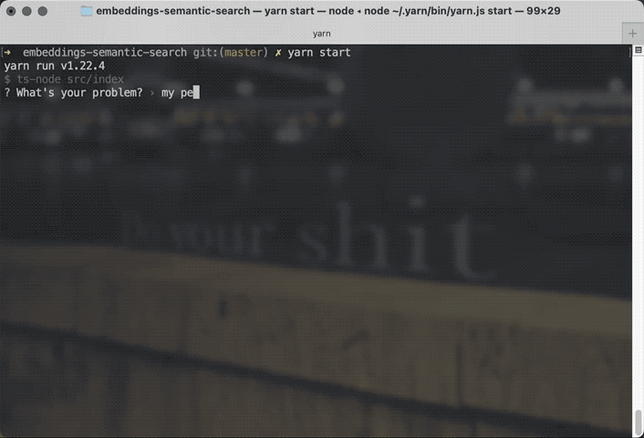

Fellow reader Aaron asked for advice on how to ship more side projects. Here's a trick I've learned over the years. Great at work too.

> I've seen you working on many small projects that you have shipped. What influences your ability to ship – I seem to always be working on an idea but never ship.

Sound familiar? Yeah me too.

I've tried all sorts of anti-procrastination tricks over the years and there's only one that works: Fucken' ship.

That's it. You aren't done until you ship. Press the big scary button, _then_ you're done. Even if your thing is crap, even if it barely works, makes no sense to anyone but you, _ship_.

Then you can get feedback and make it better.

That sounds glib, I know. But it really is that simple (not easy). You've done the work. You've created _something_. The difference between shipped and hidden in a basement for a tomorrow that never comes is whether you press the big fat scary ShipIt button.

Make pressing that button easy. What is the smallest possible amount of shipping you can do?

For me that's a screenshot or video. Look at what I shipped for [a semantic search experiment](https://swizec.com/blog/build-semantic-search-in-an-afternoon-yep/)

That thing is _ugly_. But it got people at work excited about what we can do with GPT tech. Goal achieved 💪

Next ship on that project will be bigger. Might even have a UI. Or get integrated with the rest of our systems.

Ship small things in small ways. [Work in Progress Kills Your Progress](https://swizec.com/blog/workinprogress-kills-your-progress/).

We follow that mantra at work and finished sprint 4 days early this week. You look at our stories and they look stupid small – "make _one_ button work". But we ship and it adds up.

Let's make this easy: I'll be your ship. What are you working on? Take a screenshot, hit reply.

Then you've shipped.

Cheers,
~Swizec

PS: I should take my own advice and fix that bug with an extra space after your name 🤔

[sparkjoy|]
