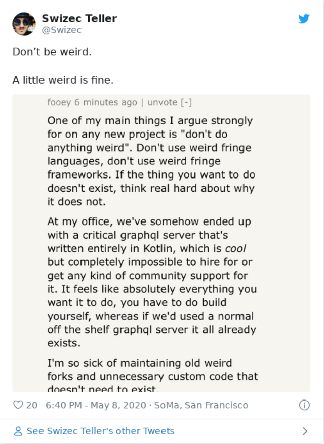

A little weird is fine.

But progress happens thanks to people who are weird.

Here's a rule a thumb I like to use when choosing technologies:

Experiment? 👉 be as weird as possible.

For production? 👉 be as boring as possible.

You see my friend having fun brings with it a lot of responsibility. Who will maintain this code? You will.

Who else will maintain this code? You will.

Wanna get promoted? Wanna move to a different project? Wanna do anything else with your life than maintain code even you barely understand?

Sure!

How long will it take to train a replacement? How much documentation did you write? Can you even find someone who wants to learn this bespoke magic they'll never get to use again in any other job?

Until you figure that out, you're stuck.

So don't be weird. Nudge at the edges. Don't jump too far too fast.

❤️

Cheers,  
~Swizec

PS: looks like the economy has mostly recovered (according to stock charts) from the panic drop in late March so think I'm gonna remove the [37% discount on ServerlessReact.Dev](https://serverlessreact.dev) on Monday. If you're thinking about building modern webapps front-to-back, now's a great time to get a copy :)

PPS: do video courses have copies? 🤔
