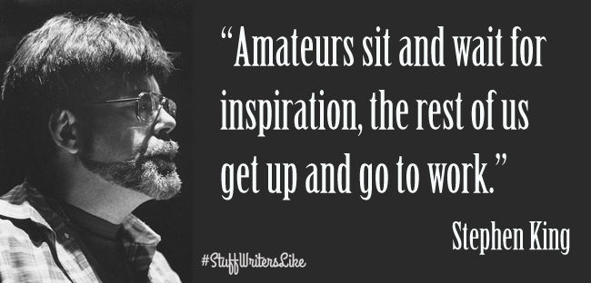
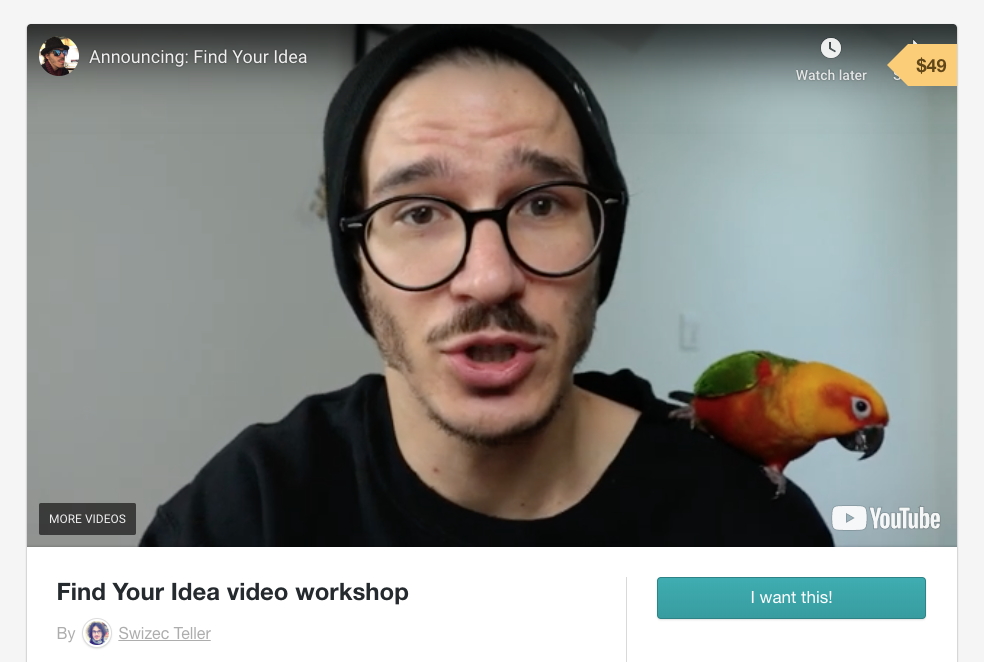

> Amateurs sit and wait for inspiration, the rest of us get up and go to work

We&#x27;ve been talking about ideas this week my friend and if there&#x27;s just one tl;dr I want you to take out of this week, it&#x27;s this 👉 **Don&#x27;t just wait around**

Good ideas aren&#x27;t something that Just Happens™. They&#x27;re work. A process. A framework that you follow.

First you gotta put yourself in a position to _notice_ good ideas. You need the right frame of mind.

Many were hot in the tropics, but there&#x27;s only one Ice King.

Many hated integrating payments, but there&#x27;s only one Stripe.

What&#x27;s the difference? Most complained and groaned then moved on. Frederic Tudor and the Collison Brothers turned their pain into an idea – a hunch.

**Then they developed it.**

Truth is, you need to develop an idea. You need to test it out. Validate. See if it works. Get a glimpse of initial interest, see how people respond, adjust.

Take my ServerlessReact.Dev course for example.

It made \$25,000 in its first week. 😳

\$25k doesn&#x27;t sound like much compared to the Ice King or Stripe, but it&#x27;s nothing to sneeze at either.

Imagine making \$25k on top of your dayjob my friend. Wouldn&#x27;t be too bad would it? 😛

And what if I told you that by the time ServerlessReact.Dev launched, there was no risk? I knew it would work.

Because for a whole year before that launch, I carefully validated the idea, tested interest, experimented with pricing, developed the material, figured out what people do and don&#x27;t want to learn, how they want to talk about it, what they&#x27;re curious about, and why.

Hell, ServerlessReact.Dev made \$24,000 just in validation tests before it ever became a flagship course on its own.

And _that_&#x27;s what I want to show you in my new [Find Your Idea](https://gum.co/fKfYf) workshop on **May 10th at 1pm**.

I want to show you the framework I use to notice, validate, and develop ideas. From as small as a blog article to write for exposure, to as big as a SaaS product to build.

The same framework applies.

- notice
- validate
- develop

## Find Your Idea

Find Your Idea is a short online workshop that teaches you how to notice, validate, and develop your ideas _before_ you waste a bunch of time you don&#x27;t have.

And it closes at midnight tonight. So [join now](https://gum.co/fKfYf), my friend, it&#x27;s gonna be great.

You&#x27;ll learn all the mental models and frameworks I use after 10 years of running various businesses and making money online.

Can&#x27;t make it live? No worries.

You get the raw recording right after and access to the self-paced workshop version a few weeks after :)

Questions? Hit reply.

Cheers,  
~Swizec

PS: [Find Your Idea](https://gum.co/fKfYf) closes tonight and it won&#x27;t be just \$49 ever again ❤️
